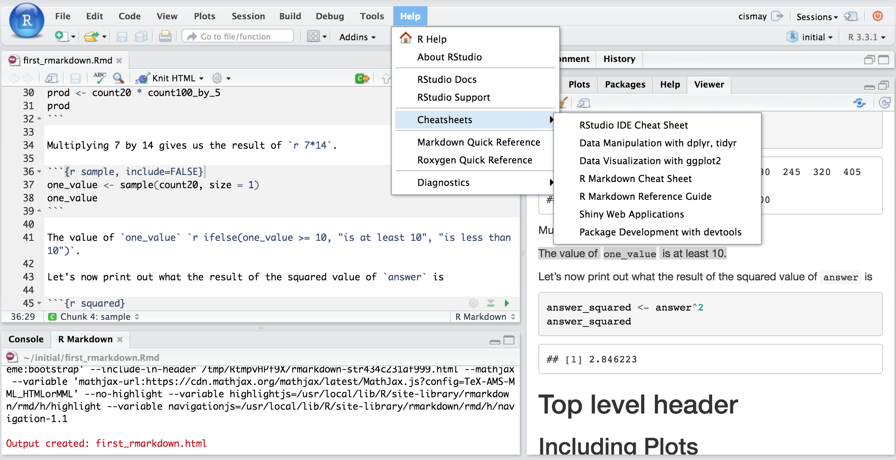

# (PART\*) Getting started with R, RStudio & R Markdown {-}

# What are R and RStudio? {#what_is_R}

It is assumed that you are using R via RStudio. First time users often confuse the two. At its simplest:

* R is like a car's engine
* RStudio is like a car's dashboard

R: Engine            |  RStudio: Dashboard 
:-------------------------:|:-------------------------:
  |  

More precisely, R is a programming language that runs computations while RStudio is an *integrated development environment (IDE)* that provides an interface by adding many convenient features and tools. So the way of having access to a speedometer, rearview mirrors, and a navigation system makes driving much easier, using RStudio's interface makes using R much easier as well. 

# Installing R and RStudio {#install_R_Rstudio}

<div class="note">
**Note**
The latest version of R is 4.1.1 ("Kick Things").  It is strongly recommended that you install this latest version, even if you have older versions already installed. 
</div>

Follow the instructions below, and optionally you can view this YouTube video [here](https://youtu.be/2Sovzf6lVRo) _prior_ to starting the steps.

1. Download and install both R and RStudio (Desktop version) on your computer. 

<div class="note">
**Note**
R needs to be installed successfully >prior< to installing RStudio (because the latter depends on the former)  
</div>

2. Figure out what operating system (and version) you have on your computer (e.g. Windows 10; Mac OS X 10.15 "Big Sur")  

3. Go to this [website](https://cran.r-project.org/) and click on the appropriate download link at the top of the page (depending on your operating system, Windows / MacOS / Linux)  
    - For *Windows* users, download the "base" version; this file will be called something like R-4.1.1-win.exe. Executing this file launches a familiar Windows Setup Wizard that will install R on your computer.  
    - For *Mac* users, download the "pkg" file that is appropriate for your version of MacOS; the file will be called something like R-4.1.1.pkg. Download and run this installation package—just accept the default options and you will be ready to go.  

4. Now to install RStudio: once you have installed "R", go to this [website](https://rstudio.com/products/rstudio/download/) and click on the  "download" button in the top right corner, then select the blue button underneath the "RStudio Desktop FREE" column.  Then, click on the appropriate link under the "Installers for Supported Platforms" heading; this again depends on what platform / operating system you're using. It will likely be one of the first two options.  

# Start using R & RStudio {#start_r}

Recall our car analogy from a [previous tutorial](#what_is_R). Much as we don't drive a car by interacting directly with the engine but rather by using elements on the car's dashboard, we won't be using R directly but rather we will use RStudio's interface. After you install R and RStudio on your computer, you'll have two new programs AKA applications you can open. We will always work in RStudio and not R. In other words:

R: Do not open this          |  RStudio: Open this
:-------------------------:|:-------------------------:
  |  

Launch RStudio on your computer to make sure it's working (it loads R for you in the background).  

## The RStudio Interface {#Rstudio_interface}

When you open RStudio, you should see something similar to the following:


  
Note the four panes which are four panels dividing the screen: the source pane (top left), console pane (bottom left), the files pane (bottom right), and the environment pane (top right). Over the course of this chapter, you’ll come to learn what purpose each of these panes serves.

## Coding basics {#coding_basics}

Please go through section [1.2 of the ModernDive online text](https://moderndive.com/1-getting-started.html#code) called "How do I code in R?". This should take about 15 minutes.

# R packages {#packages}

An R package is a collection of functions, data, and documentation that extends the capabilities of R. They are written by a world-wide community of R users. For example, among the most popular packages are:

* `ggplot2` package for data visualization 
* `dplyr` package for data wrangling 
* `tidyverse`, which is a package that includes a collection of multiple packages (including the preceding two) that are all installed at once. We'll be using this package in the course. 

There are two key things to remember about R packages:

* *Installation*: Most packages are not installed by default when you install R and RStudio. You need to install a package before you can use it. Once you've installed it, you likely don't need to install it again unless you want to update it to a newer version of the package.  

* *Loading*: Packages are not loaded automatically when you open RStudio. You need to load them everytime you open RStudio.

## Package installation {#package_install}

Let's install the `tidyverse` package.

There are two ways to install an R package:

- In the Files pane:
    + Click on "Packages"
    + Click on "Install"
    + Type the name of the package under "Packages (separate multiple with space or comma):" In this case, type `tidyverse`
    + Click "Install"  
    
- Alternatively, in the Console pane type the following:

```{r, eval=FALSE}
install.packages("tidyverse")
```

<div class="note">
**Note**
When working on your own computer, you only have to install a package once, unless you want to update an already installed package to the latest version. If you want to update a package to the latest version, then re-install it by repeating the above steps. **HOWEVER**: If you're working on a school computer (in a lab), you may need to install packages each session. Packages that are listed in the "packages" pane when you start up RStudio are pre-installed, and therefore don't need to be re-installed each time.  
</div>

## Package loading {#package_load}

Let's load the `tidyverse` package.

After you've installed a package, you can now load it using the `library()` command. For example, to load the `tidyverse` package, run the following code in the Console pane:


```{r, eval=FALSE}
library(tidyverse)
```

<div class="note">
**Note**
You have to reload each package you want to use every time you open a new session of RStudio.  This is a little annoying to get used to and will be your most common error as you begin.  When you see an error such as

```
Error: could not find function
```

remember that this likely comes from you trying to use a function in a package that has not been loaded.  Remember to run the `library()` function with the appropriate package to fix this error.
</div>

# Setting up R Markdown {#setup_markdown}

For a primer on what "markdown" is, consult chapter 6 of the [Biology Procedures and Guidelines ](https://ubco-biology.github.io/Procedures-and-Guidelines/markdown-1.html) resource, but **skip over section 6.2**. 

We'll learn more about R Markdown in another tutorial, but for now, let's make sure it runs properly, and in particular, "knits" to PDF successfully. For this, we need to install a package.  

If you're keen to get a head start on learning R Markdown, consult this [DataCarpentry Tutorial](https://datacarpentry.org/r-socialsci/05-rmarkdown/index.html). 

## Install `tinytex` package {#install_tinytex}

To ensure you have no problems creating PDF documents using R Markdown, you need to install the `tintex` R package.  

* In the command console of RStudio (the bottom left window panel), type in the following two lines of code, pressing return after each line:  

```
install.packages("tinytex")
tinytex::install_tinytex()
```

RStudio will take a moment to install a bunch of things. Once it's done, we're ready to try knitting to PDF!

## Verifying R Markdown knits successfully to PDF {#check_knit_pdf}

While in RStudio, select the "+" dropdown icon at top left of RStudio window, and select R Markdown. RStudio may at this point install a bunch of things, and if so that's ok.  A window will then appear and you can replace the "Untitled" with something like "Test", then select OK.  

This will open an R Markdown document in the top left panel.  Don't worry about all the text in there at this point. What we want to do is test whether it will "knit" or render the document to PDF format.  To do this, select the "Knit" drop-down icon near the top left of the RStudio window, and select "Knit to PDF". RStudio will ask you to first save the markdown file (save it anywhere with any name for now), then it will process the markdown file and render it to PDF.  

If this procedure does not work, first try troubleshooting the usual way: in Google, type "R-help tinytex" and also paste any error message you get. If that fails, post your issue in the course Piazza.

# Extra online resources {#r_resources}

>**NOTE** This page is still under development (Sept 8, 2021)

Below we provide tables with various online resources, including ones that will help you troubleshoot.

If you are googling for R code, make sure to also include package names in your search query (if you are using a specific package). For example, instead of googling "scatterplot in R", google "scatterplot in R with ggplot2".

Rstudio provides links to several **cheatsheets** that will come in handy throughout the semester.

You can get nice PDF versions of the files by going to **Help -> Cheatsheets** inside RStudio:



The book titled "Getting used to R, RStudio, and R Markdown" by Chester Ismay, which can be freely accessed [here](https://ismayc.github.io/rbasics-book/), is also a wonderful resource for for new users of R, RStudio, and R Markdown. It includes examples showing working with R Markdown files in RStudio recorded as GIFs.

## R Resources Online {#online_resources}

-------------------------------------------------------------------------------
URL                                                   Purpose
----------------------------------------------------- -------------------------
https://whitlockschluter3e.zoology.ubc.ca.            R resources to accompany Whitlock & Schluter text

https://datacarpentry.org/R-genomics/01-intro-to-R.html   Data Carpentry Intro R tutorials

https://r-dir.com/learn/tutorials.html                List of useful tutorials including videos

https://www.rstudio.com/resources/webinars/           Various online learning materials at RStudio

https://rmd4sci.njtierney.com                         R Markdown for Scientists

http://r4ds.had.co.nz/index.html                      Hadley Wickham's online book

-------------------------------------------------------------------------------
Table: Learning R - Tutorials and workshop materials

____

-------------------------------------------------------------------------------
URL                                                   Purpose
----------------------------------------------------- -------------------------
http://blog.revolutionanalytics.com/beginner-tips/    Beginner tips

https://mran.microsoft.com/packages/                  Tool for exploring packages
-------------------------------------------------------------------------------
Table: So many packages - how to find useful ones?


____


----------------------------------------------------------------------------------------------
URL                                                               Purpose
----------------------------------------------------------------  ----------------------------
https://www.zoology.ubc.ca/~schluter/R/                           UBC zoology site
                                                                  handy stats reference

http://statmethods.net/                                           Good general reference

----------------------------------------------------------------------------------------------
Table: Data analysis in R

____


----------------------------------------------------------------------------------------------
URL                                                               Purpose
----------------------------------------------------------------  ----------------------------
http://statmethods.net/                                           Good general reference for graphing

http://ggplot2.org/book/                                          Hadley Wickhams's ggplot2 book online

http://stats.idre.ucla.edu/r/seminars/ggplot2_intro/              Great tutorial on ggplot2

http://www.cookbook-r.com/Graphs/                                 Graphing with ggplot2

----------------------------------------------------------------------------------------------
Table: Data visualization in R

____


----------------------------------------------------------------------------------------------
URL                                                               Purpose
----------------------------------------------------------------  ----------------------------
https://www.r-bloggers.com/                                       Popular blog site, lots of info

http://rseek.org/                                                 Search engine for R help

----------------------------------------------------------------------------------------------
Table: BLOGs and general resources


____


----------------------------------------------------------------------------------------------
URL                                                                           Purpose
----------------------------------------------------------------------------  ----------------
https://cos.io/                                                               Center for Open Science

https://ropensci.org/                                                         Open science R resources

http://geoscripting-wur.github.io/RProjectManagement/                         Lessons about version control

https://nicercode.github.io/                                                  Helping to improve your code

----------------------------------------------------------------------------------------------
Table: Resources for reproducible research / open science


____


----------------------------------------------------------------------------------------------
URL                                                               Purpose
----------------------------------------------------------------  ----------------------------
http://spatial.ly/r/                                                  Example maps with R

https://rstudio.github.io/leaflet/                                    Online mapping with R

https://www.earthdatascience.org/courses/earth-analytics/             Excellent course

https://geoscripting-wur.github.io/                                   Amazing "geoscripting" tutorial
