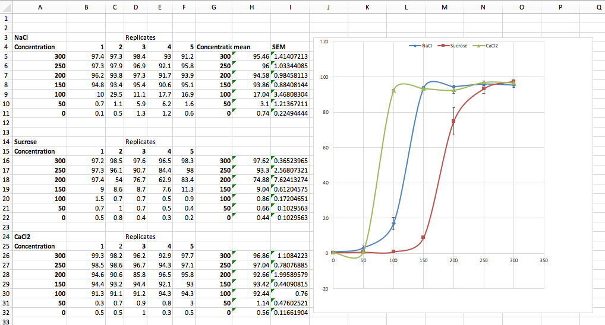
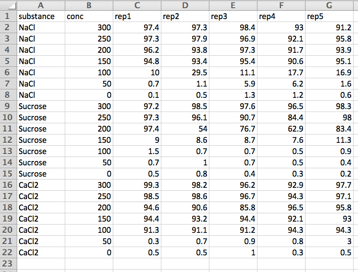

# Importing Data {#data_import}

Last updated on`r format(Sys.time(), '%B %d, %Y')`. 

* * *

## Getting started 

In this tutorial you will learn how to:  

* Format your data for importing into R  
  + Tidy data
  + Do's and Don'ts of naming variables and data entry
  + Wide versus Long format
* Saving your file in CSV (comma-separated values) format  
* Import your CSV file into a data frame in R  

* * *

## Packages 

For this tutorial you'll need the `tidyverse` package (and the many packages it brings with it), and the `dlookr` package.  Install these if you haven't already done so on your computer. 

Load the libraries

```{r message = F, warning = F}
library(tidyverse)
library(dlookr)
```

## Tidy data

Read this [recent article](https://towardsdatascience.com/tidy-data-with-r-f3d078853fc6) describing why making your data "tidy" saves a lot of time and effort in the long run.  Oh, and it uses Covid-19 data to demonstrate!  

**Optional:** If you'd like a longer, more in-depth read about "tidy data", see Hadley Wickham's "R for Datascience" online book, linked [here](http://r4ds.had.co.nz/tidy-data.html) 

You can tidy your data using the functionality of the `dplyr` package, which comes with the `tidyverse` package. Its associated cheatsheet is available [here](https://github.com/rstudio/cheatsheets/raw/master/data-transformation.pdf). 

### Naming variables

The following are good rules of thumb to follow when setting up your spreadsheet to store your data:  

* the first row should contain the names of the variables  
* each variable should have its own column  
* below the "header" row that contains the variable names, each row should contain one observation  
* do not mix data types (e.g. numerical, categorical) within a single column; 
* the variable names should not include spaces or special characters; in lieu of a space, use an underscore "_"  
* use easily-interpreted variable names when possible, and provide a separate ".txt" file that describes what each variable is, including units (this file is called a "data dictionary") 
* the data file should be saved in "CSV" format  
* do not include spaces or special characters in the file name  

* * *

## Preparing the data for import

Below is a screenshot of an Excel worksheet that a student might have generated during a concentration-response exercise, conducted in a lab course.  

You'll see three sets of data, one for each substance being analyzed (NaCl, Sucrose, and CaCl2), some calculated statistics associated with the measured values (mean and standard error of the mean), and finally some response curves that have been fit  using Excel (yuk!). 

  

* * *
  
We need to re-format these data (i.e. make them "tidy") in order to import into R.  

Typically it is easier to enter data in "wide" format, so we'll assume this is the case here. 

Below is a snapshop of how the data in the above spreadsheet might be organized for import into R:  

  

Note that we don't include any derived values like the mean and standard deviation... these will be calculated in R.  
   
* * *

## Importing data from a CSV file

You can find additional help on importing different types of files [here](https://www.statmethods.net/input/importingdata.html), and the using the [Data Import Cheat Sheet](https://github.com/rstudio/cheatsheets/raw/master/data-import.pdf).

Let's get some data to work with. We have created a CSV file with data formatted as shown above.  

First, be sure to set your working directory to the same place that your markdown file is in (you should have a markdown file that you use when working through tutorials). We're going to cheat here a bit, and you're going to use the menu in RStudio to do this:  

- Select the "session" menu
- Select "Set working directory", and then select "to source file location".

Now we can download the CSV file by right-clicking on this link [here](https://people.ok.ubc.ca/jpither/datasets/example_data.csv), and saving the file to your working directory.  

**NOTE**: If your spreadsheet includes blank cells (i.e. missing values), R will automatically covert these to "NA" values.  

Once it is saved in your **working directory**, we use the `read_csv` function from the `readr` package (which came with the `tidyverse` package) to import the data. We'll import it into a tibble called "example.data":  

```{r, eval = TRUE}
example.data <- read_csv(file = "./data/example_data.csv")
```

NOTE: if the preceding code does not work for you, use this code instead:

```
example.data <- read_csv(file.choose())
```
in which case R will let you choose the file using point-and-click.

**NOTE:** The base R package includes the `read.csv` function, which works similarly to the `read_csv` function, but is a bit less straightforward, hence our preference for `read_csv`.  

Now we can have a look at the data frame, exploring its structure using the `diagnose` function from the `dlookr` package, then looking at the first few rows with the `head` function:  

```{r, eval = TRUE}
dlookr::diagnose(example.data)
```

and:

```{r, eval = TRUE}
head(example.data)
```

* * *

## Exporting or "writing" data to a CSV file

Perhaps we wish to export a `tibble` or dataframe from R to a CSV file. We can do this with the `write_csv` function:

```
?write_csv
```

Here we write to a file called "exampledata.csv":

```{r, eval = TRUE}
write_csv(example.data, "./output/exampledata.csv")
```

**NOTE:** The base R package includes the `write.csv` function, which works similarly to the `read_csv` function, but is a bit less straightforward, hence our preference for `write_csv`.  

* * *

**ALL MATERIAL BELOW HERE IS OPTIONAL AND STILL UNDER CONSTRUCTION** 

* * *

## Converting from wide to long format

We'll use the `gather` function for this:

```
?gather
```

Here's the appropriate code for our current example, and we'll create a new data frame called "long.data":

```{r, eval = TRUE}
long.data <- gather(example.data, replicate, value, 
                    rep1:rep5, factor_key = TRUE)
```

Now let's look at the resulting data frame:

```{r, eval = TRUE}
head(long.data)
```

We could now do some analyses on these data, as shown in the next section.

* * *

## Example analyses on long format data

As we learned in another [tutorial](https://people.ok.ubc.ca/jpither/modules/Describe_by_group.html), we can calculate descriptive statistics (e.g. mean, standard deviation) for a numeric variable grouped by categories.  In the present example, we may wish to calculate the mean and standard deviation for each combination of concentration and substance.

Here we provide the mean and standard deviation of `value` grouped according to `conc` and `substance`:
```{r, eval = TRUE}
long.data %>%
  group_by(conc, substance) %>%
  summarize(mean_val = mean(value, na.rm = TRUE), sd_val = sd(value, na.rm = T))
```

The output is a `tibble` (see [R for Data Science book](http://r4ds.had.co.nz/)).

### Standard error by group

To calculate the standard error of `value`, grouped by each combination of `conc` (concentration) and `substance`, we need to do a bit more work.  We first our own standard error function, then use the `dplyr` package to apply the function across the group combinations.    

First, create a function for the standard error (consult this [tutorial](https://people.ok.ubc.ca/jpither/modules/Sampling_Estimation_Uncertainty.html)):
```{r, eval = TRUE}
standard.error <- function(x){sd(na.omit(x))/sqrt(length(na.omit(x)))}
```

Now we can apply this function to the group combinations using this code:
```{r}
long.data %>%
  group_by(conc, substance) %>%
  summarize(mean_trans = mean(value, na.rm = TRUE), 
            st_err = standard.error(value))
```

* * *

## Converting from long to wide format

**To be completed**

In the meantime, consult this [page](http://www.cookbook-r.com/Manipulating_data/Converting_data_between_wide_and_long_format/) where it uses `tidyr` for this purpose.


* * *

## The "expand.grid" function 

**TIP** You can easily create a long-format data frame in R using the `expand.grid` function:

```
?expand.grid
```

For the above example dataset, we could have prepared a data frame in R with the appropriate long format as follows:

```{r, eval = TRUE}
long.data2 <- as.data.frame(expand.grid(
  conc = seq(from = 300, to = 0, by = -50), 
  substance = c("NaCl", "Sucrose", "CaCl2"), 
  replicate = c("rep1", "rep2", "rep3", "rep4", "rep5"), 
  value = NA))
```

The result:

```{r, eval = TRUE}
head(long.data2)
```

We can re-order the columns to look exactly like the original data frame, here using old-school syntax:

```{r}
long.data2 <- long.data2[,c("substance","conc","replicate","value")]
```

Or here using "tidy" syntax and the `relocate` function from `dplyr`:

```{r}
long.data2 <- long.data2 %>% dplyr::relocate(substance)
```

The result:

```{r, eval = TRUE}
head(long.data2)
```

If you wished to use the long format data frame created above say, for example, to enter data, you could export it to CSV first, open it in Excel, then enter your measurements under the "value" column.  

Expore the data frame with the `write.csv` command:

```
?write.csv
```

```{r, eval = TRUE}
write.csv(long.data2, file = "./output/longdata.csv", row.names = FALSE)
```

* * *


