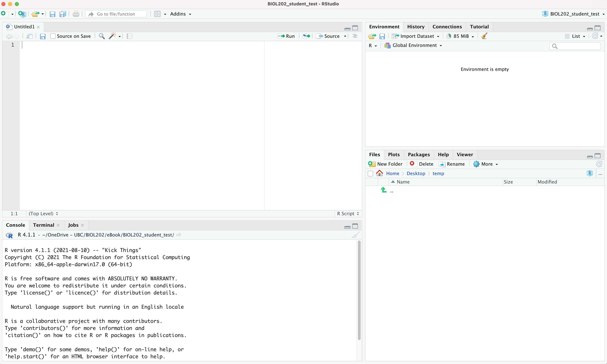
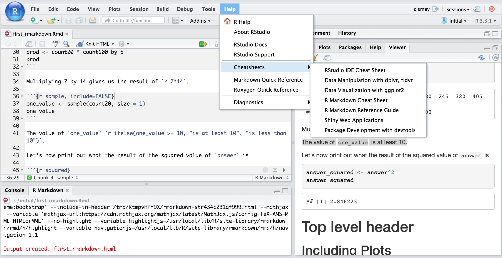

# (PART\*) Getting started with R, RStudio & R Markdown {-}

# What are R and RStudio? {#what_is_R}

```{r kilppy, echo = FALSE, include = TRUE}
klippy::klippy()
```

It is assumed that you are using <a href="https://ubco-biology.github.io/Procedures-and-Guidelines/glossary#R">R</a> via RStudio. First time users often confuse the two. At its simplest:

* R is like a car's engine
* RStudio is like a car's dashboard

R: Engine            |  RStudio: Dashboard 
:-------------------------:|:-------------------------:
  |  

More precisely, R is a programming language that runs computations while RStudio is an *integrated development environment (IDE)* that provides an interface by adding many convenient features and tools. So the way of having access to a speedometer, rearview mirrors, and a navigation system makes driving much easier, using RStudio's interface makes using R much easier as well. 

## Installing R and RStudio {#install_R_Rstudio}

<div class="note">
**Note**
The latest version of R is 4.1.1 ("Kick Things").  It is strongly recommended that you install this latest version, even if you have older versions already installed.  **However** If you have an older operating system on your computer, you'll want to check compatibility of both R and RStudio.  The RStudio website should detect your operating system and provide the appropriate download option automatically.  The website with older versions of R is [here](https://cran.r-project.org/bin/macosx/), and older versions of RStudio is [here](https://www.rstudio.com/products/rstudio/older-versions/).  
</div>

Follow the instructions below, and optionally you can view this YouTube video [here](https://youtu.be/2Sovzf6lVRo) _prior_ to starting the steps.

* Download and install both R and RStudio (Desktop version) on your computer. 

<div class="note">
**Note**
R needs to be installed successfully >prior< to installing RStudio (because the latter depends on the former)  
</div>

* Figure out what operating system (and version) you have on your computer (e.g. Windows 10; Mac OS X 12.51 "Monterey")  
* Go to this [website](https://cran.r-project.org/) and click on the appropriate download link at the top of the page (depending on your operating system, Windows / MacOS / Linux)  
    - For *Windows* users, download the "base" version; this file will be called something like R-4.1.1-win.exe. Executing this file launches a familiar Windows Setup Wizard that will install R on your computer.  
    - For *Mac* users, download the "pkg" file that is appropriate for your version of MacOS; the file will be called something like R-4.1.1.pkg. Download and run this installation package—just accept the default options and you will be ready to go.  

* Now to install RStudio: once you have installed "R", go to this [website](https://rstudio.com/products/rstudio/download/) and click on the  "download" button in the top right corner, then select the blue button underneath the "RStudio Desktop FREE" column.  Then, click on the appropriate link under the "Installers for Supported Platforms" heading; this again depends on what platform / operating system you're using. It will likely be one of the first two options.  

# Start using R & RStudio {#start_r}

Recall our car analogy from a [previous tutorial](#what_is_R). Much as we don't drive a car by interacting directly with the engine but rather by using elements on the car's dashboard, we won't be using R directly but rather we will use RStudio's interface. After you install R and RStudio on your computer, you'll have two new programs AKA applications you can open. We will always work in RStudio and not R. In other words:

R: Do not open this          |  RStudio: Open this
:-------------------------:|:-------------------------:
  |  

Launch RStudio on your computer to make sure it's working (it loads R for you in the background).  

## The RStudio Interface {#Rstudio_interface}

When you open RStudio, you should see something similar to the following:


  
Note the four panes which are four panels dividing the screen: the source pane (top left), console pane (bottom left), the files pane (bottom right), and the environment pane (top right). Over the course of this chapter, you’ll come to learn what purpose each of these panes serves.

## Coding basics {#coding_basics}

Please go through section [1.2 of the ModernDive online text](https://moderndive.com/1-getting-started.html#code) called "How do I code in R?". This should take about **15 minutes**.

## R packages {#packages}

An R package is a collection of functions, data, and documentation that extends the capabilities of R. They are written by a world-wide community of R users. For example, among the most popular packages are:

* `ggplot2` package for data visualization 
* `dplyr` package for data wrangling 
* `tidyverse`, which is a package that includes a collection of multiple packages (including the preceding two) that are all installed at once. We'll be using this package in the course. 

There are two key things to remember about R packages:

* *Installation*: Most packages are not installed by default when you install R and RStudio. You need to install a package before you can use it. Once you've installed it, you likely don't need to install it again unless you want to update it to a newer version of the package.  

* *Loading*: Packages are not loaded automatically when you open RStudio. You need to load them everytime you open RStudio.

## Package installation {#package_install}

Let's install the `tidyverse` package.

There are two ways to install an R package:

- In the Files pane:
    + Click on "Packages"
    + Click on "Install"
    + Type the name of the package under "Packages (separate multiple with space or comma):" In this case, type `tidyverse`
    + Click "Install"  
    
- Alternatively, in the Console pane type the following (**NOTE** never include this code within your R Markdown document; only install packages by typing directly in the Console):

```{r, eval=FALSE}
install.packages("tidyverse")
```

<div class="note">
**Note**
When working on your own computer, you only need to install a package once, unless you want to update an already installed package to the latest version (something you might do every 6 months or so). **HOWEVER**: If you're working on a school computer (in a computer lab or in the library), you may need to install packages each session, because local files are deleted daily. If you're unsure what packages are already installed, consult the "packages" tab in the lower-right RStudio pane when you start up RStudio; installed packages are listed there.  
</div>

## Package loading {#package_load}

Let's load the `tidyverse` package.

After you've installed a package, you can now load it using the `library()` command. For example, to load the `tidyverse` package, run the following code in the Console pane:

```{r, eval=FALSE}
library(tidyverse)
```

<div class="note">
**Note**
You have to reload each package you want to use every time you open a new session of RStudio.  This is a little annoying to get used to and will be your most common error as you begin.  When you see an error such as

```
Error: could not find function
```

remember that this likely comes from you trying to use a function in a package that has not been loaded.  Remember to run the `library()` function with the appropriate package to fix this error.
</div>

## Intro to R Markdown {#intro_markdown}

As you may have learned already from section 6 of the [Biology Procedures and Guidelines resource ](https://ubco-biology.github.io/Procedures-and-Guidelines/markdown-1.html), R <a href="https://ubco-biology.github.io/Procedures-and-Guidelines/glossary#Markdown">Markdown</a> is a markup language that provides an easy way to produce a rich, fully-documented reproducible analysis.  It allows its user to share a single file that contains all of the commentary, R code, and <a href="https://ubco-biology.github.io/Procedures-and-Guidelines/glossary#Metadata">metadata</a> needed to reproduce the analysis from beginning to end.  R Markdown allows for "chunks" of R code to be included along with Markdown text to produce a nicely formatted HTML, PDF, or Word file without having to know any complicated programming languages or having to fuss with getting the formatting just right in a Microsoft Word DOCX file.  

One R Markdown file can generate a variety of different formats and all of this is done in a single text file with a few bits of formatting.  You'll be pleasantly surprised at how easy it is to write an R Markdown document after your first few attempts.  

We will be using R Markdown to create reproducible lab reports. 

<div class="note">
**Note**
R Markdown is just one flavour of a markup language. RStudio can be used to edit R Markdown. There are many other markdown editors out there, but using RStudio is good for our purposes.  
</div>

## Literate programming with R Markdown {#lit_programming}

1. View the following short video:

[**Why use R Markdown for Lab Reports?**](https://youtu.be/lNWVQ2oxNho)
<iframe width="560" height="315" src="https://www.youtube.com/embed/lNWVQ2oxNho" frameborder="0" allowfullscreen></iframe>

The preceding video described what can be referred to as <a href="https://ubco-biology.github.io/Procedures-and-Guidelines/glossary#Literate-programming">**literate programming**</a>: authoring a single document that integrates data analysis (executable code) with textual documentation, linking data, code, and text. In R Markdown, the executable R code is placed in "chunks", and these are embedded throughout sections of regular text.   

For an example of an HTML (webpage) document that illustrates the effectiveness of literate programming, take a look at [this HTML output - a webpage](https://ubco-biology.github.io/BIOL202/Manning_et_al_full_script.html) that accompanied a lab-based experiment examining the potential for freshwater diatoms to be successfully dispersed over long distances adhered to duck feathers.

2. View the following youtube video on creating an R Markdown document:

[webpage](https://youtu.be/DNS7i2m4sB0). 

<div class="note">
**Optional**
If you'd like additional introductory tutorials on R Markdown,  see this [one from RStudio](https://rmarkdown.rstudio.com/lesson-1.html), or this [one](https://rbasics.netlify.app/4-rmarkdown.html). 
</div>

## Making sure R Markdown knits to PDF {#veryify_knit}

Now we're going to ensure R Markdown works the way we want.  A key functionality we need is being able to "knit" our report to PDF format. For this, we need to install the `tinytex` package {#install_tinytex}.  

* Copy and paste the following two lines of code into the command console of RStudio (the bottom left window panel), then press return:  

```
install.packages("tinytex")
tinytex::install_tinytex()
```

RStudio will take a minute or two to install a bunch of things. Once it's done, we're ready to try knitting to PDF!

<div class="note">
**Reminder**
Recall you only need to install a package once!  And this should be the last time you need to deal with the `tinytex` package (you won't need to "load" it in future), because now that it's installed, its functionality works in the background with RStudio.  
</div>

* While in RStudio, select the "+" dropdown icon at top left of RStudio window, and select R Markdown. RStudio may at this point install a bunch of things, and if so that's ok.  
* A window will then appear and you can replace the "Untitled" with something like "Test", then select OK.  

This will open an R Markdown document in the top left panel.  Don't worry about all the text in there at this point. What we want to do is test whether it will "knit" (render) the document to PDF format.  To do this: 

* Select the "Knit" drop-down icon near the top left of the RStudio window, and select "Knit to PDF". RStudio will ask you to first save the markdown file (save it anywhere with any name for now), then it will process the markdown file and render it to PDF.  

In a future [tutorial](#repro_research) we'll discuss how to use R Markdown as part of a reproducible workflow.
 
## Extra resources {#r_resources}

<div class="note">
**Note**
This page is still under development (Aug 2022)
</div>

If you are googling for R code, make sure to also include package names in your search query (if you are using a specific package). For example, instead of googling "scatterplot in R", google "scatterplot in R with ggplot2".

Rstudio provides links to several **cheatsheets** that will come in handy throughout the semester.

You can get nice PDF versions of the files by going to **Help -> Cheatsheets** inside RStudio:



The book titled "Getting used to R, RStudio, and R Markdown" by Chester Ismay, which can be freely accessed [here](https://ismayc.github.io/rbasics-book/), is also a wonderful resource for for new users of R, RStudio, and R Markdown. It includes examples showing working with R Markdown files in RStudio recorded as GIFs.

## R Resources Online {#online_resources}

| URL                                                      | Purpose                                           |
|:-----------------------------------------------|:-----------------------|
| <https://whitlockschluter3e.zoology.ubc.ca>.             | R resources to accompany Whitlock & Schluter text |
| <https://datacarpentry.org/R-genomics/01-intro-to-R.htm> | l Data Carpentry Intro R tutorials                |
| <https://r-dir.com/learn/tutorials.html>                 | List of useful tutorials including videos         |
| <https://www.rstudio.com/resources/webinars/>            | Various online learning materials at RStudio      |
| <https://rmd4sci.njtierney.com>                          | R Markdown for Scientists                         |
| <http://r4ds.had.co.nz/index.html>                       | Hadley Wickham's online book                      |

: Learning R - Tutorials and workshop materials

------------------------------------------------------------------------

| URL                                                  | Purpose                     |
|:-----------------------------------------------|:-----------------------|
| <http://blog.revolutionanalytics.com/beginner-tips/> | Beginner tips     
|
| <https://mran.microsoft.com/packages/>               | Tool for exploring packages |

: So many packages - how to find useful ones?

------------------------------------------------------------------------

| URL                                       | Purpose                                |
|:------------------------------------------------|:----------------------|
| <https://www.zoology.ubc.ca/~schluter/R/> | UBC zoology site handy stats reference |
| <http://statmethods.net/>                 | Good general reference                 |

: Data analysis in R

------------------------------------------------------------------------

| URL                                                    | Purpose                               |
|:------------------------------------------------|:----------------------|
| <http://statmethods.net/>                              | Good general reference for graphing   |
| <http://ggplot2.org/book/>                             | Hadley Wickhams's ggplot2 book online |
| <http://stats.idre.ucla.edu/r/seminars/ggplot2_intro/> | Great tutorial on ggplot2             |
| <http://www.cookbook-r.com/Graphs/>                    | Graphing with ggplot2                 |

: Data visualization in R

------------------------------------------------------------------------

| URL                           | Purpose                         |
|:------------------------------|:--------------------------------|
| <https://www.r-bloggers.com/> | Popular blog site, lots of info |
| <http://rseek.org/>           | Search engine for R help        |

: BLOGs and general resources

------------------------------------------------------------------------

| URL                                                     | Purpose                                                                                                                       |
|:-------------------------------------------------------|:---------------|
| <https://cos.io/>                                       | Center for Open Science                                                                                                       |
| <https://ropensci.org/>                                 | Open science R resources                                                                                                      |
| <http://geoscripting-wur.github.io/RProjectManagement/> | Lessons about <a href="https://ubco-biology.github.io/Procedures-and-Guidelines/glossary#Version-control">version control</a> |
| <https://nicercode.github.io/>                          | Helping to improve your code                                                                                                  |

: Resources for reproducible research / open science

------------------------------------------------------------------------

| URL                                                     | Purpose                                                                                                                       |
|:--------------------------------------------------------|:---------------|
| <http://spatial.ly/r/>                                  | Example maps with R                                                                                                       |
| <https://rstudio.github.io/leaflet/>                    | Online mapping with R                                                                                                     |
| <https://www.earthdatascience.org/courses/earth-analytics/> | Excellent course 
                                  |
| <https://geoscripting-wur.github.io/>                          | Amazing "geoscripting" tutorial                                                                                                  |

: Geospatial work in R
