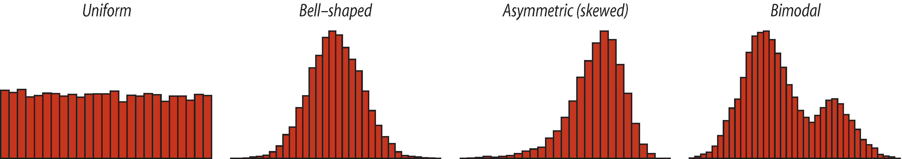

---
output:
  html_document: default
  pdf_document: default
---
# Visualizing and describing a single variable {#vis_describe}

This page was last updated on `r format(Sys.time(), '%B %d, %Y')`.

* * *

## Background

When visualizing a describing a single variable, we typically wish to describe a **frequency distribution**. We visualize a frequency distribution in different ways depending on the type of variable we're dealing with: **categorical** or **numeric**.  

* If the variable is categorical, we can visualize the frequency distribution using a **bar chart**
* If the variable is numeric, we visualize the frequency distribution using a **histogram**

In this tutorial you'll learn to construct and interpret each of these types of visualization.  You'll also learn to calculate some descriptive statistics.  

* * *  

## Getting started

### Load the required packages

In this tutorial we will make use of the following R packages:  

* `tidyverse`
* `skimr`
* `janitor`
* `naniar`

```{r warning = F, message = F}
library(janitor)
library(skimr)
library(tidyverse)
library(naniar)
```


* * *

### Import the data 

We will use the following datasets in this tutorial:

* the `students.csv` file contains anonymous physical data about BIOL202 students from a few years ago
* the `birds.csv` file contains counts of different categories of bird from a marsh habitat

Read in the data from a website (hence the `url` function wrapped in the `read.csv` function):
```{r read_data}
students <- read.csv(url("https://people.ok.ubc.ca/jpither/datasets/students.csv"), header = TRUE)  
birds <- read.csv(url("https://people.ok.ubc.ca/jpither/datasets/birds.csv"), header = TRUE)
```
 
__TIP__: Notice the two sets of parentheses in each line of code above. The RStudio text editor will highlight errors such as unmatched parentheses for you.

* * *

### Get an overview of the data

The `students` object that we created in your workspace is a *data frame*, with each row representing a *case* and each column representing a *variable*.  Data frames can store a mixture of data types: numeric variables, categorical variables, logical variables etc... all in the same data frame (as separate columns). This isn't the case with other object types (e.g. matrices).

In other tutorials we'll also use "tibbles", which are better versions of data frames, and are part of the "tidyverse". But that's for later.  

To view the names of the variables in the data frame, use the `names` command as follows:

```{r show_names}
names(students)
```

This returns the names `height_cm`, `head_circum_cm`, `number_siblings`, `dominant_hand`, `dominant_foot`, and `dominant_eye`. 

We can get a glimpse of the first handful of cases (rows) of our data with the `head` function:

```{r show_head}
head(students)
```

or with the `glimpse` function from the `dplyr` package:

```{r}
glimpse(students)
```

You could also look at *all* of the data frame at once by typing its name into the console and pressing return, but that is not advisable, as you could get reams of output thrown at you if you're dealing with a large dataset! It's better to take a small peek at the data with `head` or `glimpse`.

We should now get an idea of how many cases are there in this data set, how many variables it contains, and what type of data comprise each variable (e.g. numeric, integer, character, factor, logical, etc...).

Use the `skim` function from the `skimr` package to do this:

```{r show_structure}
skim(students)
```


You see that there are:

* 154 rows (cases or records) and 6 columns (variables)
* 3 character (categorical) and 3 numerical variables (under the "Column Type Frequency" heading)
* no designated "group" variables  

There's a lot of additional information, **the most important** of which is:  

*  "n_unique" tells you how many unique categories there are in each of the character (categorical) variables
*  "n_missing" tells  you if there are any missing values (typically coded as "NA") for each variable

Then it provides some descriptive stats for each of the categorical and numerical variables, including a miniature histogram for each of the numerical variables (you'll learn about histograms shortly!).  

1. You should now repeat the preceding steps on the `birds` data frame, so you know what it looks like.

Now that we have explored the basic structure of our dataset, we're ready to start visualizing the data graphically!

* * *

## Frequency distributions

Once you have a dataframe to work with, and have explored its structure and contents (above), the next order of business is always to _visualize_ and summarize your data using graphs and tables. 

We start by examining the *frequency distribution* of the variable(s) of interest.  A *frequency distribution* displays the number of occurrences (cases) of all values in the data.  How we display this information depends on the type of data at hand: **are they numerical or categorical**?  

We also typically report the *relative frequency distribution* for the variable(s), which describes the fraction of occurrences of each value of a variable.

Frequency distributions can be displayed in a table and graphically.

* * *

## Visualizing and describing categorical data

### Creating a frequency table for one categorical variable

Use the `xtabs` command (from the base `stats` package) to produce a *frequency table*, which shows the frequency distribution for a __categorical variable__ in tabular format.  We'll assign the output of the `xtabs` function to an object called `dom.eye.freq`.

Here we show the frequency of observations in each of the two categories contained in the `dominant_eye` variable within the `students` dataframe. We first run the function and assign the output to an object `dom.eye.freq`, then type the name of the object to show its contents:

```{r xtab_frequency}
dom.eye.freq <- xtabs(~ dominant_eye, data = students)
dom.eye.freq
```

__TIP__: Take note of the syntax in the arguments provided to the `xtabs` function. We'll return to this later. 

We see that there are 2 categories (or "levels") "l" and "r" representing left and right; this was also shown by the `skim` function earlier. There are `r dom.eye.freq[1]` and `r dom.eye.freq[2]` observations (students) in those respective categories.

To show the *relative frequency distribution* for the `dominant_eye` variable, use the `prop.table` function on the `dom.eye.freq` object.  Again, we'll assign the output to an object, here called `dom.eye.prop`:

```{r relative_frequency}
dom.eye.prop <- prop.table(dom.eye.freq)
dom.eye.prop
```

You can convert these relative frequencies to percentages by multiplying them by 100:
```{r rel_percent}
100 * dom.eye.prop
```

#### **OPTIONAL**

Or for those that are able to use the `tigerstats` package, you can use the `rowPerc` function to convert the raw frequencies to percentages:
```{r eval = F, rowperc}
rowPerc(dom.eye.prop)
```

* * *

### Create a sorted frequency table

When there are more than 2 categories in the variable of interest, you will need to __sort__ the frequencies in decreasing order.

There are several steps to this, which we'll demonstrate using the `birds` dataset.

* use the `xtabs` function to create a frequency table
* use the `sort` function to sort the resulting frequencies across categories
* use the `data.frame` function to create a data frame that stores the properly sorted frequencies
* rename the variables in the data frame
* show the resulting table

```{r sorted_dataframe}
bird.table <- xtabs(~ type, data = birds)  # create frequency table
bird.table.sort <- sort(bird.table, decreasing = TRUE)  # sort the frequencies in decreasing order
bird.df <- data.frame(bird.table.sort)  # create a data frame
names(bird.df) <- c("Birdtype", "Frequency")  # rename variables
bird.df  # show the final table
```

There we go! A frequency table that is appropriately sorted.  We'll use the `bird.table.sort` object later for graphing too.

#### **Alternative approach** 

An alternative and more efficient way to create a sorted frequency table uses the `tabyl` function from the `janitor` package, along with the `%>%` or "pipe" operator, which is loaded with the `dplyr` package.  This operator allows you to string together a series of commands, without having to create intermediate output objects.

We also make use of the `arrange` and `desc` functions from the `dplyr` package.  

Let's see the code, and explain after:

```{r}
birds %>% 
  tabyl(type)
```

We first tell R which object we're going to use for our subsequent operations. Here, the `birds` dataframe object. We then use the `%>%` operator to tell it that we have further functions to come!  

The next line of code uses the `tabyl` function from the `janitor` package, and tells R which categorical variable (`type`) to tabulate frequencies for. 

What we get is a table with 3 columns. The first column contains the unique categories for the `type` variable. The second column provides the frequency of observations in each category, and the last column is the proportion of observations in the categories (contrary to what is indicated by the "percent" heading!).  

If there had been missing values in the `type` variable, you would see another row in the table indicating the frequency of "NA" values.  

But note that the table isn't sorted!  To sort the table in decreasing order of frequency, we add another line of code after another `%>%`, and use the `arrange` function in conjunction with the `desc` function as follows:

```{r}
birds %>% 
  tabyl(type) %>%
  arrange(desc(n))
```

The `desc` function is operating on the "n" column in the output table from the preceding `tabyl`, and suffice it to say it works with the `arrange` function to sort the frequencies.


* * *

### Creating a bar chart

We use a *bar chart* to visualize the frequency distribution for a single categorical variable.

Here we'll use the `ggplot` approach with its `geom_bar` function to create a bar chart.  

To produce the bar chart, we need to produce a summary frequency table first. So let's get this from our `tabyl` script above.  Here we'll assign the sorted frequency table to a dataframe called "bird.type.sort":

```{r}
bird.type.sort <- birds %>% 
  tabyl(type) %>%
  arrange(desc(n))
```

Now we can use this to create a barchart. Let's provide the code first, and explain after.

```{r}
ggplot(data = bird.type.sort, mapping = aes(x = reorder(type, n), y = n)) + 
  geom_bar(stat = "identity") + 
  ylab("Frequency") +
  xlab("Bird type") +
  coord_flip() +
  theme_bw()
```

All figures produced using the `ggplot2` package start with the `ggplot` function. Then the following arguments: 

- the data frame or tibble that holds the data ("data = students")
- an "aes" argument, within which one specifies the variables to be plotted; here we're plotting the frequencies from the "n" variable as the "y" variable, and the "type" variable as the "x" variable. To ensure the proper sorting of the bars, we use the `reorder` function, telling R to reorder the `type` categories according to the frequencies in the `n` variable
- then there's a plus sign to tell ggplot we're not done yet with our graph - there are more functions coming
- then the type of graph, which uses a function starting with "geom"; here we want a bar chart, hence `geom_bar`
- the `geom_bar` function has its own argument: "stat = 'identity'" tells it just to make the height of the bars equal to the values provided in the "y" variable, here `n`.
- the x-axis label
- the y-axis label
- the "coord_flip()" function tells it to rotate the graph horizontally
- then the "theme_bw" function indicates we want a simple black-and-white theme

There you have it: a ggplot version of a bar chart!

### Calculating descriptive statistics for a categorical variable

The *proportion* is the most important descriptive statistic for a categorical variable.  It measures the fraction of observations in a given category within a categorical variable. For example: what proportion of the BIOL202 class has a left dominant eye?

The *proportion* of students that have a left dominant eye is the same as the *relative frequency* of students in the class that have a left dominant eye. Earlier, using the `students` dataset, we learned how to show the relative frequencies of students with left versus right dominant eyes in the class using the `prop.table` function:
```{r}
dom.eye.freq <- xtabs(~ dominant_eye, data = students)
dom.eye.prop <- prop.table(dom.eye.freq)
dom.eye.prop
```

As shown above, the proportion of students that have left dominant eye is `r dom.eye.prop[1]`.  *Proportions always fall between 0 and 1*.   

We can also get this from our table we produced with the `tabyl` function; the last column of the table provides the relative frequencies, a.k.a. proportions, within each category (even though it says "percent"):

```{r}
bird.type.sort
```


* * *

## Visualizing and describing a single numeric variable

### Displaying the frequency distribution for one numerical variable

We start by examining the *frequency distribution* of the variable of interest, which is the number of occurrences (cases) of all values in the data.  In this case, the data are numerical.  

With numerical variables, such as the `height_cm` variable in the `students` dataset, it typically does not make sense to tabulate each unique value in the data (as we do with categorical variables) because there may be many, many values with only a single occurrence.  Instead, _intervals_ are created, and and the number of occurrences of values within each interval is tallied. 

It is relatively uncommon in practice to report a frequency table for a numeric variable.  Much more common is to proceed directly to graphically displaying the frequency distribution using a __histogram__.

* * *

### Creating a histogram

A __histogram__ uses the area of rectangular bars to display the frequency distribution (or relative frequency distribution) of a numerical variable.

We'll use `ggplot2` to create a histogram. 

Please do work through the material below, as it will help you understand the overall `ggplot` approach.  

We won't be going into `ggplot2` functionality in too much detail in the course tutorials, so if you're curious, I recommend you check out this [tutorial](http://r-statistics.co/ggplot2-Tutorial-With-R.html). Specifically, it helps explain the "grammar of graphics" behind the syntax of `ggplot`.

We'll give the code first, then explain below: 

```{r}
  ggplot(data = students, aes(x = height_cm)) +
  geom_histogram(binwidth = 5, color = "black", fill = "lightgrey") +
  xlab("Height (cm)") +
  ylab("Frequency") +
  theme_bw()
```

The syntax follows what was seen above when creating a bar chart.  Here we have only an "x" variable, `height_cm`.  

The `geom_histogram` function has its own arguments:
    - what bin width (interval) should we use for lumping the height data into? You may need to adjust this with trial and error, and you could actually use the `hist` function (see above) to see what bin width it used... we see that it used 5cm as the bid width, so that's what we used here 
    - what "color" we want the outlines of each bar in the histogram to be
    - what "fill" colour we want the bars to be

Voila! Your first ggplot histogram!  

We can also assign the output from the `ggplot` function to an object, as so:

```{r}
height.hist <-  ggplot(data = students, aes(x = height_cm)) +
  geom_histogram(binwidth = 5, color = "black", fill = "lightgrey") +
  xlab("Height (cm)") +
  ylab("Frequency")
```

And then we can add more functions with the "+" sign, and see the result:

```{r}
height.hist.bw <- height.hist + theme_bw()
height.hist.bw
```


* * *

### Interpreting and describing histograms

Frequency distributions for numerical variables can take on a variety of shapes, as shown in the following display of histograms:



* * *
  
Use the image above as a guide on how to describe a histogram.  Note that the asymmetric distribution displayed above is skewed _left_. 

Things to note in your description:

* outliers - are there observations (bars) showing up far from the others?
* multiple modes (as in the "bimodal" example above)
* is it symmetric?
* is it roughly bell-shaped?

Typically your histogram and its description would be accompanied by descriptive statistics (see below). 

* * *

### Calculating descriptive statistics for a numerical variable

* When describing a numeric variable, calculate and report the __mean__ and __standard deviation__ as measures of centre and spread, respectively  

* If the frequency distribution is roughly symmetric and does not have any obvious outliers, the __mean__ and the __standard deviation__ are the preferred measures of centre and spread  

* If the frequency distribution is asymmetric and / or has outliers, the __median__ and the __inter-quartile range__ (IQR) are the preferred measures of centre and spread, and in this case, one often sees these reported __in addition__ to the mean and standard deviation  

#### **Introducing the `summarise` function**

The `dplyr` package has a handy `summarise` (equivalently `summarize`) function for calculating descriptive statistics.

Here, let's calculate the mean height of students first:

```{r}
summarise(students, mean(height_cm, na.rm = T))
```

We first tell it the dataframe or tibble to use for calculations, here `students`.  Then we simply use the standard functions that come with the base R, here the `mean` function.  

The "na.rm = T" argument ensures that if there are any missing values (NA values),they are removed for the calculation. This must be done for each of the descriptive statistics functions.  

Notice that the output from the above code is rather untidy: it returns the entire function text above the resulting number.  

We can fix that, as shown below. 

```{r}
summarise(students, mean.ht = mean(height_cm, na.rm = T))
```

What we've done here is created a new variable, called "mean.ht", to hold the output from the `mean` function.

Now, we typically wish to report multiple descriptive statistics, say, the mean and the standard deviation. To do this, we can include more than one function as arguments to the `summarise` function:

```{r}
summarise(students, 
    mean.ht = mean(height_cm, na.rm = T),
    sd.ht = sd(height_cm, na.rm = T)
    )
```

**IMPORTANT**: here we have wrapped the code across 4 lines, so as to keep it organized and legible. Notice that there's a comma at the end of the first two lines: this tells R that there are more arguments coming for the main function. We stop providing commas once we're done providing arguments, and we can close up the last parenthesis.  

Now let's calculate the mean, median, variance, standard deviation, and IQR of `height_cm`: 

```{r}
summarise(students, 
  mean.ht = mean(height_cm, na.rm = T),
  median.ht = median(height_cm, na.rm = T),
  variance.ht = var(height_cm, na.rm = T),
  sd.ht = sd(height_cm, na.rm = T),
  iqr.ht = IQR(height_cm, na.rm = T),
  count.ht = n(),
  count.missing.vals = naniar::n_miss(height_cm))
```

**This is an important piece of information** to include in your data description, because one needs to know how many observations went into calculating the descriptive statistics.  It is also crucial to report this number in figures.

For example:

```{r echo = F, warning = F, fig.cap = "Fig. 1: Histogram of height for 154 students", fig.width = 4, fig.height = 4}

  ggplot(data = students, aes(x = height_cm)) +
  geom_histogram(binwidth = 5, color = "black", fill = "lightgrey") +
  xlab("Height (cm)") +
  ylab("Frequency") +
  theme_bw()
```


* * *

## List of functions (and the source packages) used in tutorial

__Getting started__:

* `read.csv`
* `url`
* `library` 

__Data frame structure__: 

* `names`
* `head`
* `glimpse` (dplyr)
* `str`
* `skim` (`skimr`)

__Frequency tables__:

* `xtabs`
* `prop.table`

__Graphs__:

* `ggplot` (ggplot2)
* `geom_bar` (ggplot2)
* `geom_histogram` (ggplot2)
* `theme_bw` (ggplot2)

__Descriptive stats__:

* `summarise` (dplyr)
* `mean`
* `median`
* `var`
* `sd`
* `IQR`
* `sum`

