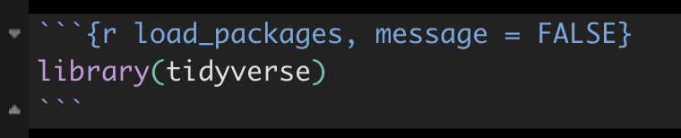
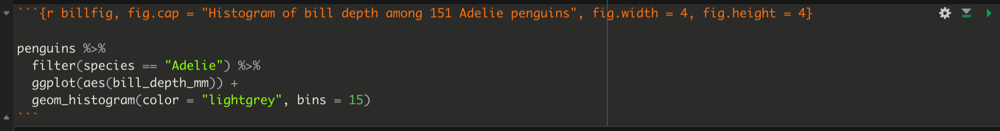
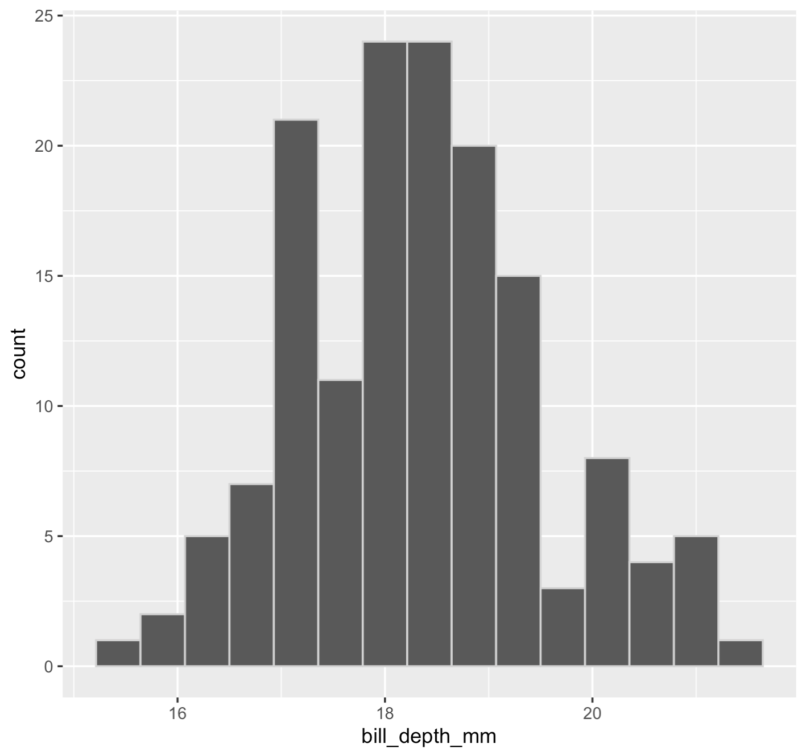

# Preparing and formatting assignments {#prepare_assignments}

This material provides instructions on how to prepare and format R Markdown documents for assignments. 

## Open your assignment RStudio project {#open_assign_project1}

In a previous [tutorial](#assign_workflow) it was suggested you set up a working root directory called "BIOL202_assignments" to host all your assignment work.  You may have also created sub-directories, one for each of the three assignments.  Regardless, in your root "BIOL202_assignments" directory locate the RStudio project file (it has a "Rproj" extension in the filename), and open it by double-clicking it.

## Download the assignment Rmd file {#download_assign_rmd}

The assignment file will be available to you for download from Canvas under the "Assignments" section. The file is actually an R Markdown file, and therefore has an "Rmd" extension.  It is simply a text document (meaning it contains only text), but the syntax used therein is "markdown" syntax, and the file extension (Rmd) specifies it as an R Markdown file. You might recall reading about Markdown in the [Biology Procedures and Guidelines document](https://ubco-biology.github.io/Procedures-and-Guidelines/markdown-1.html).

Make sure you save the Rmd file into your root "BIOL202_assignments" directory, or alternatively into the appropriate sub-directory.  

A small assignment has been set up on Canvas, with the aim of you getting use to the assignment procedure. It is located under "Lab_materials" module. Download the file, and make sure it's saved into your root directory (where your RStudio project is). 

## Open the assignment Rmd file {#open_rmd_file}

In RStudio, look in the "files" pane (bottom right) and locate your downloaded assignment Rmd file. Then click it to open.

This Markdown document includes the assignment questions, and serves as a starter document for your assignment.  

Once you have opened the document, you'll see the following text at the top: 

```{r, fig.cap = "Assignment markdown file header", echo = FALSE, fig.width = 2.5, fig.height = 2.5}
knitr::include_graphics("./more/assign_header.png")
```

Complete the following steps: 

* keeping the quotation marks, replace the "Practice assignment" text with the current assignment name   
* keeping the quotation marks, replace the "Firstname Lastname, Section YY" with your own Firstname Lastname and section number (e.g. " Jason Pither, Section 04") 
* keeping the quotation marks, replace the "Due date" with the due date of the current assignment, e.g. "September 21, 2022"  

<div class="flag">
Don't alter anything else at the top of the document, including the R Chunk that you see below the header.  
</div>

* save the Rmd file using a new name (so select file > "save as"), according to appropriate [file naming conventions](https://ubco-biology.github.io/Procedures-and-Guidelines/file-and-data-management.html), such as "Pither_BIOL202_lab-assignment-01_V0.Rmd". Recall that if you're saving this on OneDrive, or in your local directory that is synced to OneDrive, then your file will be [version controlled](#onedrive), so you don't need to include a version number ("_V0") in the filename.  

You're now ready to start working on your assignment, and doing [literate programming](https://ubco-biology.github.io/Procedures-and-Guidelines/glossary.html) using R Markdown. 

<div class="note">
In RStudio, under the "Help" menu, you'll find "Cheat Sheets" > R Markdown Cheat Sheet and R Markdown Reference Guide.  Have a look at those!
</div>

## What to include in your answers {#what_include_answer}

The general approach is to enter your text answers and associated R chunks with code underneath each question. 

<div class="note">
**TIP**: It is almost always the case that you'll need to load the `tidyverse` package, so it's advisable to include an R chunk right at the beginning of your document that does this. 
</div>

<div class="note">
**TIP**:  To insert a new code chunk, you can either: Use the shortcut: Mac = `Command+Option+I`; Windows = `Ctrl+Alt+I`. Click on the **Insert a new code chunk** icon. You can also specify the coding language of the chunk using the drop-down menu. 
</div>

### Code chunk headers {#chunk_headers}

Here's an example code chunk in which the `tidyverse` package is being loaded. You'll notice some extra text in the header of the chunk. 

```{r, fig.cap = "Code chunk header with message suppression", echo = FALSE, fig.width = 3}

```

The "load_packages" text is simply giving a name or "tag" to this R chunk. It is good practice to provide a _unique_ name to each R chunk.  

After the comma is `message = FALSE`.  This tells R markdown to NOT display any messages associated with the R commands in this chunk when knitting the R Markdown document. For example, when loading some libraries R will provide a long list of messages in the process. When you "knit" the R Markdown document, R will run each R chunk in your document. By including the `message = FALSE` heading argument, you can avoid including this extra output in your knitted document.  

<div class="flag">
The `message = FALSE` header argument is NOT something to include in all chunks by default. It should only be included if the code within the associated code chunk outputs a lot of unnecessary information that would otherwise clutter your knitted PDF document.
</div>

---

There will be routine steps to take for each question. 

### Import data {#first_csv_import}

Each assignment question will indicate which dataset(s) you'll need to answer the question, and where to locate / download these. In many instances multiple questions will use the same dataset, in which case you don't need to load data for each question; just load it once. 

Here's an example of code for importing data. It uses the `read_csv` function from the `readr` package, which is bundled with the `tidyverse` package:

```
example_data <- read_csv("https://raw.githubusercontent.com/ubco-biology/BIOL202/main/data/example_data.csv")
```

The `read_csv` function will take as an argument a URL address for a data file. Here we've provided a URL for the location of a <a href="https://ubco-biology.github.io/Procedures-and-Guidelines/glossary#Comma-separated-values-(CSV)-file">CSV file (comma-separated values file)</a>, which is typically what we'll use.  

### Load packages {#first_load_package}

Once you've loaded the data, you'll now need to figure out how to answer the question by looking through the tutorials for the answer. And typically, to answer the question you'll need to make sure you've loaded some packages.

If you've forgotten what "packages" are, refresh your memory at this [tutorial](#packages).  

For example, it's likely you've already loaded the `tidyverse` package (as advised above), but if a tutorial indicates you need another package, say the `janitor` package, then insert a code chunk with the following:

```
library(janitor)
```

<div class="note">
When working on your own computer, you only need to install a package once (unless you want to update an already installed package to the latest version, which is a rare event). If you're working on a school computer (in a computer lab), you may need to install packages each time you log on to a computer, because the school computers delete local files daily. If you're unsure what packages are already installed, consult the "packages" tab in the lower-right RStudio pane when you start up RStudio; installed packages are listed there.  
</div>

### Answer the questions

After you've imported the required data and loaded required packages, it's time to answer the questions! 

You simply insert any required text and R code (in R Chunks) after each question. The tutorials will provide the information required to answer the questions.  

<div class="note">
**TIP**: The way to test out your code once it's inserted in the R chunk is to press the green play button at the top right of the code chunk. This will run what's in the chunk.  You'll be provided error statements if something goes wrong. If it works, it will provide you the output (and hopefully the answer!), and this is what you use to inform your written (typed) answer.
</div>

Here's what you need to include in your answers: 

- Answer each question clearly and in full sentences. Make sure you answer specifically the question asked.

- Verify that the code you used to answer the question is included in an R chunk and appears in the knitted document (this should happen automatically)

- Verify that the output from each R chunk is included in your knitted document (this should happen automatically)

- For any figures (graphs) that you produce, you must include a figure caption. See the next [section](#rmd_graphing) for instructions. 
 
 - If you use a graph to answer a question, refer to that graph in your answer
 
<div class="note">
**REMINDER**: As you work on your document, save frequently, and also knit your document frequently.
</div>

<div class="note">
**TIP**: You will often need/want to preview the document you are working on to ensure that everything is being formatted as you expected in the knitting process. The default setting is for the preview to open in a new pop-up window outside of RStudio, although you may find it useful to have it open in the Viewer panel within RStudio itself (particularly if you're only working with one screen!). To change the preview location, click the **Settings** icon in the toolbar and select the option to "Preview in Viewer Pane".
</div>

## Setting up R Markdown for graphing {#rmd_graphing}

There are some special code chunk header arguments that need to be set in your Markdown document in order to:

* include proper __Figure captions__ with your figures (a necessity!)
* set the dimensions of your figures

In each code chunk that includes code to construct a graph, your chunk header options should look like this in the top of the chunk, and there should be one blank line underneath before the main code starts.  The following chunk produced the figure below. And recall that in the example below, the "bill_fig" text is simply the name I've given to this code chunk. 

```{r, echo = FALSE, fig.width = 4}

```

```{r, echo = FALSE, fig.width = 4, fig.height = 4}

```

**Figure 1:** Histogram of bill depth among 151 Adelie penguins

The key parts are the "fig.cap = " argument, to which you provide the text you want to use as the figure caption. Then there's the "fig.width = " and "fig.height = " arguments, which indicate the size of the figure when knitted.  This will likely require some trial-and-error to get a good size, but start with the values in this example (4 for each). 

**Automated figure numbering** 

When you knit the document to PDF, you'll see the "Figure X:" (with a number in place of the "X") text was appended at the beginning of the caption phrase that was included in the chunk header, "Histogram of bill depth among 151 Adelie penguins".

This feature - automatic figure numbering - was set within the header of the assignment markdown document:

```{r, fig.cap = "Assignment markdown file header with figure caption option", echo = FALSE, fig.width = 3}
knitr::include_graphics("./more/assign_header.png")
```

The line "fig_caption = true" tells R Markdown and the knitting process to automatically include this part of a figure caption, "Figure X", underneath each figure you produce. Where "X" will automatically be replaced with the appropriate number.  For example, it will use "Figure 1:" for your first figure, "Figure 2" for your second, and so on.

## Example question / answer {#example_answer}

Below is an example of how to answer a question. You haven't yet learned some of the functions we use here, but follow along for now - it's just an example!

<div class="note">
There are almost *always* multiple coding approaches to get the right answer, some better than others. As long as your code and answer are accurate and make sense, you'll get the marks!
</div>

**Question 1.** What are the minimum and maximum heights (variable name is "height_cm") of students in the "students" dataset, which is available at this URL:

```
https://raw.githubusercontent.com/ubco-biology/BIOL202/main/data/students2.csv
```

As we learned in the [fictitious] "importing and exploring data" tutorial, I can use the `read_csv` function from the `readr` package (loaded with `tidyverse`) to download and import the dataset.  It creates a "tibble" object, which here I name "students":

```{r loadtidy, echo = FALSE, message = FALSE}
library(tidyverse)
```


```{r import_students1, message = FALSE}
students <- read_csv("https://raw.githubusercontent.com/ubco-biology/BIOL202/main/data/students.csv")
```

I also learned that it's a good idea to get an overview of the dataset as a first step after importing data.  To do this, use the `skim_without_charts` function from the `skimr` package.  I need to load that package first:

```{r load_skimr, message = FALSE}
library(skimr)
```

Now skim:

```{r skim_data, eval = TRUE}
skim_without_charts(students)
```

This shows we have four character and three numeric variables, with 154 rows (observations) and 7 columns (variables) total. 

We can use the `summary` function to get some basic <a href="https://ubco-biology.github.io/Procedures-and-Guidelines/glossary#Descriptive-statistics">descriptive statistics</a>, including the minimum and maximum of numeric variables. The `summary` function is part of the base R package, so no additional packages need to be loaded. 

We also use the `select` function from the `dplyr` package (which is loaded with `tidyverse`) to select which variable in the `students` tibble we wish to summarize. 

The use of the "%>%" syntax is described in another tutorial (yet to be posted!). 

```{r min_max1}
summary.height <- students %>% 
  select(height_cm) %>%
  summary
summary.height
```

As shown in the output above, the minimum height was 150.0 cm and the maximum student height was 210.8 cm.

<div class="note">
**TIP**: You'll note that functions and package names above are highlighted in grey. When writing in markdown, it's good practice to encompass function names and package names in single backticks, i.e.`` `tidyverse` ``. Backticks are typically located with the tilden ("~") key on your keyboard. 
</div>

## Knitting your assignment to PDF {#knit_assign}

All assignments are to be submitted to Canvas as **PDF documents**. 

As you learned in a previous [tutorial](#veryify_knit), simply click on the "knit" button and select PDF. Your PDF file will adopt the same name as your markdown file, but it will have a "pdf" extension rather than an "Rmd" extension.

Once you have knitted your assignment to PDF, open up the PDF document, and verify that it looks correct, and be sure to check all your spelling, and that figures / tables are appropriately formatted etc...  

If you need to fix something, close your PDF file, go back to your R Markdown document and do the edits there. Save, then knit again!

## Submit your assignment {#submit_rmd}

Once you're happy with the PDF you created, it's time to submit **both your markdown file (.Rmd file) and your PDF document** to the appropriate place in Canvas.  Submitting both files enables markers to check where things went wrong if there are any knitting errors.  

<div class="note">
**Only the PDF document will be graded**. As such, do not wait until the last minute to try to knit your document; if you are unsuccessful at knitting, and end up having time to submit only your markdown file, you will receive a _zero_ on your assignment.
</div>
 
It's a good idea also to verify afterwards that your PDF document did indeed upload correctly.