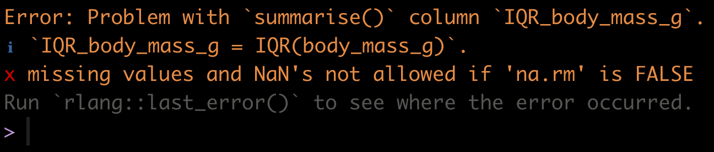

# Describing a single variable {#vis_describe}

```{r echo = FALSE}
knitr::opts_chunk$set(echo = TRUE)
options(knitr.table.format = "html")
```

**Tutorial learning objectives**

In this tutorial you will:  

* Learn how to calculate the main descriptor of a categorical variable: the **proportion**
* Learn how to calculate measures of centre and spread for a single numerical variable

## Load packages and import data {#desc_packages_data}

Let's load some packages first: 

```{r desc1_package1, message = FALSE}
library(tidyverse)
library(palmerpenguins)
library(skimr)
library(knitr)
```

And we're introducing a new package called `naniar`, which helps us deal more easily with missing values in datasets.

You may need to install that package (**recall** you only do this once!). Consult a [previous tutorial](#package_install) if you forget how.

Once you've installed it, load it:

```{r load_naniar, message = FALSE}
library(naniar)
```

We will use the following datasets in this tutorial:

* the `birds.csv` file contains counts of different categories of bird observed at a marsh habitat
* the `penguins` dataset that is available as part of the `palmerpenguins` package

```{r desc_import_birds}
birds <- read_csv("https://raw.githubusercontent.com/ubco-biology/BIOL202/main/data/birds.csv")
```

## Describing a categorical variable {#desc_cat_Var}

The *proportion* is the most important descriptive statistic for a categorical variable.  It measures the fraction of observations in a given category within a categorical variable. 

For example, the `birds.csv` file has a single variable called `type` that includes tallies (frequencies) of each of four categories of bird observed at a marsh habitat.

```{r desc_birds}
birds
```

The *proportion* of birds belonging to a given category is the same as the *relative frequency* of birds belonging to a given category. 

In a previous [tutorial](#vis_cat_freq_table), using the `tigerdeaths` dataset, we learned how to create a frequency table that included relative frequencies.

Let's use the same approach for the `birds` dataset. First we create the frequency table, then we display the table with an appropriate heading:

```{r desc_freq_table_birds}
birds.table <- birds %>%
  count(type, sort = TRUE) %>% 
  mutate(relative_frequency = n / sum(n))
```

<div class="note">
**NOTE**
If there are missing values ("NA") in the categorical variable, the preceding code will successfully enumerate those and create an "NA" category in the frequency table.
</div>

Now display the table:

```{r birds_table}
birds.table %>%
  kable(caption = "Frequency table showing the frequencies of each of four types of bird observed at a marsh habitat (N = 86)", digits = 3)
```

We can see, for example, that the proportion (relative frequency) of birds belonging to the "Predatory" category was `r as.numeric(birds.table[2,3])`.

We calculate proportions (relative frequencies) using the simple formula:  

$$\hat{p} = \frac{n_i}{N}$$
Where $$n_i$$ is the frequency of observations in the given category of interest _i_, and _N_ is total number of observations (sample size) across all categories.

<div class="note">
**Reminder**
Proportions, and thus relative frequencies, must be between 0 and 1.
</div>

## Describing a numerical variable {#desc_numeric_var}

Numeric variables are described with measures of **centre** and **spread**.

Before calculating descriptive statistics for a numeric variable, it is advisable to visualize its frequency distribution first. Why? Because characteristics of the frequency distribution will govern which measures of centre and spread are more reliable or representative.  

* If the frequency distribution is roughly symmetric and does not have any obvious outliers, then the __mean__ and the __standard deviation__ are the preferred measures of centre and spread, respectively

* If the frequency distribution is asymmetric and / or has outliers, the __median__ and the __inter-quartile range__ (IQR) are the preferred measures of centre and spread

It is often the case, however, that all four measures are presented together.

<div class="note">
**New tool**
Introducing the `summarise` function.
</div>

The `dplyr` package, which is loaded with the `tidyverse`, has a handy `summarise` (equivalently `summarize`) function for calculating descriptive statistics.  

Check out its help file by copying the following code into your command console:

```
?summarise
```

Let's use the `penguins` dataset for our demonstrations. 

The first step is to visualize the frequency distribution. Given that this is a numeric variable, we do this using a histogram, as we learned in a previous [tutorial](#vis_histogram).

```{r fig.cap = "Histogram of body mass (g) for 342 penguins", fig.width = 6, warning = FALSE}
ggplot(data = penguins, aes(x = body_mass_g)) +
  geom_histogram(binwidth = 500, colour = "black", fill = "lightgrey") +
  xlab("Body mass (g)") +
  ylab("Frequency") +
  theme_bw()
```

We are reminded that the distribution of body mass is moderately positively skewed and thus asymmetric, with a single mode near 3500g. There are no obvious outliers in the distribution.

This means that the **median** and **IQR** should be the preferred descriptors of centre and spread, respectively. 

### Calculating the median & IQR {#median_IQR}

So let's calculate the median and IQR of body mass for all penguins.  Let's provide the code, then explain after:

```
penguins %>%
  summarise(
   median_body_mass_g =  median(body_mass_g),
   IQR_body_mass_g = IQR(body_mass_g)
    )
```

Uh oh! If you tried to run this code, it would have given you an error: 

```{r fig.cap = "Error when functions encounter 'NA' values", echo = FALSE, fig.width = 5}

```

We forgot that when we [previously](#vis_data_overview) got an overview of the `penguins` dataset we discovered there were missing values ("NA" values)!

<div class="note">
**TIP**
If there are "NA" values in the variable being analyzed, some R functions, such as the function `median` or `mean`, will simply return "NA". To remedy this, we use the "na.rm = TRUE" argument.
</div>

Let's try our code again, adding the "na.rm = TRUE" argument.  And note that the key functions called within the `summarise` function are `median` and `IQR` (case sensitive!).

```{r desc_penguins_2}
penguins %>%
  summarise(
   Median =  median(body_mass_g, na.rm = TRUE),
   InterQR = IQR(body_mass_g, na.rm = TRUE)
    )
```

In the preceding code chunk, we have:

* The name of the tibble (here `penguins`) being used in the subsequent functions
* A pipe "%>% to tell R we're not done coding
* The `summarise` function (`summarize` will work too), telling R we're going to calculate a new variable
* The name we'll give to the first variable we're creating, here we call the variable "Median" (the "M" is capitalized to distinguish this variable name from the function `median`)
* And we define how to calculate the "Median", here using the `median` function
* We feed the variable of interest from the `penguins` tibble, "body_mass_g", to the `median` function, along with the argument "na.rm = TRUE"
* We end the line with a comma, telling R that we're not done providing arguments to the `summarise` function
* We do the same for the inter-quartile range variable we're creating called "InterQR", calculating the value using the `IQR` function, and this time no comma at the end of the line, because this is the last argument being provided to the `summarise` function
* We close out the parentheses for the `summarise` function

### Calculating the mean & standard deviation {#mean_sd}

Although the median and IQR are the preferred descriptors for the `body_mass_g` variable, it is nonetheless commonplace to report the mean and standard deviation also.

Let's do this, and while we're at it, include even more descriptors to illustrate how they're calculated.

This time we'll put the output from our `summarise` function into a table, and then present it in a nice format, like we learned how to do for a [frequency table](#vis_cat_freq_table).  

Let's create the table of descriptive statistics first, a tibble called "penguins.descriptors", and we'll describe what's going on after (**NOTE** this code chunk was edited slightly on Sept. 30, 2021): 

```{r desc_penguins_3}
penguins.descriptors <- penguins %>%
  summarise( 
  Mean = mean(body_mass_g, na.rm = T),
  SD = sd(body_mass_g, na.rm = T),
  Median = median(body_mass_g, na.rm = T),
  InterQR = IQR(body_mass_g, na.rm = T),
  Count = n() - naniar::n_miss(body_mass_g),
  Count_NA = naniar::n_miss(body_mass_g))
```

The first 4 descriptive statistics are self-explanatory based on their variable names.  

The last two: "Count" and "Count_NA" are providing the total number of complete observations in the `body_mass_g` variable (thus the number of observations that went into calculating the descriptive statistics), and then the total number of missing values (NAs) in the variable, respectively.

**ADDED OCTOBER 2, 2021**

The last two lines of code above require further explanation:

This code: `Count = n() - naniar::n_miss(body_mass_g))` tells R to first tally the total sample size using the `n()` function, then to subtract from that the total number of missing values, which is calculated using the `n_miss` function from the `naniar` package.  

The double colons in `naniar::n_miss(body_mass_g)` indicates that the function `n_miss` comes from the `naniar` package.  This syntax, which we have not used previously, provides a failsafe way to run a function even if the package is not presently loaded.

The same coding approach is used in the last line: `Count_NA = naniar::n_miss(body_mass_g)`.

* * *

<div class="note">
**TIP**
It is important to calculate the total number of complete observations in the variable of interest, because, as described in the [Biology Procedures and Guidelines document](https://ubco-biology.github.io/Procedures-and-Guidelines/figures-tables.html), this number needs to be reported in figure and table headings.
</div>

Now let's show the table of descriptive statistics, using the `kable` function we learned about in a previous tutorial.  

```{r desc_bodymass}
penguins.descriptors %>%
  kable(caption = "Descriptive statistics of measurements of body mass (g) for 342 penguins", digits = 3)
```

<div class="note">
**NOTE**
In another tutorial we'll learn how to present the table following all the guidelines in the [Biology Guidelines and Procedures document](https://ubco-biology.github.io/Procedures-and-Guidelines/figures-tables.html), including, for example, significant digits. For now, the preceding table is good!
</div>

1. **Descriptive statistics**: Create a histogram and table of descriptive statistics for the "flipper_length_mm" variable in the `penguins` dataset.

## Describing a numerical variable grouped by a categorical variable {#desc_numeric_var_cat}

In this tutorial you'll learn how to calculate descriptive statistics for a numerical variable grouped according to categories of a categorical variable.  

For example, a common scenario in biology is to want to calculate and report the mean and standard deviation of a response variable for different "treatment groups" in an experiment. (More commonly we would report the mean and standard error, but that's for a later tutorial!).

It is straightforward to modify the code we used in the preceding tutorial to do what we want.

Specifically, we use the `group_by` function from the `dplyr` package to tell R to do the calculations on the observations within each category of the grouping variable.

For example, let's describe penguin body mass grouped by "species".

We'll create a new tibble object called "penguins.descriptors.byspecies", and we insert one line of code using the `group_by` function, and telling R which categorical variable to use for the grouping (here, "species"):

```{r desc_penguins_grouped}
penguins.descriptors.byspecies <- penguins %>%
  group_by(species) %>%
summarise(
  Mean = mean(body_mass_g, na.rm = T),
  SD = sd(body_mass_g, na.rm = T),
  Median = median(body_mass_g, na.rm = T),
  InterQR = IQR(body_mass_g, na.rm = T),
  Count = n() - naniar::n_miss(body_mass_g),
  Count_NA = naniar::n_miss(body_mass_g))
```

It's that simple!

Let's have a look at the output:

```{r}
penguins.descriptors.byspecies
```

1. Use the `kable` function to output this new tibble in a nice format