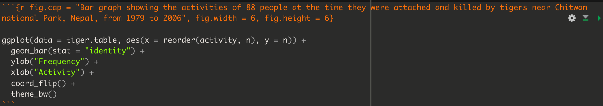

# (PART\*) Visualizing and Describing Data {-}

# Visualizing a single variable {#vis_variable}

```{r echo = FALSE}
knitr::opts_chunk$set(echo = TRUE)
options(knitr.table.format = "html")
```

**Tutorial learning objectives**

In this tutorial you will:  

* Revisit how to import data and get an overview of a "tibble" object
* Learn how to construct a frequency table
* Learn how to visualize the frequency distribution of a single categorical variable using a bar graph
* Learn how to visualize the frequency distribution of a single numerical variable using a histogram
* Learn how to describe a histogram

**Background** 

How to best visualize data depends upon (i) whether the data are **categorical** or **numerical**, and (ii) whether you're visualizing one variable or associations between two variables (we don't cover how to visualize associations between more than two variables). This tutorial focuses on visualizing a single variable. 

When visualizing a single variable, we aim to visualize a **frequency distribution**. A frequency distribution is the frequency with which unique data values occur in the dataset.

* If the variable is categorical, we can visualize the frequency distribution using a **bar graph**
* If the variable is numeric, we visualize the frequency distribution using a **histogram**

In this tutorial you'll learn to construct and interpret each of these types of visualization.  

## Load packages and import data {#vis_packages_data}

In this tutorial we will make use of `tidyverse` and its suite of packages, as well as the `skimr` package. You'll also use the `palmerpenguins` package that provides some penguin-related data to work with (see this [website](https://allisonhorst.github.io/palmerpenguins/) for more info). Lastly, you'll use the `knitr` package for helping create nice tables. The latter package should have come installed with RStudio, so check the "packages" tab in the bottom-right pane of RStudio to see if it's already installed.  If it's not, then install it following the instructions you [saw earlier](#package_install).

```{r vis1_package, message = FALSE}
library(tidyverse)
library(palmerpenguins)
library(skimr)
library(knitr)
library(janitor)
```

And we will use the following datasets in this tutorial:

* the `penguins` dataset that is available as part of the `palmerpenguins` package
* the `tigerdeaths.csv` file contains data associated with example 2.2A in the Whitlock and Schluter text
* the `birds.csv` file contains counts of different categories of bird observed at a marsh habitat

<div class="note">
Unless otherwise indicated, all <a href="https://ubco-biology.github.io/Procedures-and-Guidelines/glossary#Comma-separated-values-(CSV)-file">CSV data files</a> that we use in this course are stored at the same URL location, specifically: "https://raw.githubusercontent.com/ubco-biology/BIOL202/main/data/". Thus, to import any CSV file you just need to copy that path, then append the appropriate file name to the end of the path. For example, the full path to access the `birds.csv` file would be "https://raw.githubusercontent.com/ubco-biology/BIOL202/main/data/birds.csv". And a [previous tutorial](#import_csv_url) showed you how to import using the `read_csv` function.
</div>

## Get an overview of the data {#vis_data_overview}

The `penguins` object is a *tibble*, with each row representing a *case* and each column representing a *variable*.  Tibbles can store a mixture of data types: numeric variables, categorical variables, logical variables etc... all in the same object (as separate columns). This isn't the case with other object types (e.g. matrices).

We'll get an overview of the data using the `skim_without_charts` function, as we learned in the [Preparing and Importing Tidy Data](#data_overview) tutorial:

```{r vis1_skim}
penguins %>%
  skim_without_charts()
```

Optionally, we can also get a view of the first handful of rows of a tibble by simply typing the name of the object on its own, and hitting return:

```{r vis1_head}
penguins 
```

In a [previous tutorial](#data_overview) you learned the important information to look for when getting an overview of a dataset using the `skim_without_charts` function.

<div class="note">
**TIP**
It's important to check whether there are any missing values for any of the variables in your dataset. In the `penguins` dataset, you'll see from the `skim_without_charts` output that there are 344 cases (rows), but (as an example) there are 2 missing values for each of the 4 morphometric variables, including body mass. **You need to take note of this so that you report the correct sample sizes in any table or figure captions!**
</div>

Once you have gotten an overview your dataset's structure and contents, the next order of business is always to _visualize_ your data using graphs and sometimes tables. 

1.  **Import and data overview:** Following the instructions provided in previous tutorials, import the `tigerdeaths.csv` and `birds.csv` datasets, and get an overview of each of those datasets.

## Create a frequency table {#vis_cat_freq_table}

Sometimes when the aim is to visualize a single categorical variable, it's useful to present a *frequency table*. If your variable has more than, say, 10 unique categories, then this approach can be messy, and instead one should solely create a **bar graph**, as described in the next section.

Many straightforward operations like tabulation and calculating descriptive statistics can be done using the functionality of the `dplyr` package (see the cheatsheet [here](https://github.com/rstudio/cheatsheets/raw/master/data-transformation.pdf)), which gets loaded as part of the `tidyverse` suite of packages.

Here, we'll use this functionality to create a *frequency table* for a categorical variable.  

We'll demonstrate this  using the `tigerdeaths.csv` dataset that you should have imported as part of a suggested activity in the previous section, using code like this:

```{r vis1_read_tiger, message = FALSE}
tigerdeaths <- read_csv("https://raw.githubusercontent.com/ubco-biology/BIOL202/main/data/tigerdeaths.csv")
```

You would also have gotten [overview of the data](#vis_data_overview) as part of the activity, using the `skim_without_charts` function.  This would have shown that the `activity` variable is of type "character", which tells us it is a **categorical** variable, and that it includes 9 unique categories.  We also would have seen that there are 88 cases (rows) in the dataset.

Let's provide the code to generate the frequency table, using the pipes "%>%" approach we learned about in an [earlier tutorial](#import_csv_local).  We'll assign the output to a new object that will hold the frequency table.  We'll name the object "tiger.table".  Note that we won't yet view the table here... we'll do that next. 

We'll provide the code first, then explain it step-by-step after.  

Here's the code for creating the frequency table and assigning it to a new object named "tiger.table":

```{r vis1_freq_table_single_cat}
tiger.table <- tigerdeaths %>%
  count(activity, sort = TRUE) %>% 
  mutate(relative_frequency = n / sum(n)) %>%
  adorn_totals()
```

* The first line provides the name of the object (tibble) that we're going to create (here, "tiger.table"), and use the assignment operator ("<-") tell R to put whatever the output of our operation is into that object. The next part of the first line provides the name of the object that we're going to do something with, here "tigerdeaths". The "%>%" tells R that we're not done yet, and there's more lines of code to come.
* The second line uses the `count` function from the `dplyr` package to tally the unique values of a variable, in this case the "activity" variable. It also takes an argument "sort = TRUE", telling it to sort the counts in descending order (the default sort direction). Then another "%>%" to continue the code..
* The last line uses `mutate` function from the `dplyr` package that creates a new variable, and the arguments provided in the parentheses tells R what that variable should be called, here "relative_frequency", and then how to calculate it. 
* The `n` in the third line is a function that tallies the sample size or count of all observations in the present category or group, and then the `sum(n)` sums up the total sample size. Thus, `n / sum(n)` calculates the relative frequency (equivalent to the <a href="https://ubco-biology.github.io/Procedures-and-Guidelines/glossary#Proportion">proportion</a>) of all observations that are within the given category  
* the `adorn_totals` in the last line is a function from the `janitor` package that enables adding row and / or column totals to tables (see the help for this function for more details)

<div class="advanced">
Try figuring out how you would change the last line of code in the chunk above so that the table showed the _percent_ rather than the _relative frequency_ of observations in each category
</div>

Now that we've created the frequency table, let's have a look at it.

In a supplementary tutorial, you'll find instructions on how to create nicely formatted tables for output with appropriate captions. 

For now, let's go ahead and use the `kable` function that comes with the `knitr` package, using the pipe approach:

```{r vis_tigertable, echo = FALSE}
tiger.table %>%
  kable(caption = "Frequency table showing the activities of 88 people at the time they were attacked and killed by tigers near Chitwan national Park, Nepal, from 1979 to 2006", digits = 3, booktabs = TRUE)
```

```
tiger.table %>%
  kable(caption = "Frequency table showing the activities of 88 people at the time they were attacked and killed by tigers near Chitwan national Park, Nepal, from 1979 to 2006", digits = 3)
```

The key argument to the `kable` function is the table object (which here we provide before the pipe), and the table heading (caption).   

Notice that this produces a nicely formatted table with an appropriately worded caption. The argument "digits = 3" tells it to return numeric values to 3 digits in the table.

You now know how to create a frequency table for a categorical variable!

2. **Frequency table**: Try creating a frequency table using the `birds` dataset, which includes data about four types of birds observed at a wetland.

## Create a bar graph {#vis_cat_barchart}

We use a *bar graph* to visualize the frequency distribution for a single categorical variable.

We'll use the `ggplot` approach with its `geom_bar` function to create a bar graph. The `ggplot` function comes with the `ggplot2` package, which itself is loaded as part of the `tidyverse`.

To produce the bar graph, we use a frequency table as the input. Thus, let's repeat the creation of the "tiger.table" from the preceding section. 

```{r vis1_freq_table_single_cat2}
tiger.table <- tigerdeaths %>%
  count(activity, sort = TRUE) %>% 
  mutate(relative_frequency = n / sum(n)) %>%
  adorn_totals()
```

Recall that the "tiger.table" is a sort of summary presentation of the "activity" variable: 

```{r showtigerdable}
tiger.table
```

It shows the total counts (frequencies) of individuals in each of the nine "activity" categories.

And although in the code chunk below you'll see that we provide an "x" and a "y" variable for creating the graph, remember that we're really only visualizing a _single categorical variable_. 

Let's provide the code first, and explain after.

```{r fig.cap = "Bar graph showing the activities of 88 people at the time they were attached and killed by tigers near Chitwan national Park, Nepal, from 1979 to 2006", fig.width = 6, fig.height = 6}

ggplot(data = tiger.table, aes(x = reorder(activity, n), y = n)) + 
  geom_bar(stat = "identity") + 
  ylab("Frequency") +
  xlab("Activity") +
  coord_flip() +
  theme_bw()
```

All figures produced using the `ggplot2` package start with the `ggplot` function. Then the following arguments: 

* The tibble (or dataframe) that holds the data ("data = tiger.table")
* An "aes" argument (which stands for "aesthetics"), within which one specifies the variables to be plotted; here we're plotting the frequencies from the "n" variable in the frequency table as the "y" variable, and the "activity" categorical variable as the "x" variable. To ensure the proper sorting of the bars, we use the `reorder` function, telling R to reorder the `activity` categories according to the frequencies in the `n` variable
* Then there's a plus sign ("+") to tell the `ggplot` function we're not done yet with our graph - there are more lines of code coming (think of it as ggplot's version of the "pipe")
* Then the type of graph, which uses a function starting with "geom"; here we want a bar graph, hence `geom_bar`
* The `geom_bar` function has its own argument: "stat = 'identity'" tells it just to make the height of the bars equal to the values provided in the "y" variable, here `n`.
* The `ylab` function sets the y-axis label
* The `xlab` function sets the x-axis label
* The `coord_flip` function tells it to rotate the graph horizontally; this makes it easier to fit the activity labels on the graph
* Then the `theme_bw` function indicates we want a simple black-and-white theme

There you have it: a nicely formatted bar graph!

**REMINDER** Don't forget to include a good figure caption! Here's a snapshot of the full code chunk that produced the bar graph above:

```{r fig.cap = "Example code chunk for producing a good bar graph", echo = FALSE, fig.width = 5}

```

3. **Bar graph**: Try creating a bar graph using the `birds` dataset, which includes data about four types of birds observed at a wetland.

## Create a histogram {#vis_histogram}

A __histogram__ uses the area of rectangular bars to display the frequency distribution (or relative frequency distribution) of a numerical variable.

We'll use `ggplot` to create a histogram, and we'll again use the `penguins` dataset.

We'll give the code first, then explain below: 

```{r fig.cap = "Histogram of body mass (g) for 342 penguins", fig.width = 6, warning = FALSE}

ggplot(data = penguins, aes(x = body_mass_g)) +
  geom_histogram(colour = "black", fill = "lightgrey") +
  xlab("Body mass (g)") +
  ylab("Frequency") +
  theme_bw()
```

The syntax follows what was seen above when creating a bar graph, but: 

* Here we have only a single variable "x" variable, `body_mass_g` to provide the `aes` function.
* We use the `geom_histogram` function, which has its own optional arguments:
    - the "color" we want the outlines of each bar in the histogram to be
    - the "fill" colour we want the bars to be
    
You can also specify the "bin width" that `geom_histogram` uses when generating the histogram. Notice above that we got a message stating:

```
## `stat_bin()` using `bins = 30`. Pick better value with `binwidth`.
```

It's telling us that there's probably a better bin width to use. The trick is to not have to small a bin width, such that you end up with too many bars in your histogram (giving too much detail in the frequency distribution), and to not have too large a bin width such that you have too few bars in your histogram (giving too little detail). 

The `hist` function that comes with base R (so no need to load a package) has an algorithm that typically chooses good bin widths.  To remove some of the subjectivity from this procedure, let's leverage that function to figure out the best bin widths.

We'll provide the code then explain after:

```{r vis1_get_hist_info}
penguins.hist.info <- hist(penguins$body_mass_g, plot = FALSE)
```

In the chunk above, we have: 

* The "penguins.hist.info" is the name we'll give to the object we're going to create, and the assignment operator "<-" is telling R to put whatever the output from the function is into that new object
* The `hist` function takes the variable you want to generate a histogram function for. And in this case, it's the `body_mass_g` variable in the `penguins` tibble. 
* The dollar sign allows you to specify the tibble name along with the variable name: "penguins$body_mass_g".
* The "plot = FALSE" tells the function we don't wish to produce the actual histogram, and as a consequence the function instead gives us the information that would have gone into creating the histogram, including for example the break points for the histogram bins. It packages this information in the form of a "list", which is one type of object.

Let's look at the info stored in the list object:

```{r vis1_get_binwidths}
penguins.hist.info
```

We won't worry about all the information provided here. Instead just notice that the first variable in the list is "breaks". Specifically, this provides us all the "break points" for the histogram for the given variable; break points are the values that delimit the bins for the histogram bars.  

That's the information we can use to get the ideal bin width: the difference between consecutive breaks is our desired bin width!

In this example it's easy to see that the bin width was 500.  But lets provide code to calculate it and thus make sure it's reproducible. We simply need to calculate the difference between any two consecutive break points (they will all be equal in magnitude):

```{r vis1_break_calc}
penguins.hist.info$breaks[2] - penguins.hist.info$breaks[1]
```

The above code simply asks R to calculate the difference (using the subtraction sign) between the second element of the "breaks" variable, denoted using the square brackets "breaks[2]", and the first element "breaks[2]". 

And R returns `r penguins.hist.info$breaks[2] - penguins.hist.info$breaks[1]`.  That's the bin width we want to use!

So let's edit the original histogram code to include the "binwidth" argument in the `geom_histogram` function, as follows:

```{r fig.cap = "Histogram of body mass (g) for 342 penguins", fig.width = 6, warning = FALSE}

ggplot(data = penguins, aes(x = body_mass_g)) +
  geom_histogram(binwidth = 500, colour = "black", fill = "lightgrey") +
  xlab("Body mass (g)") +
  ylab("Frequency") +
  theme_bw()
```

There we go! Now we need to learn how to describe and interpret a histogram...

## Describing a histogram {#vis_describe_hist}

Things to note in your description of a histogram:

* Is it roughly symmetric or is it negatively or positively skewed?
* Is it roughly bell-shaped?
* Outliers - are there observations (bars) showing up far from the others?
* Are there multiple <a href="https://ubco-biology.github.io/Procedures-and-Guidelines/glossary#Mode">modes</a>?

So, let's look again at the penguin body mass histogram, and provide a description thereafter:

```{r fig.cap = "Histogram of body mass (g) for 342 penguins", fig.width = 6, warning = FALSE}

ggplot(data = penguins, aes(x = body_mass_g)) +
  geom_histogram(binwidth = 500, colour = "black", fill = "lightgrey") +
  xlab("Body mass (g)") +
  ylab("Frequency") +
  theme_bw()
```

The histogram is moderately positively skewed and thus asymmetric, with a single mode near 3500g. There are no obvious outliers in the distribution. 

1. **Histogram**: Create a histogram of the bill lengths of penguins in the `penguins` dataset, and include an appropriate figure caption. Then provide a description of what you see.

