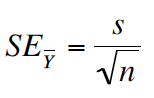

# (PART\*) Inferential Statistics {-}

# Sampling, Estimation, & Uncertainty {#estimation}

```{r echo = FALSE}
knitr::opts_chunk$set(echo = TRUE)
options(knitr.table.format = "html")
```

**Tutorial learning objectives**

In this tutorial you will:  

* Learn how to take a random sample of observations from a dataset
* Learn through simulation what "sampling error" is
* Learn about sampling distributions through simulation 
* Learn how to calculate the standard error of the mean
* Learn how to calculate the "rule of thumb 95% confidence interval"

## Load packages and import data {#estimation_packages_data}

Let's load some familiar packages first: 

```{r est_package, message = FALSE}
library(tidyverse)
library(naniar)
library(knitr)
library(skimr)
```

We will also need a new package called `infer`, so install that package using the procedure you [previously learned](#package_install), then load it:

```{r est_package2, message = FALSE}
library(infer)
```

**Import Data** 

For this tutorial we'll use the human gene length dataset that is used in Chapter 4 of the Whitlock & Schluter text. 

The dataset is described in example 4.1 in the text.

Let's import it:

```{r est_read_data}
genelengths <- read_csv("https://raw.githubusercontent.com/ubco-biology/BIOL202/main/data/humangenelength.csv")
```

**Get an overview of the data** 

We'll use `skim_without_charts` to get an overview: 

```{r est_overview}
genelengths %>%
  skim_without_charts()
```

The "size" variable is the key one: it includes the gene lengths (number of nucleotides) for each of the `r nrow(genelengths)` genes in the dataset.  

## Functions for sampling {#sampling_functions}

To illustrate the concepts of "sampling error" and the "sampling distribution of the mean", we're going to make use of datasets that include measurements for all individuals in a "population" of interest, and we're going to take random samples of observations from those datasets. This mimics the process of sampling at random from a population.

There are two functions that are especially helpful for taking random samples from objects. 

* The `sample` function in the base R package is easy to use for taking a random sample from a **vector** of values. Look at the help function for it:

```
?sample
```

The second useful function is the `slice_sample` function from the `dplyr` package (loaded with `tidyverse`). This function takes random samples of rows from a **dataframe** or **tibble**.

```
?slice_sample
```

Note that both functions have a `replace` argument that dictates whether the sampling we conduct occurs with or without replacement. For instance, the following code will not work (try copying and pasting into your console):  

```
sample(1:6, size = 10, replace = F)
```

Here we're telling R to sample 10 values from a vector that includes only 6 values (one through six), and with the `replace = F` argument we told R not to put the sampled numbers back in the pile for future sampling.  

If instead we specified `replace = T`, as shown below, then we be conducting *sampling with replacement*, and sampled values are placed back in the pool each time, thus enabling the code to work (try it):  

```
sample(1:6, size = 10, replace = T)
```

<div class="note">
**NOTE**
Most of the time we wish to *sample without replacement*, hence `replace = F`.
</div>

### Setting the "seed" for random sampling {#setseed}

Functions such as `sample` and `slice_sample` have a challenge to meet: they must be able to take samples that are as as random as possible. On a computer, this is easier said then done; special algorithms are required to meet the challenge. R has some pretty good ones available, so we don't have to worry about it (though to be honest, they can only generate "pseudorandom" numbers, but that's good enough for our purposes!).

However, we DO need to worry about *computational reproducibility*. 

Imagine we have authored a script for a research project, and the script makes use of functions such as `sample`.  Now imagine that someone else wanted to re-run our analyses on their own computer.  Any code chunks that included functions such as `sample` would produce different results for them, because the function takes a different random sample each time it's run!

Thankfully there's a way to ensure that scripts implementing random sampling can be computationally reproducible: we can use the `set.seed` function.

<div class="note">
**NOTE**
This assumes you are using R version 4 or later (e.g. 4.1). The `set.seed` function used a different default algorithm in versions of R prior to version 4.0.
</div>

Let's provide the code chunk then explain after:

```{r show_set_seed, message = FALSE, warning = FALSE}
set.seed(12)
```

The `set.seed` function requires an integer value as an argument. You can pick any number you want as the seed number. Here we'll use 12, and if you do too, you'll get the same results as in the tutorial.

Let's test this using the `runif` function, which generates random numbers between user-designated minimum and maximum values (the default is numbers between zero and one).

Let's include the `set.seed` function right before using the `runif` function, and here we'll use a seed number of 15.

```{r show_runif, message = FALSE, warning = FALSE}
set.seed(15)
runif(3)
```

Here we told the `runif` function to generate three random numbers, and it used the default minimum and maximum values of zero and one.  

Now let's try a different seed:

```{r show_runif2, message = FALSE, warning = FALSE}
set.seed(25)
runif(3)
```

So long as you used the same seed number, you should have gotten the same three random numbers as shown above.

<div class="note">
**IMPORTANT**
When you are authoring your own script or markdown document (e.g. for a research project), it is advisable to only set the seed once, at the beginning of your script or markdown document. When you run or knit your completed script/markdown, the seed will be set at the beginning, the code chunks will run in sequence, and each chunk that uses a random number generator will do so in a predictable way (based on the seed number). The script will be computationally reproducible. In contrast, when we're trying out code (e.g. when working on tutorial material), we aren't running a set sequence or number of code chunks, so we can't rely on everyone getting the same output for a particular code chunk.  For this reason you'll see in the tutorial material that many of the code chunks that require use of a random number generator will include a `set.seed` statement, to ensure that everyone gets the same output from that specific code chunk (this isn't always required, but often it is). 
</div>

1. Generate 10 random numbers using the `runif` function, and first set the seed number to 200. 

## Sampling error {#sampling_error}

> **Sampling error** is the chance difference, caused by sampling, between an estimate and the population parameter being estimated

Here we'll get a feel for **sampling error** using the human gene data. 

Let's use the `slice_sample` function to randomly sample sample _n_ = 20 rows from the `genelengths` tibble, and store them in a tibble object called "randsamp1": 

```{r samp_genes1, message = FALSE, warning = FALSE}
set.seed(12)
randsamp1 <- genelengths %>%
  slice_sample(n = 20, replace = FALSE) %>%
  select(size)
```

In the preceding chunk, we:

* set the seed (here using integer 12), so that everyone gets the same output for this code chunk
* tell R that we want the output from our code to be stored in an object named "randsamp1"
* use the `slice_sample` function to randomly sample 20 rows from the `genelengths` tibble, and to do so without replacement
* use the `select` function to tell R to return only the "size" variable from the newly generated (sampled) tibble 

Now let's use the `mean` and `sd` base functions to calculate the mean and standard deviation using our sample.

We'll assign the calculations to an object "randsamp1.mean.sd", then we'll present the output using the `kable` function. 

```{r randsamp1_descr}
randsamp1.mean.sd <- randsamp1 %>%
  summarise(
    Mean_genelength = mean(size, na.rm = TRUE),
    SD_genelength = sd(size, na.rm = TRUE)
  )
```

Now present the output using the `kable` function so we can control the maximum number of digits shown. 

<div class="note">
**TIP**
Using the `kable` approach to presenting tibble outputs ensures that, when knitted, your output shows a sufficient number of decimal places... something that doesn't always happen without using the `kable` function. 
</div>

```{r show_table1}
kable(randsamp1.mean.sd, digits = 4)
```

Do your numbers match those above?

Let's now draw another random sample of the same size (20), making sure to give the resulting tibble object a different name ("randsamp2"). Here, we won't set the seed again, because all that is required is for everyone to get a different sample from the first one above; we don't need to have everyone get the _same_ sample, but it's ok if we do.

```{r samp_genes2}
randsamp2 <- genelengths %>%
  slice_sample(n = 20, replace = FALSE) %>%
  select(size)
```

And calculate the mean and sd:
```{r randsamp2_descr}
randsamp2.mean.sd <- randsamp2 %>%
  summarise(
    Mean_genelength = mean(size, na.rm = TRUE),
    SD_genelength = sd(size, na.rm = TRUE)
  )
```

And show using the `kable` function: 

```{r show_table2}
kable(randsamp2.mean.sd, digits = 4)
```

Are they the same as we saw using the first random sample?  NO! This reflects __sampling error__.

1. Repeat the process above to get a third sample of size 20 genes, and calculate the mean and standard deviation of gene length for that sample.

## Sampling distribution of the mean {#sampdistmean}

Now let's learn code to conduct our own resampling exercise.

Let's repeat the sampling exercise we did in the preceding section concerning [sampling error](#sampling_error), but this time repeat it many times, say 10000 times.

We'll also calculate the mean gene length for each sample that we take, and store this value.

For this, we'll use the newly installed `infer` package, and its handy function `rep_slice_sample`, which complements the `slice_sample` function we've used before. 

Let's look at the code then explain after: 

```{r sample_means}
gene.means.n20 <- genelengths %>%
  rep_slice_sample(n = 20, replace = FALSE, reps = 10000) %>%
  summarise(
    mean_length = mean(size, na.rm = T),
    sampsize = as.factor(20)
  )
```

In the above chunk, we:

* Tell R to put the output from our functions into a new tibble object called "gene.means.n20", with the "n20" on the end denoting the fact that we used a sample size of 20 for these samples
* use the `rep_slice_sample` function to sample n = 20 rows at random from the `genelengths` tibble, and repeat this "reps = 10000" times
* next we use the familiar `summarise` function to then create a new variable "mean_length", which in the next line we define as the mean of the values in the "size" variable (and recall, at this point we have a sample of 20 of these)
* we also create a new categorical (factor) variable "sampsize" that indicates what sample size we used for this exercise, and we store it as a factor rather than a number (we're doing this because it will come in handy later)

Let's look at the first handful of rows in the newly created tibble:

```{r see_sample_means}
gene.means.n20
```

We see that it is a tibble with 10000 rows and three columns: a variable called "replicate", which holds the numbers one through the number of replicates run (here, 10000), a variable "mean_length" that we created, which holds the sample mean gene length for each of the replicate samples we took, and a variable "sampsize" that tells us the sample size used for each sample (here, 20).

<div class="note">
**Pause**
If we were to plot a histogram of these 10000 sample means, what shape do you think it would have? And what value do you think it would be centred on?
</div>

### Visualize the sampling distribution {#hist_samdist}

Let's plot a histogram of the 10000 means that we calculated.

First, to figure out what axis limits we should set for our histogram, let's get an idea of what the mean gene length values look like:

```{r view_means}
gene.means.n20 %>%
 skim_without_charts(mean_length)
```

OK, so we see that the minimum and maximum values are `r min(gene.means.n20$mean_length)` (under the "p0" heading) and `r max(gene.means.n20$mean_length)` (under the "p100" heading). So this can inform our x-axis limits when constructing the histogram (note that you typically need to try out different maximum values for the y-axis limits).

Let's first remind ourselves what the true mean gene length is in the entire population of genes. We'll assign the output to an object "true.mean.length" and a variable called "Pop_mean", then show using the `kable` approach.

```{r get_true_mean_gene}
true.mean.length <- genelengths %>%
  summarise(
    Pop_mean = mean(size, na.rm = TRUE)
  )
```

Show using `kable`: 

```{r}
kable(true.mean.length, digits = 4)
```

Now let's plot the histogram of 10000 sample means: 

```{r fig.cap = "Approximate sampling distribution of mean gene lengths from the human genome (10000 replicate samples of size 20).", fig.width = 4, fig.height = 4, warning = FALSE}

gene.means.n20 %>%
ggplot(aes(x = mean_length)) +
  geom_histogram(binwidth = 250, color = "black", fill = "lightgrey") +
  ylim(0, 1700) +
  xlim(1500, 10000) +
  xlab("Gene length (nucleotides)") +
  ylab("Number of genes") +
  theme_bw()
```

This histogram is an approximation of the **sampling distribution of the mean** for a sample size of 20 (to construct a real sampling distribution we'd need to take an infinite number of replicate samples). 

Before interpreting the histogram, let's first calculate the mean of the 10000 sample means, then display using the `kable` approach:

```{r get_sampmean_genes}
sample.mean.n20 <- gene.means.n20 %>%
  summarise(
    Sample_mean = mean(mean_length, na.rm = TRUE)
  )
```

Show using `kable`:

```{r}
kable(sample.mean.n20, digits = 4)
```

Note that the mean of the sample means is around `r round(mean(sample.mean.n20$Sample_mean, na.rm = TRUE), 0)`, which is pretty darn close to the true population mean of `r round(mean(genelengths$size, na.rm = TRUE), 0)`. 

This reflects the fact that, provided a good random sample, the sample mean is an **unbiased estimate** of the true population mean.

Now, let's interpret the histogram:

* The vast majority of means are centred around the true population mean (around 3500)
* The frequency distribution unimodal, but is right (positively) skewed; it has a handful of sample means that are very large

The latter characteristic reflects the fact that the population of genes includes more than 100 genes that are extremely large. When we take a random sample of 20 genes, it is possible that - just by chance - our sample could include one or more of the extremely large genes in the population, and this would of course inflate the magnitude of our mean gene length in the sample. 

Let's repeat this sampling exersize using a larger sample size, say 50.

```{r sample_means_50}
gene.means.n50 <- genelengths %>%
  rep_slice_sample(n = 50, replace = FALSE, reps = 10000) %>%
  summarise(
    mean_length = mean(size, na.rm = T),
    sampsize = as.factor(50)
  )
```

Now plot a histogram, making sure to keep the x- and y-axis limits the same as we used above, so that we can compare the outputs

```{r warning = FALSE, message = FALSE, fig.cap = "Approximate sampling distribution of mean gene lengths from the human genome (10000 replicate samples of size 50).", fig.width = 4, fig.height = 4}

gene.means.n50 %>%
ggplot(aes(x = mean_length)) +
  geom_histogram(binwidth = 250, color = "black", fill = "lightgrey") +
  xlim(1500, 10000) +
  xlab("Gene length (nucleotides)") +
  ylab("Number of genes") +
  theme_bw()
```

Notice that there is much less positive skew to this frequency distribution.

Let's produce a figure that allows us to directly compare the two sampling distributions.

First we need to combine the data into one tibble.

<div class="note">
**New tool**
We can merge two tibbles (or data frames) together by rows using the `bind_rows` function from the `dplyr` package
</div>

The `bind_rows` function will simply append one object to another by rows. This requires that the two (or more) objects each have the same variables.  In our case, the two objects have the same three variables.

```{r bind_data}
gene.means.combined <- bind_rows(gene.means.n20, gene.means.n50)
```

Now we have what we need to produce a graph that enables direct comparison of the two sampling distributions.

**NOTE** This type of graph is not something you'll need to be able to do for assignments!

```{r warning = FALSE, message = FALSE, fig.cap = "Approximate sampling distributions of mean gene lengths from the human genome, using sample sizes of 20 and 50 (10000 replicate samples in each distribution).", fig.width = 4, fig.height = 4}

gene.means.combined %>%
 ggplot(aes(x = mean_length, fill = as.factor(sampsize))) +
  geom_histogram(position = 'identity', colour = "darkgrey", alpha = 0.5, binwidth = 250) +
  scale_fill_manual(values=c("#999999", "#E69F00", "#56B4E9")) +
  xlab("Gene length (nucleotides)") +
  ylab("Number of genes") +
  theme_bw() +
  theme(legend.position = "top") +
  guides(fill = guide_legend(title = "Sample size"))
```

We can see that the smaller sample size (20) yields a broader sampling distribution, and though it's a difficult to see, it also exhibits a longer tail towards larger gene lengths. 

With larger sample sizes, we'll get more precise estimates of the true population mean!

1. Follow this [online tutorial](http://www.zoology.ubc.ca/~whitlock/Kingfisher/SamplingNormal.htm) that helps visualize the construction of a sampling distribution of the mean 

## Standard error of the mean {#sem_page}

This is the formula for calculating the __standard error of the mean__ when the population parameter <sigma> is unknown (which is usually the case):



This is one measure of uncertainty that we report alongside our sample-based estimate of the population mean.

It represents the standard deviation of the sampling distribution of the mean. Thus, it is a measure of spread for the sampling distribution of the mean. 

**Calculating the SEM in R**

To illustrate how to calculate the SEM, we'll make use of the gene length dataset again.

Let's take a random sample of 20 genes, making sure to set the seed this time so everyone gets the same result. We'll use a seed number of 29, and we'll save our sample of values from the variable "size" in an object (tibble) called "newsamp.n20":

```{r samp1_descr}
set.seed(29)
newsamp.n20 <- genelengths %>%
  slice_sample(n = 20, replace = FALSE) %>%
  select(size)
```

Now let's show the code for calculating the SEM for the mean calculated using values in the "size" variable from our "newsamp.n20" object. We'll output stats to a new object "newsamp.n20.stats" then display the object using `kable`.

```{r samp1_descr_sem}
newsamp.n20.stats <- newsamp.n20 %>%
  summarise(
    Count = n() - naniar::n_miss(size),
    Mean_genelength = mean(size, na.rm = TRUE),
    SD_genelength = sd(size, na.rm = TRUE),
    SEM = SD_genelength/sqrt(Count)
  )
```

You've seen all but the last lines of code before! Importantly, as we've seen [before](#mean_sd), the "Count" variable, calculatedusing the `n` function in combinatin with the `n_miss` function from the `naniar` package, tallies the number of non-missing observations in the variable of interest (here, "size"). This is the sample size that we'll need for the calculation of the SEM. 

The last line creates a new variable "SEM" that is calculated using the formula shown above, and inputs from the previous lines' calculations. 

Specifically, the sample size "n" value comes from the "Count" variable, and the "s" value comes from the "SD_genelength" variable. And lastly, we use the `sqrt` function to take the square-root of the sample size.

Display the output:

```{r shownewsamp}
kable(newsamp.n20.stats, digits = 4)
```

If you wish to calculate and report only the mean and SEM for a variable (here, the "size" variable from our tibble "newsamp.n20"):

```{r simple_SEM}
newsamp.n20.stats.short <- newsamp.n20 %>%
  summarise(
    Mean_genelength = mean(size, na.rm = TRUE),
    SEM = sd(size, na.rm = TRUE)/sqrt(n() - naniar::n_miss(size))
  )
```

Display the output:

```{r shownewsamp2}
kable(newsamp.n20.stats.short, digits = 4)
```

<div class="note">
**TIP**
It is a good idea to use the longer approach that reports the sample size ("Count"), mean, standard deviation, and SEM. Why? Because in this way you're reporting each value (*n* and *s*) that goes into the calculation of the SEM.
</div>

## Rule of thumb 95% confidence interval {#confint_rough}

The __Rule of Thumb__ 95% confidence interval is calculated simply as the sample mean +/- two standard errors. 

Thus, the __lower confidence limit__ is calculated as the sample mean minus 2 times the standard error, and the __upper confidence limit__ is calculated as the sample mean plus 2 times the standard error. 

We can re-use code from the previous section for the calculations, and we'll assign the output to a new object called "newsamp.n20.allstats": 

```{r more_SEM}
newsamp.n20.allstats <- newsamp.n20 %>%
  summarise(
    Count = n() - naniar::n_miss(size),
    Mean_genelength = mean(size, na.rm = TRUE),
    SD_genelength = sd(size, na.rm = TRUE),
    SEM = SD_genelength/sqrt(Count),
    Lower_95_CL = Mean_genelength - 2 * SEM,
    Upper_95_CL = Mean_genelength + 2 * SEM
  )
```


We've added two lines of code, one for the lower confidence limit and one for the upper confidence limit.

Notice that we again use calculations completed in preceding lines as input for the subsequent lines. Specifically, we use the "Mean_genelength" value and the "SEM" value in our confidence limit calculations. 

The asterisk (*) denotes multiplication.

Let's look at the output:

```{r new_allstats}
kable(newsamp.n20.allstats, digits = 4)
```

<div class="note">
**IMPORTANT:**  
If you were asked to report the rule-of-thumb 95% confidence **interval**, then you'd use the output from your calculations above to report:  
**`r round(newsamp.n20.allstats$Lower_95_CL, 3)` < $\mu$ < `r round(newsamp.n20.allstats$Upper_95_CL, 3)`**  
Note that it is the population parameter being estimated, $\mu$, that appears in between the lower and upper limits.
</div>

__NOTE__: In a later tutorial you'll learn how to calculate actual confidence intervals, rather than "rule of thumb" confidence intervals

