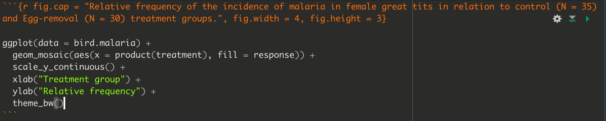

# Visualizing associations between two variables {#vis_twovar}

```{r echo = FALSE}
knitr::opts_chunk$set(echo = TRUE)
options(knitr.table.format = "html")
```

**Tutorial learning objectives**

In this tutorial you will:  

* Learn how to visualize associations between two categorical variables using a contingency table
* Learn how to visualize associations between two categorical variables graphically
* Learn how to visualize associations between two numerical variables
* Learn how to visualize associations between a numerical response variable and a categorical explanatory variable

**Background**

The type of graph that is most suitable for visualizing an association between two variables depends upon the type of data being visualized:  

* If both variables are categorical, we can visualize the association in a table called a **contingency table**, or we can visualize the association graphically using a **grouped bar chart** or a **mosaic plot**
* If both variables are numeric, we visualize the association graphically using a **scatterplot**
* If the response variable is numerical and the explanatory variable is categorical, we visualize the association graphically using a **strip chart**, **boxplot**, or variations on these
* We do not discuss the scenario where the response variable is categorical and the explanatory variable is numerical

In this tutorial you'll learn to construct and interpret each of these types of visualization.  In later tutorials you'll learn how to conduct statistical analyses of these associations.  

## Load packages and import data {#vis2_packages_data}

Let's load some familiar packages first: 

```{r desc1_package, message = FALSE}
library(tidyverse)
library(palmerpenguins)
library(knitr)
library(skimr)
```

We also need the `janitor` package, the `ggmosaic` package, and the `ggExtra` packages, and these are likely to be new to you.  Check whether these packages are installed under the "packages" tab in the bottom-right panel in RStudio. If they are not yet installed, then [install them](#package_install). **Only install them once on your computer!**

Load the packages:

```{r load_janitor}
library(janitor)
library(ggmosaic)
library(ggExtra)
```

**Import Data** 

We'll again make use of the `penguins` dataset, which gets loaded as a "tibble" object with the `palmerpenguins` package.

Import the `locusts.csv` data, which are described in the Whitlock & Schluter text, Figure 2.1-2.  We'll create a tibble called `locust`. 

```{r vis2_read_data}
locust <- read_csv("https://raw.githubusercontent.com/ubco-biology/BIOL202/main/data/locust.csv")
```

Import the `bird.malaria.csv` data, which are described in the Whitlock & Schluter text, Example 2.3A (p. 40). We'll create a tibble called `bird.malaria`.

```{r vis2_read_data2}
bird.malaria<- read_csv("https://raw.githubusercontent.com/ubco-biology/BIOL202/main/data/bird_malaria.csv")
```

1. Get an overview of the `locust` and `bird.malaria` tibbles.

## Visualizing association between two categorical variables {#vis2_2cat}

We'll cover three ways to visualize associations between two categorical variables:

* a __contingency table__ 
* a __grouped bar graph__
* a __mosaic plot__

### Constructing a contingency table {#vis2_cont_table}

<div class="note">
**New tool**
The `tabyl` function from the `janitor` package is useful for creating contingency tables, or more generally, cross-tabulating frequencies for multiple categorical variables.
</div>

You can check out more about the `tabyl` function at this [vignette](https://cran.r-project.org/web/packages/janitor/vignettes/tabyls.html).

Let's use the `bird.malaria` dataset for our demonstration. 

If you got an overview of the dataset, as suggested as part of the activity in the preceding section, you would have seen that the `bird.malaria` tibble includes two categorical variables: `treatment` and `response`, each with 2 categories.  

The dataset includes `r nrow(bird.malaria)` rows.  Each row corresponds to an individual (unique) bird.  Thirty of the birds were randomly assigned to the "Control" treatment group, and 35 were randomly assigned to the "Egg removal" treatment group.

The `response` variable includes the categories "Malaria" and "No Malaria", indicating whether the bird contracted Malaria after the treatment.

Our goal is to visualize the frequency of birds that fall into each of the four unique combinations of category: 

* Control + No Malaria
* Control + Malaria
* Egg removal + No Malaria
* Egg removal + Malaria

More specifically, we are interested in comparing the incidence of malaria among the Control and Egg removal treatment groups.  We'll learn in a later tutorial how to conduct this comparison statistically.

Let's provide the code, then explain after. We'll again make use of the `kable` function from the `knitr` package to help present a nice table. So first we create the table ("bird.malaria.table"), then in a later code chunk we'll output a nice version of the table using the `kable` function.

First create the basic contingency table: 

```{r malaria_contingency1}
bird.malaria.freq <- bird.malaria %>%
  tabyl(treatment, response)
```

Code explanation:  

* the first line is telling R to assign any output from our commands to the object called "bird.malaria.freq" 
* the first line is also telling R that we're using the `bird.malaria` object as input to our subsequent  functions, and the pipe (%>%) tells R there's more to come. 
* the second line uses the `tabyl` function, and we provide it with the names of the variables from the `bird.malaria` object that we want to use for tabulating frequencies. Here we provide the variable names "treatment", and "response" 

Let's look at the table:
```{r show_malaria}
bird.malaria.freq
```

It is typically a good idea to also include the row and column totals in a contingency table.

To do this, we use the `adorn_totals` function, from the `janitor` package, as follows, and we'll create a new object called "bird.malaria.freq.totals":

```{r peng_contingency1}
bird.malaria.freq.totals <- bird.malaria %>%
  tabyl(treatment, response) %>%
  adorn_totals(where = c("row", "col"))
```

* the last line tells the `adorn_totals` function that we want to add the row and column totals to our table

Now let's see what the table looks like before using the `kable` function. To do this, just provide the name of the object:

```{r show_cont_table}
bird.malaria.freq.totals
```

Now let's use the `kable` function to improve the look, and add a table heading.

<div class="note">
**NOTE**
We are still finalizing the tutorial describing how to provide a Table heading.
</div>

```{r vismalaria}

bird.malaria.freq.totals %>%
  kable(caption = "Contingency table showing the incidence of malaria in female great tits in relation to experimental treatment", booktabs = TRUE)
```

**Relative frequencies**

Often it is useful to also present a contingency table that shows the *relative frequencies*.  However, it's important to know how to calculate those relative frequencies.

For instance, recall that in this malaria example, we are interested in comparing the incidence of malaria among the Control and Egg removal treatment groups. Thus, we should calculate the relative frequencies using the **row totals**. This will become clear when we show the table.  

We can get relative frequencies, which are equivalent to <a href="https://ubco-biology.github.io/Procedures-and-Guidelines/glossary#Proportion">proportions</a>, using the `adorn_percentages` function (the function name is a misnomer, because we're calculating proportions, not percentages!), and telling R to use the row totals for the calculations.

First create the new table object "bird.malaria.prop":

```{r}
bird.malaria.prop <- bird.malaria %>%
  tabyl(treatment, response) %>%
    adorn_percentages("row")
```

Now present it using `kable`:

```{r vismalariaprop}

bird.malaria.prop %>%
  kable(caption = "Contingency table showing the relative frequency of malaria in female great tits in relation to experimental treatment", booktabs = TRUE)
```

### Constructing a grouped bar graph {#grouped_bar_graphs}

To construct a grouped bar graph, we first need _wrangle_ (reformat) the data to be in the form of a [**frequency table**](#vis_cat_freq_table).

Let's revisit what the `bird.malaria` tibble looks like:

```{r}
bird.malaria
```

To wrangle this into the appropriate format, here's the appropriate code:

```{r}
bird.malaria.tidy <- bird.malaria %>%
  group_by(treatment) %>%
  count(response)
```

This is similar to what you learned in a [previous tutorial](#vis_cat_freq_table), but here we've added a new function!

<div class="note">
**New tool**
The `group_by` function from the `dplyr` package enables one to apply a function to each category of a categorical variable.  See more help using "?group_by".
</div>

In the preceding code chunk, we're tallying the observations in the two "treatment" variable categories, but also keeping track of which category of "response" the individual belongs to.

Let's have a look at the result:

```{r}
bird.malaria.tidy
```

We now have what we need for a grouped bar chart, using the `ggplot` function:

```{r malaria_barchart1}
ggplot(data = bird.malaria.tidy, aes(x = treatment, y = n, fill = response)) + 
  geom_bar(stat = "identity", position = position_dodge()) + 
  ylab("Frequency") +
  xlab("Treatment group") +
  theme_bw()
```

This code is similar to what we used [previously to create a bar graph](#vis_cat_barchart), but there are two key differences:   

* in the first line within the `aes` function, we include a new argument `fill = response`, telling R to use different bar fill colours based on the categories in the "response" variable.  
* in the second line, we provide a new argument to the `geom_bar` function: `position = position_dodge()`, which tells R to use separate bars for each category of the "fill" variable (if we did not include this argument, we'd get a "stacked bar graph" instead)

<div class="note">
**Note**
It is best practice to use the **response variable** as the "fill" variable in a grouped bar graph, as we have done in the malaria example. 
</div>

If we wished to provide an appropriate figure heading, this would be the code:

```{r fig.cap = "Example code chunk for producing a good grouped bar graph", echo = FALSE, fig.width = 5}
knitr::include_graphics("./more/grouped_bar_graph.png")
```

And the result:

```{r fig.cap = "Grouped bar graph showing the incidence of malaria in female great tits in relation to control (N = 35) and Egg-removal (N = 30) treatment groups.", fig.width = 4, fig.height = 5}

ggplot(data = bird.malaria.tidy, aes(x = treatment, y = n, fill = response)) + 
  geom_bar(stat = "identity", position = position_dodge()) + 
  ylab("Frequency") +
  xlab("Treatment group") +
  theme_bw()
```

### Constructing a mosaic plot {#mosaic_plot}

An alternative and often more effective way to visualize the association between two categorical variables is a __mosaic plot__.

For this we use the `geom_mosaic` function, from the `ggmosaic` package, in conjunction with the `ggplot` function.

For more information about the `ggmosaic` package, see this [vignette](https://cran.r-project.org/web/packages/ggmosaic/vignettes/ggmosaic.html). 

For the `geom_mosaic` function, we actually use the original (raw) `bird.malaria` tibble, which has a row for every observation (i.e. it isn't summarized first into a frequency table).

Here's the code, and we'll explain after:

```{r mosaic_malaria1}
ggplot(data = bird.malaria) +
  geom_mosaic(aes(x = product(treatment), fill = response)) +
  xlab("Treatment group") +
  ylab("Relative frequency")
```

In the code chunk above we see one key difference from previous uses of the `ggplot` function is that the `aes` function is not provided in the arguments to `ggplot` in the first line, but is instead provided to the arguments of the `geom_mosaic` function on the second line.

We also see `product(treatment)`, which is difficult to explain, so suffice it to say that it's telling the `geom_mosaic` function to calculate relative frequencies based on the "treatment" variable, and in conjunction with the fill variable "response".  

Note that in the mosaic plot there are no number values provided on the y-axis.  This is OK: as you can see, the difference in the relative frequency of malaria incidence across the treatment groups is obvious, and that's the goal of this type of graph, i.e. to visualize any differences in relative frequency across groups.  One doesn't need y-axis numbers because it's the comparison across groups that is the focus.  Nevertheless, the y-axis limits would be zero and one, so one can "eyeball" the relative frequencies for each group. We'll learn about interpreting mosaic plots soon. 

1. Using the `penguins` dataset, try creating a mosaic plot for comparing the relative frequency of penguins belonging to the three different "species" across the three different islands (variable "island").

### Interpreting mosaic plots {#interpret_mosaic}

Let's provide the mosaic plot again, and this time we'll provide an appropriate figure heading in the chunk header, as we [learned previously](#rmd_graphing):

```{r fig.cap = "Relative frequency of the incidence of malaria in female great tits in relation to control (N = 35) and Egg-removal (N = 30) treatment groups.", fig.width = 4, fig.height = 3}

ggplot(data = bird.malaria) +
  geom_mosaic(aes(x = product(treatment), fill = response)) +
  xlab("Treatment group") +
  ylab("Relative frequency")
```

Here's the code:

```{r fig.cap = "Example code chunk for producing a good mosaic plot", echo = FALSE, fig.width = 6}

```

When interpreting a mosaic plot, the key is to look how the relative frequency of the categories of the response variable - denoted by the "fill" colours - varies across the explanatory variable, which is arranged on the x-axis.

For example, in the malaria example above:

"The mosaic plot shows that the incidence (or relative frequency) of malaria is comparatively greater among birds in the egg removal treatment group compared to the control group. Only about 20% of birds in the control group contracted malaria, whereas 50% of the birds in the the egg-removal group contracted malaria."

## Visualizing association between two numeric variables {#two_numeric}

We use a __scatterplot__ to show association between two numerical variables.

We'll use the `ggplot` function that we've seen before, along with `geom_point` to construct a scatterplot. 

We'll provide an example using the `penguins` dataset, examining how bill depth and length are associated among the penguins belonging to the Adelie species.

<div class="note">
**NOTE**
As shown in the tutorial on [preparing and formatting assignments](#rmd_graphing), we can use the `filter` function from the `dplyr` package to easily subset datasets according to some criterion, such as belonging to a specific category.
</div>

```{r fig.cap = "Scatterplot of the association between bill length and depth among 151 Adelie penguins", fig.height = 4, fig.width = 5}

penguins %>% 
  filter(species == "Adelie") %>%
ggplot(aes(x = bill_length_mm, y = bill_depth_mm)) +
  geom_point(shape = 1) +
  xlab("Bill length (mm)") +
  ylab("Bill depth (mm)") +
  theme_bw()
```

In the code chunk above, we have:

* the input tibble `penguins` followed by the pipe ("%>%")
* the `filter` function with the criterion used for subsetting, specifically any cases in which the "species" categorical variable equals "Adelie"
* then we provide the `ggplot` function and its `aes` argument, specifying the x- and y- variables to be used
* then we use `geom_point` to tell R to create a scatterplot using points, and specifically "shape = 1" denotes hollow circles
* then we have x and y labels, followed by the `theme_bw` function telling R to use black and white theme

Notice that the figure caption indicates the number of observations (sample size) used in the plot. In a [previous tutorial](#vis_describe) it was emphasized that one needs to be careful in tallying the actual number of observations being used in a graph or when calculating <a href="https://ubco-biology.github.io/Procedures-and-Guidelines/glossary#Descriptive-statistics">descriptive statistics</a>. For example, there is one missing value ("NA") in the bill measurements for the Adelie penguins, hence the sample size of 151 instead of 152.  

<div class="note">
**Reminder**
Recall that you can use the `skim` or `skim_without_charts` functions to get an overview of a dataset or of a single variable in a dataset, and to figure out how many missing values there are for each variable. You can also use the `summarise` function, as described [previously](#mean_sd). 
</div>

### Interpreting and describing a scatterplot {#interpret_scatter}

Things to report when describing a scatterplot:

* is there an association? A "shotgun blast" pattern indicates no. If there is an association, is it _positive_ or _negative_?
* if there is an association, is it weak, moderate, or strong?
* is the association _linear_? If not, is there a different pattern like concave down?
* are there any _outlier_ observations that lie far from the general trend?  

In the scatterplot above, bill length and depth are positively associated, and the association is moderately strong. There are no observations that are strongly inconsistent with the general trend, though one individual with bill length of around 35mm and depth of around 21mm may be somewhat unusual. 

1. Using the `penguins` dataset, create a scatterplot of flipper length in relation to body mass, and provide an appropriate figure caption. 

## Visualizing association between a numeric and a categorical variable {#numeric_vs_cat}

To visualize association between a numerical response variable and a categorical explanatory variable, we have a variety of options, and the choice depends in part on the sample sizes within the categories being visualized.

* When sample sizes are relatively small in each category, such as 20 or fewer, use a **stripchart**
* When sample sizes are larger (>20), use a **violin plot**, or less ideal, a **boxplot**.

We'll use locust serotonin data set from the text book. Consult figure 2.1-2 in the text for a description. 

<div class="note">
**Tip**
Always remember to get an overview of the dataset before attempting to create graphs, and not only for establishing sample sizes. If you had gotten an overview of the `locust` dataset, you would see we have a numeric response variable "serotoninLevel", but the categorical (explanatory) variable "treatmentTime" is actually coded as a numerical variable, with values of 0, 1, or 2 hours. Although this variable is coded as numeric, we can treat it as though it is an <a href="https://ubco-biology.github.io/Procedures-and-Guidelines/glossary#Ordinal-categorical-data">ordinal categorical variable</a>.  
</div>

We should re-code the "treatmentTime" variable in the `locust` dataset as a "factor" variable with three "levels": 0, 1, 2.  This is not necessary for our graphs to work, but it is good practice to do this when you encounter this situation where a variable that should be treated as an ordinal categorical variable is coded as numerical.

We do this using the `as.factor` function, as follows: 

```{r recode_factor}
locust$treatmentTime <- as.factor(locust$treatmentTime)
```

Before creating a stripchart, it's a good idea to prepare a table of descriptive stats for your numerical response variable grouped by the categorical variable.

* * *

1. Using what you learned in a [previous tutorial](#desc_numeric_var_cat), create a table of descriptive statistics of serotonin levels grouped by the treatment group variable.

* * *

### Create a stripchart {#stripchart}

Now we're ready to create a stripchart of the locust experiment data.  Note that we're not yet ready to add "error bars" to our strip chart; that will come in a later tutorial.

We'll provide the code, then explain after:

```{r fig.cap = "Serotonin levels in the central nervous system of desert locusts that were experimentally crowded for 0 (control), 1, and 2 hours. N = 10 per treatment group.", fig.width = 4, fig.height = 6, warning = FALSE}

locust %>% 
  ggplot(aes(x = treatmentTime, y = serotoninLevel)) +
  geom_jitter(colour = "black", size = 3, shape = 1, width = 0.1) +
  xlab("Treatment time (hours)") +
  ylab("Serotonin (pmoles)") +
  ylim(0, 25) +
  theme_bw()
```

* the `ggplot` line of code is familiar
* the new function here is the `geom_jitter` function that simply plots the points in each group such that they are "jittered" or offset from one-another (to make them more visible). Its arguments include 'colour = "black"' telling R to use black points, "size = 3" to make the points a little larger than the default (1), "shape = 1" denoting hollow circles, and "width = 0.1" telling R to jitter the points a relatively small amount in the horizontal direction. Feel free to play with this arguments to get a feel for how they work.
* the x- and y-axis labels come next
* then we specify the minimum and maximum limits to the y-axis using the `ylim` function

Notice how all the data are visible!  And it's evident that in the control and 1-hour treatment groups the majority of locusts exhibited comparatively low levels of serotonin (note the clusters of points).

### Create a violin plot {#violinplot}  

Given that violin plots are best suited to when one has larger sample sizes per group, we'll go back to the `penguins` dataset for this, and evaluate how body mass of male penguins varies among species.

Let's first find out more about the data for the male penguins, so that we can include sample sizes in our figure captions.  Specifically, we'll tally the number of complete body mass observations for each species, and also the number of missing values (NAs). 

We'll combine the `filter` function with the `group_by` function that we learned about in a [previous tutorial](#desc_numeric_var_cat):

```{r male_peng_stats}
penguins %>%
  filter(sex == "male") %>%
  group_by(species) %>%
  summarise(
    Count = n() - naniar::n_miss(body_mass_g),
    Count_NA = naniar::n_miss(body_mass_g))
```

This is the same code we used [previously](#desc_numeric_var_cat) for calculating descriptive statistics using a grouping variable (though we've eliminated some of the descriptive statistics here), but we inserted the `filter` function in the second line to make sure we're only using the male penguin records.

We now have the accurate sample sizes for each species (under the "Count" variable) we need to report in any figure caption.

We use the familiar `ggplot` approach for creating violin plots. 

<div class="note">
**Tip**
When using the `ggplot` function, we can assign the output to an object. We can then subsequently add features to the plot by adding to the object.  We'll demonstrate this here. 
</div>

Let's assign the basic violin plot to an object called "bodymass.violin", and we'll explain the rest of the code after:

```{r biolin1}
bodymass.violin <- penguins %>% 
  filter(sex == "male") %>%
  ggplot(aes(x = species, y = body_mass_g)) +
  geom_violin() +
  xlab("Species") +
  ylab("Body mass (g)") +
  theme_bw()
```

* We assign the output to the object called "bodymass.violin", and tell R which data object we're using (penguins)
* We then `filter` the dataset to include only male penguins (sex == "male"), and note the two equal signs and the quotations around "male"
* Then the familar `ggplot` with its `aes` argument
* Now the new `geom_violin` function, and it has optional arguments that we haven't used (see help file for the function)
* Then the familiar labels and theme functions

Let's now have a look at the graph, and to do so, we simply type the name of the graph object we created:

```{r body_violin, fig.width = 4}
bodymass.violin
```

One problem with the above graph is that we don't see the individual data points.

We can add those using the `geom_jitter` function we learned about when [creating stripcharts](#stripchart).

Here's how we add features to an existing `ggplot` graph object, and we can again create a new object, or simply replace the old one.

Here, we'll create a new object called "bodymass.violin.points":

```{r newviolin}
bodymass.violin.points <- bodymass.violin + geom_jitter(size = 2, shape = 1, width = 0.1)
```

And now show the plot:

```{r fig.cap = "Violin plot showing the body mass (g) of male Adelie (N = 73), Chinstrap (N = 34), and Gentoo (N = 61) penguins.", fig.width = 4, fig.height = 5, warning = FALSE}

bodymass.violin.points
```


**TIP**: If you wish to run all the code at once in a single chunk to create a figure, rather than adding new code to an existing object, here's what you'd include in your chunk (but here we don't show the chunk header that would include the caption):

```
penguins %>% 
  filter(sex == "male") %>%
  ggplot(aes(x = species, y = body_mass_g)) +
  geom_violin() +
  geom_jitter(size = 2, shape = 1, width = 0.1) +
  xlab("Species") +
  ylab("Body mass (g)") +
  theme_bw()
```


To help understand what the violin plot is showing, we'll provide a new **bonus** graph that adds something called "density plots" to the margin of the violin plot. 

Don't worry about replicating this type of graph, but if you can, fantastic!

First we create the main `ggplot` violin plot object:

```{r extraplot, warning = FALSE}
bodymass.violin2 <- penguins %>% 
  filter(sex == "male") %>%
  ggplot() +
  geom_violin(aes(x = species, y = body_mass_g, colour = species)) +
  geom_jitter(aes(x = species, y = body_mass_g, colour = species), size = 2, shape = 1, width = 0.1) +
  xlab("Species") +
  ylab("Body mass (g)") +
  ylim(3000, 6300) +
  theme_bw() +
  theme(legend.position = "bottom") +
  guides(colour = guide_legend(title="Species"))
```

Now we add density plots in the margins using the `ggMarginal` function from the `ggExtra` package:

```{r fig.cap = "Violin plot showing the body mass (g) of male Adelie (N = 73), Chinstrap (N = 34), and Gentoo (N = 61) penguins. Density plots are provided in the margin.", fig.width = 5, fig.height = 6, warning = FALSE}

ggMarginal(bodymass.violin2, type = "density", alpha = 0.3, groupFill = TRUE)
```

The violin plot is designed to give an idea of the frequency distribution of response variable values within each group. Specifically, the width of the violin reflects the frequency of observations in that range of values. This is evident in the above figure within the "density plots" that are provided in the right-hand margin. Consider these density plots as a smoothed out version of a histogram.

We can see, for example, that for all three species of penguin there is a bulge in the middle indicating that there is a central <a href="https://ubco-biology.github.io/Procedures-and-Guidelines/glossary#Mode">mode</a> to the body mass values in each group, with fewer values towards lower and higher extremes.  The frequency distribution for the Gentoo species approximates a "bell shape" distribution, for example (the blue data). 

### Creating a boxplot {#boxplots}

Here we'll learn how to create basic boxplots, and also superimpose boxplots onto violin plots.  

In future tutorials we'll learn how to add features to these types of graphs in order to complement statistical comparisons of a numerical response variable among categories (groups) of a categorical explanatory variable.  

Here is the code for creating boxplots, again using the penguins body mass data, and this time the `geom_boxplot` function:

```{r fig.cap = "Boxplot showing the body mass (g) of male Adelie (N = 73), Chinstrap (N = 34), and Gentoo (N = 61) penguins. Density plots are provided in the margin. Boxes delimit the first and third quartiles, and the middle line depicts the median. Whiskers extend to values beyond the 1st (lower) and 3rd (upper) quartiles, up to a maximum of 1.5 x IQR, and individual black points are outlying values.", fig.width = 4, fig.height = 5, warning = FALSE}

penguins %>% 
  filter(sex == "male") %>%
  ggplot(aes(x = species, y = body_mass_g)) +
  geom_boxplot() +
  xlab("Species") +
  ylab("Body mass (g)") +
  theme_bw()
```

For more information about the features of the boxplot, look at the help file for the `geom_boxplot` function:

```
?geom_boxplot
```

<div class="note">
**NOTE**
The first time you include a boxplot in a report / lab, be sure to include in the figure caption the details of what is being shown.  You only need to do this the first time. Subsequent boxplot figure captions can refer to the first one for details.  
</div>

When sample sizes are large in each group, like they are for the penguins data we've been visualizing, the most ideal way to visualize the data is to combine violin and boxplots. We'll do this next!

### Combining violin and boxplots {#bestplot}

Superimposing boxplots onto violin plots (and of course, showing individual points too!) provides for a very informative graph. 

We already have a basic violin plot object created, called "bodymass.violin", so let's start with that, then add the boxplot information, then superimpose the points.  We need to do it in that order, so that the points become the "top" layer of information, and aren't hidden behind the boxplot or violins.

```{r fig.cap = "Violin plot showing the body mass (g) of male Adelie (N = 73), Chinstrap (N = 34), and Gentoo (N = 61) penguins. Boxplots are superimposed, with boxes delimiting the first and third quartiles, and middle line depicting the median. Whiskers extend to values beyond the 1st (lower) and 3rd (upper) quartiles, up to a maximum of 1.5 x IQR, and individual black points are outlying values.", fig.width = 4, fig.height = 5,, warning = FALSE}

bodymass.violin + 
  geom_boxplot(width = 0.1) + 
  geom_jitter(colour = "grey", size = 1, shape = 1, width = 0.15)
```

* We start with the base violin plot object "bodymass.violin"
* We then add the boxplot using `geom_boxplot`, ensuring that the boxes are narrow in width (width = 0.1) so they don't overwhelm the violins
* We then add the individual data points using `geom_jitter`, and this time using the colour "grey" so that they don't obscure the black boxes underneath, and making them a bit smaller this time (size = 1), and keeping them as hollow circles (shape = 1), and this time spreading them out horizontally a bit more (width = 0.15)


**TIP**: if you'd rather do all the code in one chunk, without creating objects, here's what you'd include:

```
penguins %>% 
  filter(sex == "male") %>%
  ggplot(aes(x = species, y = body_mass_g)) +
  geom_violin() +
  geom_boxplot(width = 0.1) + 
  geom_jitter(colour = "grey", size = 1, shape = 1, width = 0.15) +
  xlab("Species") +
  ylab("Body mass (g)") +
  theme_bw()
```

<div class="note">
**Tip**
It often takes some playing around with argument values before one gets the ideal graph. For example, in the above graph, try changing some of the values used in the `geom_jitter` function. 
</div>


1. Using the `penguins` dataset, and only the records pertaining to female penguins, create a combined violin / boxplot graph showing bill length in relation to species. Include an appropriate figure caption. 

### Interpreting stripcharts and boxplots {#interp_violin}

We will wait until a future tutorial to learn more about interpreting violin / boxplots, because there we learn how to add more information to the graphs, such as group <a href="https://ubco-biology.github.io/Procedures-and-Guidelines/glossary#Mean">means</a> and measures of uncertainty. 
