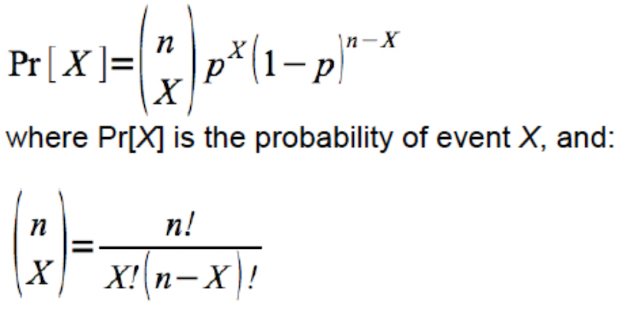

# Analyzing a single categorical variable {#single_cat}

```{r echo = FALSE}
knitr::opts_chunk$set(echo = TRUE)
options(knitr.table.format = "html")
```

**Tutorial learning objectives**

* Learn how to calculate a standard error for a proportion
* Learn how to calculate a confidence interval for a proportion
* Learn about the binomial distribution and the `dbinom` function
* Learn how to test hypotheses about a proportion using the **binomial test**
* Learn an example of the confidence interval approach to hypothesis testing

<div class="note">
**NOTE**
In 2021 we will not be covering "$\chi$^2^ Goodness of Fit tests", which are also tests that apply when analyzing a single categorical variable. For an older tutorial on this, see this [webpage](https://people.ok.ubc.ca/jpither/modules/Goodness_of_fit_tests.html#assumptions_of_the_(chi)2_gof_test) (thought it may soon be inactive). 
</div>

## Load packages and import data {#singcat_packages_data}

Load the `tidyverse`, `skimr`, `naniar`, `knitr`, and `janitor` packages: 

```{r sing_packages, warning = FALSE}
library(tidyverse)
library(skimr)
library(naniar)
library(knitr)
library(janitor)
```

We will also need a new package called `binom`, so install that package using the procedure you [previously learned](#package_install), then load it:

```{r sing_package2, message = FALSE}
library(binom)
```

Import the `damselfly.csv` data set we used in the preceding [tutorial](#hypothesis), and also the `birds.csv` dataset we used in an earlier [tutorial](#vis_describe).

```{r get_dfly}
damselfly <- read_csv("https://raw.githubusercontent.com/ubco-biology/BIOL202/main/data/damselfly.csv")
birds <- read_csv("https://raw.githubusercontent.com/ubco-biology/BIOL202/main/data/birds.csv")
```

Recall what the damselfly dataset looks like:

```{r view_dfly}
damselfly
```

The data show the predominant direction (either clockwise or counter-clockwise) of 20 circular battles between male damseflies. 

And remind yourself what the birds dataset looks like:

```{r desc_birds2}
birds
```

These data describe the category of bird (variable "type" that has 4 different categories) for a random sample of 86 birds sampled at a marsh habitat. 

## Estimating proportions {#estproportions}

Recall that the key descriptor for a categorical variable is a **proportion**.  And when we wish to draw inferences about a categorical attribute within a population of interest, we take a random sample from the population to _estimate_ the true proportion ${p}$ of the population with that attribute.  Our estimate is denoted $\hat{p}$.

In a [previous tutorial](#vis_cat_freq_table) we used the "birds" dataset to practice creating a "frequency table" that showed the _relative frequencies_ of birds falling in each category of the categorical variable "type". These relative frequencies are equivalent to their respective proportions.

So, for the birds dataset, let's produce a frequency table, but instead of using the term "relative frequency" we'll use "p_hat" to denote that this is our estimate of the proportion of birds in that category.

We'll put the output in an object "bird.freq.table" then we'll display it after: 

```{r desc_freq_table_birds2}
bird.freq.table <- birds %>%
  count(type, sort = TRUE) %>% 
  mutate(p_hat = n / sum(n))
```

Now show the table: 

```{r showbird}
kable(bird.freq.table, digits = 4)
```

We can see that the proportion of birds at the marsh that belong to the "Predatory" category is about 0.34. Assuming we had a good random sample, this is our best estimate of the true proportion of marsh birds that are predatory.

Being an estimate, however, we need to attach some measure of uncertainty to it.

In a previous tutorial we learned how to calculate the [standard error](#sem_page) and rule-of-thumb 95% [confidence interval](#confint_rough) for the **mean**.

Here we'll learn how to calculate these measures of uncertainty for a **proportion**.

### Standard error for a proportion {#sterr_prop}

Here's the equation for the standard error for the proportion: 

$$SE_\hat{p} = \sqrt\frac{\hat{p}(1-\hat{p})}{n}$$

Let's use the "birds" dataset to demonstrate the calculation.

Let's re-create the table again:

```{r desc_freq_table_birds3}
bird.freq.table <- birds %>%
  count(type, sort = TRUE) %>% 
  mutate(p_hat = n / sum(n))
```

Show the table:
```{r desc_freq_table_birdsshow}
kable(bird.freq.table, digits = 4)
```

That table does show us our estimate of the proportion of birds that are predatory. We'll isolate that value later. 

But we also need to get the total sample size, i.e. the total number of birds sampled. 

To do this, we need to make sure not to count any missing values, and we can use the `n_complete` function from the `naniar` package:

```{r getn2}
birds.sampsize <- birds %>%
  select(type) %>%
  n_complete()
```

In the preceding code:

* We first ensure the output will be put in a new object called "birds.sampsize"
* We provide the tibble `birds`, which is what is fed to the subsequent code
* We then use `select` to select the variable of interest "type"
* We then use the `n_complete` function to get the total number of non-missing observations in the variable.

Now let's see what the outcome was:

```{r shown}
birds.sampsize
```

<div class="note">
**NOTE**
In previous tutorials we used a bit more cumbersome way to calculate the total number of complete observations in a variable. The `n_complete` function will simplify things. 
</div>

Now that we have _n_ (above), stored in the object "birds.sampsize", we need to extract the "p_hat" value associated with the "Predatory" category, and we'll store this in an object called "pred.phat":

```{r proppred}
pred.phat <- bird.freq.table %>%
  filter(type == "Predatory") %>%
  select(p_hat)
```

In the preceding chunk we: 

* assign our output to an object "pred.phat"
* use the `filter` function to get the rows where the "type" variable is equal to the "Predatory" category
* use the `select` function to return (select) the "p_hat" variable only

Let's look at what this produced:

```{r pre_phat}
pred.phat
```

So this produced a tibble called "pred.phat" with a variable "p_hat", and it has one value - our proportion estimate $\hat{p}$. 

**NOTE**: We could have calculated and isolated the "P-hat" value for predatory birds all in one go, using the following code: 

```{r}
pred.phat <- birds %>%
  count(type, sort = TRUE) %>% 
  mutate(p_hat = n / sum(n)) %>%
  filter(type == "Predatory") %>%
  select(p_hat)
```

That demonstrates the power of the pipe approach!

OK, now we're ready to calculate $SE_\hat{p} = \sqrt\frac{\hat{p}(1-\hat{p})}{n}$

Here's how we do this using basic R syntax, recalling that our "n" (`r birds.sampsize` birds total) is stored in the object "birds.sampsize".

We'll store the value in a new object called "SE_phat":

```{r calc_se_p}
SE_phat <- sqrt(pred.phat * (1 - pred.phat) / birds.sampsize)
```

And now see what the value is: 

```{r showphat2}
SE_phat
```

**Reporting the proportion and standard error**

To properly report a proportion estimate along with its standard error, we need to know how to produce a "plus/minus" symbol in markdown.

Here's what you type in the regular text area of your markdown document (not in a code chunk).  

```
$\pm$
```

The `$\pm$` is the syntax for a plus-minus symbol.  More symbols can be found at this [website](https://rpruim.github.io/s341/S19/from-class/MathinRmd.html). 

And so you insert that text in between your estimate $\hat{p}$ and the $SE_\hat{p}$, as such: `r round(pred.phat, 2)` $\pm$ `r round(SE_phat, 3)`. 

### Confidence interval for a proportion {#confint_prop}

Although a number of options are available for calculating a confidence interval for a proportion, we'll use the _Agresti-Coull_ method, as it has desirable properties:

$$p' \pm 1.96\cdot \sqrt\frac{p'(1-p')}{N+4}$$ where $$p' = \frac{X+2}{n+4}$$

The **margin of error** from the above equation is this part: 

$$1.96\cdot \sqrt\frac{p'(1-p')}{N+4}$$

This margin of error is the value that we _subtract_ to our proportion estimate $\hat{p}$ to get the **lower 95% confidence limit**, and we _add_ that value to our proportion estimate $\hat{p}$ to get the **upper 95% confidence limit**.

We'll again use the "birds" data, and the estimated proportion of birds that are predatory.

Let's again calculate the sample size of birds:

```{r getn3}
birds.sampsize <- birds %>%
  select(type) %>%
  n_complete()
```

And here's the frequency table we constructed: 

```{r desc_freq_table_birds4}
bird.freq.table <- birds %>%
  count(type, sort = TRUE) %>% 
  mutate(p_hat = n / sum(n))
```

Show the table: 
```{r showtablebirds1}
bird.freq.table
```

Looking at the formula for the _Agresti-Coull_ confidence interal, we see that we need _X_ - the number of "successes", which in our case is the number of birds in the category "Predatory". This is provided in our table above.  So let's extract that information.

We'll store our value of "X" in a new object called "bird.X":

```{r getx}
bird.X <- bird.freq.table %>%
  filter(type == "Predatory") %>%
  select(n)
```

Now let's see the output:
```{r seex}
bird.X
```

Unlike the standard error calculation, for which we did actual math using R, for the confidence interval we'll make use of the `binom.confint` function from the `binom` package. Have a look at the help page:

```
?binom.confint
```

The function takes a handful of arguments, including the value of _X_, the number of trials _n_, the confidence level we wish to use (typically 0.95 corresponding to a 95% confidence interval), and the method one wishes to use.

Let's try it out using our bird data.

The one catch in the code below is that we can't simply provide the name of our "bird.X" object to provide the value of _X_ for the `binom.confint` function; instead we need to specify that the value we want to use is stored in the variable called "n" within the "bird.X" object. Thus, we use `bird.X$n`. The dollar sign allows us to specify a specific variable within the tibble. 

Then, we use "ac" to specify the "Agresti-Coull" methods. 

We'll assing our output to a new object called "confint.results":

```{r agresti}
confint.results <- binom.confint(x = bird.X$n, n = birds.sampsize, conf.level = 0.95, methods = "ac")
```

Have a look at the output using the `kable` function to make it nicer looking:

```{r agrestiout}
kable(confint.results, digits = 4)
```

The function provides us with the values of _X_, _n_, the proportion estimate (strangely called "mean"), and the lower and upper confidence limits. 

**Reporting the confidence interval for a proportion**

The appropriate way to report the confidence interval is as follows: 

The 95% Agresti-Coull confidence interval is: `r round(confint.results$lower, 3)` $\le {p} \le$ `r round(confint.results$upper, 3)`. 

1. What is the best estimate of the proportion of the marsh birds that belong to the "Shorebird" category? What is the standard error of the proportion, and the 95% Agresti-Coull confidence interval?

## Binomial distribution {#binomdist}

The binomial distribution provides the probability distribution for the number of "successes" in a fixed number of independent trials, when the probability of success is the same in each trial.  

Here's the formula:

```{r fig.width = 3, fig.height = 2, echo = FALSE}

```

It turns out there's a handy function `dbinom` (available in the base R package) that will calculate the exact probability associated with any particular outcome for a random trial with a given sample space (set of outcomes) and probability of success. It uses the equation shown above.

Check the help file for the function: 

```
?dbinom
```

**Dice example**

Imagine rolling a fair, 6-sided die *n* = 6 times (six random trials).  Let's consider rolling a "4" a "success".  

What is the probability of observing two fours (i.e. two successes) in our 6 rolls of the die (random trials)?

We have _X_ = 2 (the number of successes), _p_ = 1/6 (the probability of a success in each trial), and _n_ = 6 (the number of trials). 

Here's the code, where "x" represents our "_X_", "size" represents the number of trials ("_n_"), and "prob" is the probability of success in each trial (here, 1/6).

We'll create an object to hold the number of trials we wish to use first:

```{r}
num.trials <- 6
dbinom(x = 2, size = num.trials, prob = 1/6)
```

Thus, the probability of rolling two fours (i.e. having 2 successes) out of 6 rolls of the dice is about `r round(dbinom(x = 2, size = 6, prob = 1/6), 3)`. 

In order to get the probabilities associated with *each* possible outcome (i.e. 0 through 6 successes), we use the code shown in the chunk below. 

```{r get_binom_probs}
exact.probs.6 <- tibble(
  X = 0:num.trials,
  probs = dbinom(x = 0:num.trials, size = num.trials, prob = 1/6)
  )
exact.probs.6
```

Above we created a new tibble object (using the function `tibble`) called "exact.probs.6", with a variable "X" that holds each of the possible outcomes (X = 0 through 6 or the number of trials), and "probs" that holds the probability of each outcome, calculated using the `dbinom` function:

See that the `dbinom` function will accept a vector of values of `x`, for which the associated probabilities are calculated.    

Now let's use these exact probabilities to create a barplot showing an exact, discrete probability distribution, corresponding to the binomial distribution with a sample size (number of trials) of *n* = `r num.trials` and a probability of success *p* = 1/6:

```{r fig.cap = "Probability of obtaining X successes out of 6 random trials, with probability of success = 1/6.", fig.height = 4, fig.width = 5}

ggplot(exact.probs.6, aes(y = probs, x = X)) +
  geom_bar(stat = "identity", fill = "lightgrey", colour = "black") +
  xlab("Number of successes (X)") +
  ylab("Pr[X]") +
  theme_bw()
```

**Added October 17, 2021**

What if we wished to calculate the probability of getting *at least* two fours in our 6 rolls of the dice?

Consult the bar chart above.  Recall that "rolling a 4" is our definition of a "success" (it could have been "rolling a 1", or "rolling a 5" - these all result in the same calculation).  Thus to calculate the probability of getting at least 2 successes we need to sum up the probabilities associated with getting 2, 3, 4, 5, and 6 successes.

We can do this using the following R code:

```{r atleast}
probs.2_to_6 <- dbinom(x = 2:num.trials, size = num.trials, prob = 1/6)
sum(probs.2_to_6)
```

Note that we ask the `dbinom` function to do the calculation for each of the `2:num.trials` outcomes of interest. We store these calculated probabilities in a new object "probs.2_to_6".

Then, we use the `sum` function to sum up the probabilities within that object.

The resulting value of `r sum(probs.2_to_6)` looks about right based on our bar chart!

* * *

Now let's increase the number of trials to *n* = 15, and compare the distribution to that observed using *n* = 6:  

```{r getnew_probs}
num.trials <- 15
exact.probs.15 <- tibble(
  X = 0:num.trials,
  probs = dbinom(x = 0:num.trials, size = num.trials, prob = 1/6)
  )
exact.probs.15
```

Now plot the binomial probability distribution: 

```{r fig.cap = "Probability of obtaining X successes out of 15 random trials, with probability of success = 1/6.", fig.height = 4, fig.width = 5}

ggplot(exact.probs.15, aes(y = probs, x = X)) +
  geom_bar(stat = "identity", fill = "lightgrey", colour = "black") +
  xlab("Number of successes (X)") +
  ylab("Pr[X]") +
  theme_bw()
```

1. Challenge: Binomial probabilities

* Use the `dbinom` function to calculate the probability of rolling three "2"s when rolling a fair six-sided die 20 times.
* Produce a graph of a discrete probability distribution for this scenario: *p* = 1/4, and *n* = 12.

## Binomial test {#binom_test}

We previously learned about estimating proportions, and calculating measures of uncertainty for those estimates.

Now we'll learn a procedure for testing hypotheses about proportions. 

For this example we'll use the `damselfly` dataset we used in the previous tutorial regarding [hypothesis tests](#hypothesis).

Recall that the researcher found that in 17 out of 20 circular battles (or "bouts") the damselflies flew in the counter-clockwise direction.

The question was: should this result be considered evidence of handedness in this population?

* * *

Take a moment to refresh your memory regarding the [steps to hypothesis testing](#hyp_steps).

We'll explain first how this is a test about a proportion.

Considering the question posed above, we need to first think about what we'd expect if there was truly **no** "handedness" in the population of damseflies.  In this case, then we'd expect the circular battles to occur with equal frequency in both clockwise and counter-clockwise directions.

In other words, if there was no handedness, we'd expect the _proportion_ of battles that are counter-clockwise (the direction we'll arbitrarily call a "success") to equal ${p} = 0.5$.

* We'll use a **binomial test** here, because this is the **most appropriate (and powerful) test** when comparing the observed number of "successes" in a dataset to the number expected under a null hypothesis.  Or put another way, we compare an observed _proportion_ of successes in a dataset to the proportion expected under a null hypothesis.

Let's devise an appropriate null and alternative hypothesis for this question.  

**H~0~**: The proportion of damselfly battles in the population flown in the counter-clockwise direction is 0.5 ($p_0 = 0.5$)  

**H~A~**: The proportion of damselfly battles in the population flown in the counter-clockwise direction is not 0.5 ($p_0 \ne 0.5$)

* We'll use an $\alpha$ level of 0.05.  
* It is a two-tailed alternative hypothesis; there is no reason to eliminate the possibility that the damselflies exhibit right- or left-"handedness"
* The binomial test assumes that the random trials were independent, and the probability of success was equal in each trial - we'll assume so!
* We don't need a figure for this test
* The test statistic is the number of battles that were flown predominantly in the counter-clockwise direction (the direction we arbitrarily chose as a "success"). 
* The binomial test calculates an exact *P*-value for us (using the [binomial equation](#binomdist)), and we don't need to rely on an approximate null distribution, like we do for other tests. 

Let's conduct the test now.

We use the `binom.test` function that is from the base R package.

```
?binom.test
```

Let's show the code then explain after: 

```{r binomtest}
binom.test.results <- binom.test(x = 17, n = 20, p = 0.5, alternative = "two.sided")
```

* We create a new object "binom.test.results" to hold the results
* the arguments for the `binom.test` function include the number of successes (x), the number of trials (n), the null hypothesized proportion (p), and we specify that the alternative hypothesis is "two.sided" - which is almost always the case

Now let's look at the output:

```{r binomtestresult}
binom.test.results
```

The output from the binomial test includes the number of successes, the number of trials, and the calculated _P_-value.  It also includes a 95% confidence interval for the proportion.

<div class="note">
**IMPORTANT**
The confidence interval provided by this `binom.test` function is _not_ recommended.  Rather, you should **ALWAYS** use the Agresti-Coull method to calculate a confidence interval for a proportion, as shown in the previous [tutorial](#confint_prop). 
</div>

Let's now calculate the Agresti-Coull 95% confidence interval for the proportion, as we learned previously, using the `binom.confint` function from the `binom` package:

```{r agresti2}
damsel.confint.results <- binom.confint(x = 17, n = 20, conf.level = 0.95, methods = "ac")
```

And look at the output:

```{r agresti2out}
kable(damsel.confint.results, digits = 4)
```

Now we have all the ingredients for a proper concluding statement.  

This is an example of an appropriate concluding statement for a binomial test:

> Counter-clockwise battles occurred with significantly greater frequency than expected (17 of 20 battles; observed proportion of counter-clockwise battles = `r round(binom.test.results$estimate, 3)`; Binomial test; _P_-value = `r round(binom.test.results$p.val, 3)`; Agresti-Coull 95% confidence interval: `r round(damsel.confint.results$lower,3)` $\le {p} \le$ `r round(damsel.confint.results$upper,3)`.  

## Confidence interval approach to hypothesis testing {#prophypconf}

In the preceding tutorial, we calculated the Agresti-Coull 95% confidence interval for the proportion of damsefly battles flown in the counter-clockwise direction as: `r round(damsel.confint.results$lower,3)` $\le {p} \le$ `r round(damsel.confint.results$upper,3)`.  

Given that the interval excludes (does not encompass) the null hypothesized proportion of $p_0 = 0.5$, we can reject the null hypothesis.  

In this case, the appropriate concluding statement would be:

> Counter-clockwise battles occurred in a significantly higher proportion than 0.5 (observed proportion of counter-clockwise battles = `r round(binom.test.results$estimate, 3)`; Agresti-Coull 95% confidence interval: `r round(damsel.confint.results$lower,3)` < ${p}$ < `r round(damsel.confint.results$upper,3)`.  

* * *

1. **Binomial hypothesis test practice**: Using the present tutorial as a guide, use a **binomial test** to address the question posed in Example 6.2 in the text book (concerning handedness in toads). Be sure to include all the steps of a hypothesis test.
