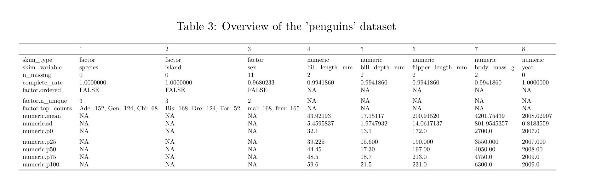

# Creating tables in R Markdown {-}

```{r tablesettings, echo = FALSE}
knitr::opts_chunk$set(echo = TRUE)
options(knitr.table.format = "html")
```

**Tutorial learning objectives**

* Learn how to produce nice tables in R Markdown for PDF output

<div class="note">
**IMPORTANT:  **
This tutorial aims to help you produce nice tables when knitting to PDF.  However, because this tutorial is presented in HTML format, some of the output does not look the same as it will in PDF format.  These instances are noted.
</div>

## Load packages and import data {#tables_packages}

Load the following packages, including `palmerpenguins` and `kableExtra`:

```{r tables_packages, warning = FALSE, message = FALSE}
library(tidyverse)
library(knitr)
library(naniar)
library(skimr)
library(palmerpenguins)
library(kableExtra)
```

We'll use the "circadian.csv" dataset, which is also used in the ["comparing more than 2 means tutorial"](#compare_three_more_means).  These data are associated with Example 15.1 in the text. 

The `circadian` data describe melatonin production in 22 people randomly assigned to one of three light treatments.  

```{r anova_getdata}
circadian <- read_csv("https://raw.githubusercontent.com/ubco-biology/BIOL202/main/data/circadian.csv")
```

### Formatting output from the `skimr` package {#skim_tables}

It is always good practice to get an overview of a dataset before proceeding with analyses.

For this we have been using the `skim_without_charts` function from the `skimr` package.

You may have noticed that when you knit assignments to PDF, any output from the `skim_without_charts` function tends to run off the edge of the page.  Here we'll learn how to avoid this.

The key is to assign the output to an object first, as such:

```{r lookdata22}
skim.out <- circadian %>%
  skim_without_charts()
```

We will also "transpose" (rotate) the table using the `t` base function:, so that it'll fit on a page:

```{r transposetable}
skim.out.transposed <- t(skim.out)
```

Now we'll use the `kbl` function with various arguments to ensure the output looks good and includes a table caption:

<div class="note">
**NOTE:  **
This table will look different when knitted to PDF (rather than HTML)
</div>

<div class="note">
**IMPORTANT:  **
Notice that, unlike figure captions, which must be provided in the chunk header, the caption for a table is provided as an argument to the `kbl` function within the actual code!
</div>

```
kbl(skim.out.transposed, caption = "Overview of the 'circadian' dataset",
    booktabs = TRUE) %>%
  kable_styling(latex_options = "hold_position")
```

In the preceding code we:

* use the `kbl` function and provide 3 arguments: 
  + provide the name of the table-like object we wish to format for output
  + provide a table caption
  + provide an argument "booktabs = TRUE" (this provides nice formatting)

Then we include pipes ("%>%), and follow with:

* the `kable_styling` function with a few arguments: 
  + "latex_options = 'hold_position'" which forces the table to appear where the code chunk comes 

For lots of great examples of how the `kableExtra` package can be used, see this [vignette](https://haozhu233.github.io/kableExtra/awesome_table_in_pdf.pdf) for PDF output, and [this one](https://cran.r-project.org/web/packages/kableExtra/vignettes/awesome_table_in_html.html) for HTML output.

<div class="note">
**IMPORTANT:  **
If you attempt to use the `skim_without_charts` function without wrapping the about in a `kbl` function, you will likely get an error when you attempt to knit to PDF.
</div>

```{r showskimtable, echo = FALSE}
kbl(skim.out.transposed, caption = "Overview of the 'circadian' dataset",
    booktabs = TRUE) %>%
  kable_styling(latex_options = "hold_position")
```

Let's check to see if this approach works on a larger dataset (one with more variables).

Let's try it on the "penguins" dataset:

```{r skimpenguins}
skim.penguins <- penguins %>%
  skim_without_charts()
```

Transpose:
```{r transpenguins}
skim.penguins.transposed <- t(skim.penguins)
```

Now let's try the `kbl` ouptut:

<div class="note">
**NOTE:  **
This table will look different when knitted to PDF (rather than HTML).  Specifically, it will print off page...
</div>

```{r nicetablepeng}
kbl(skim.penguins.transposed, caption = "Overview of the 'penguins' dataset",
    booktabs = TRUE) %>%
  kable_styling(latex_options = "hold_position")
```

Argh, our output went off the page!

If this happens, then we add another argument to the `kable_styling` function, the "scale_down" option:

```
kbl(skim.penguins.transposed, caption = "Overview of the 'penguins' dataset",
    booktabs = TRUE) %>%
  kable_styling(latex_options = c("scale_down", "hold_position"))
```

```{r echo = FALSE}
kbl(skim.penguins.transposed, caption = "Overview of the 'penguins' dataset") %>%
  kable_paper(full_width = F, html_font = "Arial Narrow")
```

<div class="note">
**NOTE:  **
On this HTML page the table above still goes off the page, but the PDF version will work!
</div>

Here's an image of the PDF output:

```{r echo = FALSE}

```

For very large datasets you may find this approach causes the font to be too small.

### A nicely formatted table of descriptive statistics {#stats_nicetable}

Here is the code (which you've already learned) to create a good table of descriptive statistics for a numeric response variable grouped by categories in a categorical explanatory variable.

We'll use the "penguins" dataset again, and calculate descriptive statistics for bill lengths of male penguins, grouped by species:

```{r conf_table_anova}
penguins.stats <- penguins %>%
  filter(sex == "male") %>%
  group_by(species) %>%
  summarise(
    Count = n() - naniar::n_miss(bill_length_mm),
    Count_NA = naniar::n_miss(bill_length_mm), 
    Mean = mean(bill_length_mm, na.rm = TRUE),
    SD = sd(bill_length_mm, na.rm = TRUE),
    SEM = SD/sqrt(Count),
    Low_95_CL = t.test(bill_length_mm, conf.level = 0.95)$conf.int[1],
    Up_95_CL = t.test(bill_length_mm, conf.level = 0.95)$conf.int[2]
  )
```

Here's what the raw table looks like:
```{r showsimpletable}
penguins.stats
```

Now let's format it for PDF output:

```{r givenicepdftable}
kbl(penguins.stats, caption = "Descriptive statistics for bill length among male penguins.", 
    booktabs = TRUE, digits = c(0, 0, 0, 2, 3, 3, 3, 3)) %>% 
  kable_styling(latex_options = c("scale_down", "hold_position"), position = "center")
```

The **key difference** from the previous example done with the `skim_without_charts` output is that here we specify the number of decimal places we want each descriptive statistic to be reported to.

Specifically, the "digits" argument accepts a vector of numbers, whose length is equal to the number of columns being reported in the table, and these numbers indicate the number of decimal places to include for that specific variable.

At this point it would be a good idea to revisit the Biology department's [guidelines for reporting descriptive statistics](https://ubco-biology.github.io/Procedures-and-Guidelines/descriptive-summary-statistics.html). 

For example, we can see that the first three numbers in the "digits" argument are zeroes, and these correspond to the first three columns of the table: "species", "Count", "Count_NA".  These are columns whose values don't require decimal places.

For the "Mean" column we report the values to 1 more decimal place than was used in the measurement (which you find out by looking at the raw data in the "penguins" object), so here, 2 decimal places.

For measures of spread (like the standard deviation) and measures of uncertainty (including SEM and confidence limits), report the numbers to 2 more decimal places than was used in the measurement, so here, 3 decimal places.

You now know how to produce nicely formatted tables in your knitted PDF output!

<div class="note">
**IMPORTANT:  **
Be sure to try knitting to PDF as soon as you've used any of the `kable` or `kableExtra` package functions in a code chunk, as this will help you trouble-shoot if you encounter problems.
</div>
