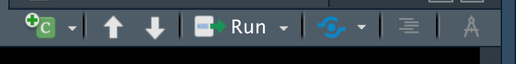

# Visual Markdown Editor {-}

This is an optional tutorial describing a new feature included in the latest version (1.4) of RStudio: a ["Visual Markdown Editor"](https://rstudio.github.io/visual-markdown-editing/?_ga=2.43936998.2146903537.1631712539-1654786890.1631712539). 

## A more familiar editing environment {-}

Markdown documents can be edited either in **source** mode (what we're looking at right now) or in **visual** mode. To switch between these modes, click on the button at the top right of the toolbar on the Source panel in RStudio (when viewing a .Rmd file), or use the shortcut [`Command`/`Control`]+`Shift`+`F4`.  

```{r, echo = F, fig.width = 3}

```

**Toolbar above the editing pane in RStudio.**

The tool you want is the one on the far-right in the picture above.

<div class="note">
**NOTE**
The visual editor with reformat your source code using Pandoc's default markdown writer, so it may look slightly different when you toggle back to source view. 
</div>

For many, the VME will feel much more familiar and use-friendly the the 'traditional' Markdown source editing. Highlights of this new feature include:  

* Real-time spell-checking and outline navigation.
* Tight integration with source editing (editing location and undo/redo state are preserved when switching between modes).  
* Keyboard support. In addition to traditional shortcuts, you can use markdown expressions (e.g. ##, **bold**, etc.) for formatting. If you don’t remember all of the keyboard shortcuts, you can also use the catch-all ⌘ / shortcut to insert anything.  
* Extensive support for citations, including integration with Zotero and the ability to insert citations from DOIs or searches of PubMed, Crossref, and DataCite.  
* Scientific and technical writing features, including cross-references, footnotes, equations, code execution, and embedded LaTeX.  

<div class="note">
**NOTE**
If you opt to use the Visual Markdown Editor for assignments, be sure that all required code chunks are visible in your knitted document.
</div>