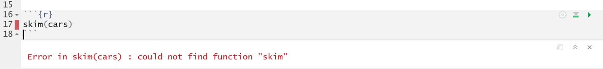
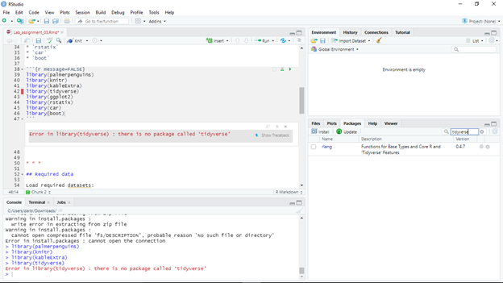
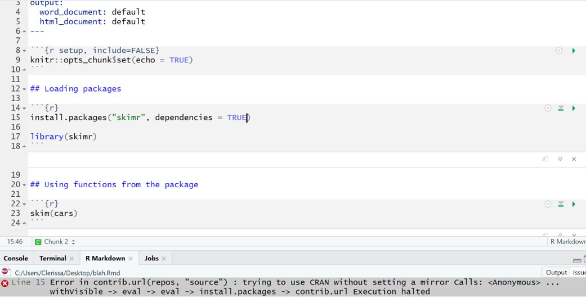
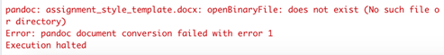
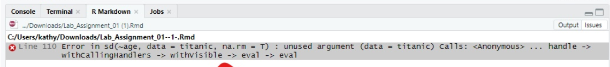
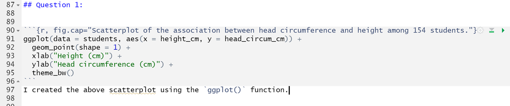
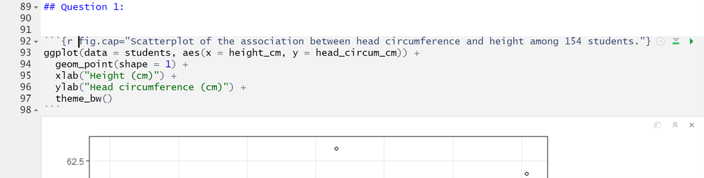

# Common errors and their solutions {-}

## Google can help {-}

* R will tell you specifically which line in your code (e.g. in your R Markdown document) the error is coming from. Make sure you read the error and take a look at the line where the error is if indicated
* Try googling the specific error to see if you can find a solution online; use the search phrase "R-help error statement" (where "error statement" is what R told you)

***

## Rosetta error {-}


This error seems to arise for those using MacOS Ventura.  

**Solution:** This solution is derived from this [webpage](https://github.com/rstudio/rstudio/issues/12512), and is also described in this [Piazza post](https://piazza.com/class/llsbjgmektu6ld/post/7).  

* Close RStudio. 
* Open a "terminal" window on your Mac (you can use the search tool to do this). 
* Install "brew" by copying and pasting this in your terminal window:  

```
/bin/bash -c "$(curl -fsSL https://raw.githubusercontent.com/Homebrew/install/HEAD/install.sh)"
``` 

* then install "pandoc" by typing this in your terminal window:  

```
brew install pandoc
```

* if that's successful, then open RStudio and type this in the command console:  

```
Sys.setenv(RSTUDIO\_PANDOC="/opt/homebrew/bin")
```

Now you should be able to knit an RMD file to PDF!  

***

## Rtools required during install {-}


**Solution:** Head to [this website](https://cran.rstudio.com/bin/windows/Rtools/) and follow the instructions to download `Rtools` onto your computer. Then try re-installing the package again. 

## Could not find function {-}



**Solution:** This error arises when you are trying to run a package, but you haven’t loaded the package yet. Therefore, R can’t find the function you are trying to use. To fix this error, load the package in an R chunk near the top of your RMarkdown document and then re-run your code. Do not load packages in the console! See a screenshot below.


## There is no package {-}



**Solution:** This error happens because the package has not yet been installed. To fix this error run the `install.packages()` function in the R console (NOT in the RMarkdown document!!). Then re-load the package using the `library()` function in the RMarkdown document (NOT in the console!!).

## Trying to use CRAN without setting a mirror {-}



**Solution:** When we install packages in R, we need to do it in the console and not in the RMarkdown document because it causes this error when knitting. To fix this problem:

* Remove the `install.packages()` code from the RMarkdown document

* Install the package in the console


* Try re-knitting the RMarkdown document

## PDF Latex is not found {-}

`Error: LaTeX failed to compile Practice_assignment.tex. See https://yihui.org/tinytex/r/#debugging for debugging tips.`
 `In addition: Warning message:`
 `In system2(..., stdout = if (use_file_stdout()) f1 else FALSE, stderr = f2) :`
  `'"pdflatex"' not found`
 `Execution halted`

`No LaTeX installation detected (LaTeX is required to create PDF output). You should install a LaTeX distribution for your platform: https://www.latex-project.org/get/`

 `If you are not sure, you may install TinyTeX in R: tinytex::install_tinytex()`

 `Otherwise consider MiKTeX on Windows - http://miktex.org`

 `MacTeX on macOS - https://tug.org/mactex/`
  `(NOTE: Download with Safari rather than Chrome _strongly_ recommended)`

 `Linux: Use system package manager`

**Solutions:**

*Option 1:* Run these commands in the R console (in this specific order!):

* `install.packages("tinytex", dependencies = TRUE)`
* `library("tinytex")`
* `install_tinytex()`

*Option 2:* If you are using a Windows computer and option 1 didn’t work, try downloading[ MikTeX](http://miktex.org). Then try knitting again.

*Option 3:* If you are using a Mac computer and option 1 didn’t work, try downloading [MacTeX](https://tug.org/mactex/). Then try knitting again.

*Option 4:* If none of the above options work, knit your RMarkdown file to a Word document and then save it as a pdf.

## Error in parse {-}


**Solution:** This type of error usually occurs when there is an unexpected symbol or character (ie. comma, semicolon, colon, bracket, etc.) in your code. In this case, I erroneously included a greater than sign (>) at the end of line. To fix this error, simply remove the unexpected symbol.

## No such file or directory exists {-}



This error happens because in your RMarkdown document you refer to a file/folder, but that file/folder but R can’t find the file.

**Solution:** TBD

## Messy output when loading packages {-} 


**Solution:** When you load packages in R, the knitted document will automatically show associated messages as output in your knitted document. This can make your assignment look messy when you are loading a bunch of packages. To hide these messages, add `message = FALSE` into the R chunk where you load packages. See the example below.


## Unused argument {-} 



**Solution:** This error sometimes happens because the `library() function` is located below the line of code where a function is called on from that package. To fix this error, the `library()` function needs to be moved above the chunk where you use functions from that package. Best practice is to put it an R chunk at the top of your assignment (below the header) where you load all of the required packages for your assignment. See below for an example screenshot.


## Object not found {-}


**Solution:** This error occurs when you’re ‘calling’ on an object in your code, but you haven’t actually created that object yet. As such, your computer can’t find the object. To fix this error, you should insert a line of code creating your object. Make sure the object is created BEFORE (on an earlier line of code) you try to use the function. See screenshot below.


## Figure caption doesn’t show up below figure in knitted document {-}



**Solution:** This error happens when you knit to PDF and your figure caption doesn’t show up despite having the correct code within your Rchunk. One potential cause for this error, is that you have text immediately below your Rchunk. To fix this error, make sure there is a blank line between the end of your Rchunk with the code for the figure and any subsequent text. See the screenshot below for the corrected error. 


## Figures are placed in weird spots in knitted PDF {-}

This has to do with out the conversion process works, and can't easily be helped. And nor does it really matter - you won't lose marks for this. If you're curious as to why this happens, consult this [webpage](https://bookdown.org/yihui/rmarkdown-cookbook/figure-placement.html).

## Filename, directory name, or volume label syntax is incorrect {-}


**Solution:** This error occurs because there is a mistake in the code for the figure caption. Specifically, there needs to be a space between the "r" and "fig." in the RChunk header. See the screenshot below for the correct figure caption code. 



## Installing packages: there is a binary version available {-}

If you are attempting to install a package (using `install.packages`) and you get this message:

```
There is a binary version available but the source version is later:
  binary source needs_compilation
systemfonts  1.0.2  1.0.3              TRUE

Do you want to install from sources the package which needs compilation? (Yes/no/cancel)
```

Respond with "no" (without quotes).  Do NOT respond "Yes". 

## Unicode knitting error {-}

When you try to knit your markdown file, and you get an error that refers to a "Unicode character" like this:


This means there’s a strange, non-simple text character somewhere in your RMD script.  Mostly likely it is the result of copying and pasting text directly from the web into your RMD document.  Common examples of troublesome characters include curly quotation marks and special symbols.

To troubleshoot, first go carefully through your RMD text to look for obviously strange characters.

If that doesn't reveal anything, you'll need to trysystematically knitting one section of your RMD document at a time. For example: 

Open a blank text document alongside your current RMD file, and cut out one question/answer at a time, pasting into blank text document temporarily.  Then try knitting your reduced RMD document, and if it works, paste the cut code back in to your RMD document. Then go to the next question and do the same thing. This will help isolate problem.
