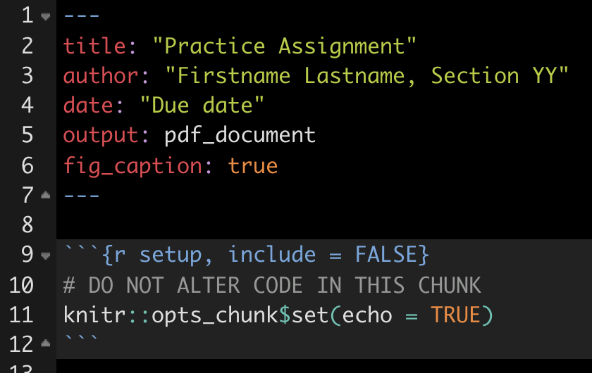
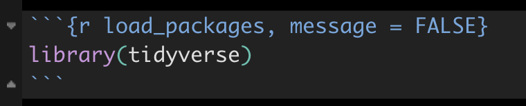
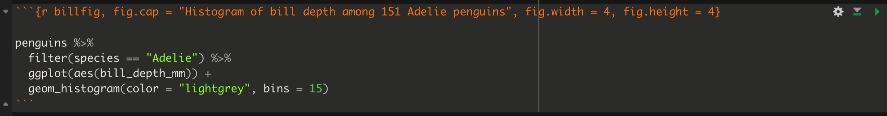
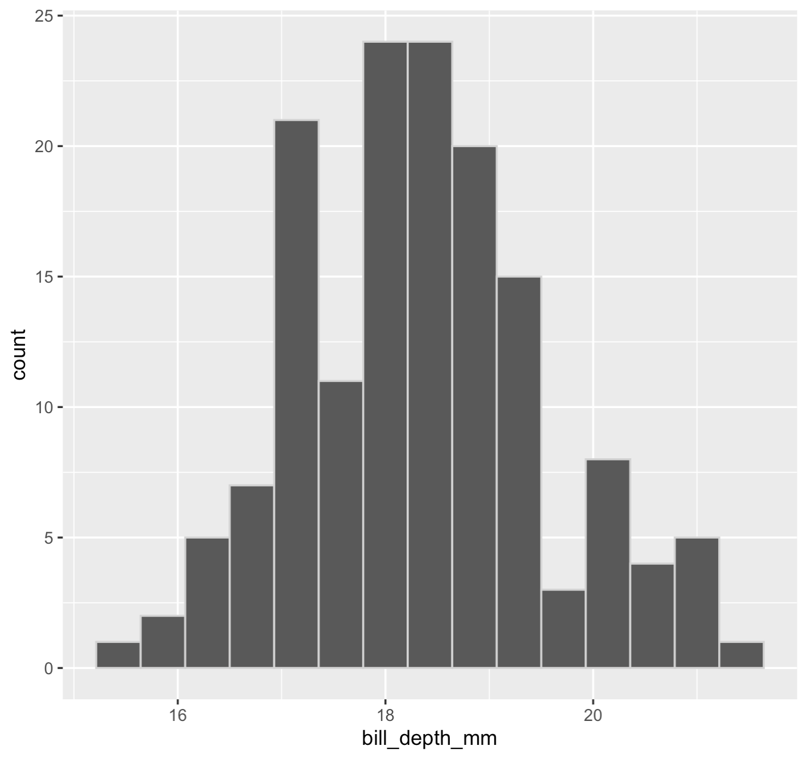
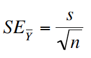

--- 
title: "Tutorials for BIOL202: Introduction to Biostatistics"
author: "Jason Pither"
date: "`r Sys.Date()`"
site: bookdown::bookdown_site
documentclass: book
description: "All tutorials associated with BIOL202"
bibliography: [biol202.bib, packages.bib]
biblio-style: apalike
link-citations: yes
---

# (PART\*) Preface {-}

```{r echo = FALSE}
knitr::opts_chunk$set(echo = TRUE)
options(knitr.table.format = "html")
options(pillar.sigfig = 4)
```

# Welcome {-}

This is an open source online book that includes all tutorials and other resources for the "lab" portion of the course BIOL202: Introduction to Biostatistics, at the University of British Columbia, Okanagan campus. 

This book is **currently under development, with sections being added weekly**.

## Author {-}

I (Jason Pither) am an Associate Professor in the Department of Biology at the Okanagan campus of the University of British Columbia. I am an ecologist with interests in biogeography, community ecology, and landscape ecology. I have been using "R" (and its [predecessor, "S"](https://en.wikipedia.org/wiki/R_(programming_language)#History)) in my  research for over two decades, and has been teaching Introductory Biostatistics using R since 2014.  

## Acknowledgments {-}

I am grateful to be able to live, work, and play on the traditional, ancestral, and unceded territory of the Syilx (Okanagan) people. To find out more about Indigenous territories where you live, consult [https://native-land.ca](https://native-land.ca).

This online book borrows materials generously made openly available by the following keen educators:  

+ Chester Ismay and Albert Y. Kim ([Statistical Inference via Data Science online book](https://moderndive.com/)). This resource is licensed under a [Creative Commons Attribution - NonCommercial-ShareAlike 4.0 International License](http://creativecommons.org/licenses/by-nc-sa/4.0/).
+ Mike Whitlock and Dolph Schluter ([resources accompanying the text "Analysis of Biological Data"](https://whitlockschluter3e.zoology.ubc.ca/index.html))

## Copyright {-}

This work is licenced under the Creative Commons [Attribution-NonCommercial-ShareAlike 4.0 International (CC BY-NC-SA 4.0)](https://creativecommons.org/licenses/by-nc-sa/4.0/)


Please use the following for citing this document

Pither, J. (2021). *Tutorials for BIOL202: Introduction to Biostatistics*. [https://ubco-biology.github.io/BIOL202/index.html](https://ubco-biology.github.io/BIOL202/index.html)

All source files are available on [github](https://github.com/ubco-biology/BIOL202).

<!--chapter:end:index.Rmd-->

# (PART\*) Getting started with R, RStudio & R Markdown {-}

# What are R and RStudio? {#what_is_R}

```{r klippy, echo = FALSE, include = TRUE}
klippy::klippy()
```

It is assumed that you are using R via RStudio. First time users often confuse the two. At its simplest:

* R is like a car's engine
* RStudio is like a car's dashboard

R: Engine            |  RStudio: Dashboard 
:-------------------------:|:-------------------------:
  |  

More precisely, R is a programming language that runs computations while RStudio is an *integrated development environment (IDE)* that provides an interface by adding many convenient features and tools. So the way of having access to a speedometer, rearview mirrors, and a navigation system makes driving much easier, using RStudio's interface makes using R much easier as well. 

# Installing R and RStudio {#install_R_Rstudio}

<div class="note">
**Note**
The latest version of R is 4.1.1 ("Kick Things").  It is strongly recommended that you install this latest version, even if you have older versions already installed.  **However** If you have an older operating system on your computer, you'll want to check compatibility of both R and RStudio.  The RStudio website should detect your operating system and provide the appropriate download option automatically.  The website with older versions of R is [here](https://cran.r-project.org/bin/macosx/), and older versions of RStudio is [here](https://www.rstudio.com/products/rstudio/older-versions/).  
</div>

Follow the instructions below, and optionally you can view this YouTube video [here](https://youtu.be/2Sovzf6lVRo) _prior_ to starting the steps.

* Download and install both R and RStudio (Desktop version) on your computer. 

<div class="note">
**Note**
R needs to be installed successfully >prior< to installing RStudio (because the latter depends on the former)  
</div>

* Figure out what operating system (and version) you have on your computer (e.g. Windows 10; Mac OS X 10.15 "Big Sur")  
* Go to this [website](https://cran.r-project.org/) and click on the appropriate download link at the top of the page (depending on your operating system, Windows / MacOS / Linux)  
    - For *Windows* users, download the "base" version; this file will be called something like R-4.1.1-win.exe. Executing this file launches a familiar Windows Setup Wizard that will install R on your computer.  
    - For *Mac* users, download the "pkg" file that is appropriate for your version of MacOS; the file will be called something like R-4.1.1.pkg. Download and run this installation package—just accept the default options and you will be ready to go.  

* Now to install RStudio: once you have installed "R", go to this [website](https://rstudio.com/products/rstudio/download/) and click on the  "download" button in the top right corner, then select the blue button underneath the "RStudio Desktop FREE" column.  Then, click on the appropriate link under the "Installers for Supported Platforms" heading; this again depends on what platform / operating system you're using. It will likely be one of the first two options.  

# Start using R & RStudio {#start_r}

Recall our car analogy from a [previous tutorial](#what_is_R). Much as we don't drive a car by interacting directly with the engine but rather by using elements on the car's dashboard, we won't be using R directly but rather we will use RStudio's interface. After you install R and RStudio on your computer, you'll have two new programs AKA applications you can open. We will always work in RStudio and not R. In other words:

R: Do not open this          |  RStudio: Open this
:-------------------------:|:-------------------------:
  |  

Launch RStudio on your computer to make sure it's working (it loads R for you in the background).  

## The RStudio Interface {#Rstudio_interface}

When you open RStudio, you should see something similar to the following:


  
Note the four panes which are four panels dividing the screen: the source pane (top left), console pane (bottom left), the files pane (bottom right), and the environment pane (top right). Over the course of this chapter, you’ll come to learn what purpose each of these panes serves.

## Coding basics {#coding_basics}

Please go through section [1.2 of the ModernDive online text](https://moderndive.com/1-getting-started.html#code) called "How do I code in R?". This should take about **15 minutes**.

# R packages {#packages}

An R package is a collection of functions, data, and documentation that extends the capabilities of R. They are written by a world-wide community of R users. For example, among the most popular packages are:

* `ggplot2` package for data visualization 
* `dplyr` package for data wrangling 
* `tidyverse`, which is a package that includes a collection of multiple packages (including the preceding two) that are all installed at once. We'll be using this package in the course. 

There are two key things to remember about R packages:

* *Installation*: Most packages are not installed by default when you install R and RStudio. You need to install a package before you can use it. Once you've installed it, you likely don't need to install it again unless you want to update it to a newer version of the package.  

* *Loading*: Packages are not loaded automatically when you open RStudio. You need to load them everytime you open RStudio.

## Package installation {#package_install}

Let's install the `tidyverse` package.

There are two ways to install an R package:

- In the Files pane:
    + Click on "Packages"
    + Click on "Install"
    + Type the name of the package under "Packages (separate multiple with space or comma):" In this case, type `tidyverse`
    + Click "Install"  
    
- Alternatively, in the Console pane type the following (**NOTE** never include this code within your R Markdown document; only install packages by typing directly in the Console):

```{r, eval=FALSE}
install.packages("tidyverse")
```

<div class="note">
**Note**
When working on your own computer, you only need to install a package once, unless you want to update an already installed package to the latest version (something you might do every 6 months or so). **HOWEVER**: If you're working on a school computer (in a computer lab or in the library), you may need to install packages each session, because local files are deleted daily. If you're unsure what packages are already installed, consult the "packages" tab in the lower-right RStudio pane when you start up RStudio; installed packages are listed there.  
</div>

## Package loading {#package_load}

Let's load the `tidyverse` package.

After you've installed a package, you can now load it using the `library()` command. For example, to load the `tidyverse` package, run the following code in the Console pane:

```{r, eval=FALSE}
library(tidyverse)
```

<div class="note">
**Note**
You have to reload each package you want to use every time you open a new session of RStudio.  This is a little annoying to get used to and will be your most common error as you begin.  When you see an error such as

```
Error: could not find function
```

remember that this likely comes from you trying to use a function in a package that has not been loaded.  Remember to run the `library()` function with the appropriate package to fix this error.
</div>

# Intro to R Markdown {#intro_markdown}

As you may have learned already from section 6 of the [Biology Procedures and Guidelines resource ](https://ubco-biology.github.io/Procedures-and-Guidelines/markdown-1.html), R Markdown is a markup language that provides an easy way to produce a rich, fully-documented reproducible analysis.  It allows its user to share a single file that contains all of the commentary, R code, and metadata needed to reproduce the analysis from beginning to end.  R Markdown allows for "chunks" of R code to be included along with Markdown text to produce a nicely formatted HTML, PDF, or Word file without having to know any complicated programming languages or having to fuss with getting the formatting just right in a Microsoft Word DOCX file.  

One R Markdown file can generate a variety of different formats and all of this is done in a single text file with a few bits of formatting.  You'll be pleasantly surprised at how easy it is to write an R Markdown document after your first few attempts.  

We will be using R Markdown to create reproducible lab reports. 

<div class="note">
**Note**
R Markdown is just one flavour of a markup language. RStudio can be used to edit R Markdown. There are many other markdown editors out there, but using RStudio is good for our purposes.  
</div>

## Literate programming with R Markdown {#lit_programming}

1. View the following short video:

[**Why use R Markdown for Lab Reports?**](https://youtu.be/lNWVQ2oxNho)
<iframe width="560" height="315" src="https://www.youtube.com/embed/lNWVQ2oxNho" frameborder="0" allowfullscreen></iframe>

The preceding video described what can be referred to as **literate programming**: authoring a single document that integrates data analysis (executable code) with textual documentation, linking data, code, and text. In R Markdown, the executable R code is placed in "chunks", and these are embedded throughout sections of regular text.   

For an example of an HTML (webpage) document that illustrates the effectiveness of literate programming, take a look at [this HTML output - a webpage](https://ubco-biology.github.io/BIOL202/Manning_et_al_full_script.html) that accompanied a lab-based experiment examining the potential for freshwater diatoms to be successfully dispersed over long distances adhered to duck feathers.

2. View the following youtube video on creating an R Markdown document:

[webpage](https://youtu.be/DNS7i2m4sB0). 

<div class="note">
**Optional**
If you'd like additional introductory tutorials on R Markdown,  see this [one from RStudio](https://rmarkdown.rstudio.com/lesson-1.html), or this [one](https://rbasics.netlify.app/4-rmarkdown.html). 
</div>

## Making sure R Markdown knits to PDF {#veryify_knit}

Now we're going to ensure R Markdown works the way we want.  A key functionality we need is being able to "knit" our report to PDF format. For this, we need to install the `tinytex` package {#install_tinytex}.  

* Copy and paste the following two lines of code into the command console of RStudio (the bottom left window panel), then press return:  

```
install.packages("tinytex")
tinytex::install_tinytex()
```

RStudio will take a minute or two to install a bunch of things. Once it's done, we're ready to try knitting to PDF!

<div class="note">
**Reminder**
Recall you only need to install a package once!  And this should be the last time you need to deal with the `tinytex` package (you won't need to "load" it in future), because now that it's installed, its functionality works in the background with RStudio.  
</div>

* While in RStudio, select the "+" dropdown icon at top left of RStudio window, and select R Markdown. RStudio may at this point install a bunch of things, and if so that's ok.  
* A window will then appear and you can replace the "Untitled" with something like "Test", then select OK.  

This will open an R Markdown document in the top left panel.  Don't worry about all the text in there at this point. What we want to do is test whether it will "knit" (render) the document to PDF format.  To do this: 

* Select the "Knit" drop-down icon near the top left of the RStudio window, and select "Knit to PDF". RStudio will ask you to first save the markdown file (save it anywhere with any name for now), then it will process the markdown file and render it to PDF.  

In a future [tutorial](#repro_research) we'll discuss how to use R Markdown as part of a reproducible workflow.
 
# Extra online resources {#r_resources}

<div class="note">
**Note**
This page is still under development (Sept 8, 2021)
</div>

Below we provide tables with various online resources, including ones that will help you troubleshoot.

If you are googling for R code, make sure to also include package names in your search query (if you are using a specific package). For example, instead of googling "scatterplot in R", google "scatterplot in R with ggplot2".

Rstudio provides links to several **cheatsheets** that will come in handy throughout the semester.

You can get nice PDF versions of the files by going to **Help -> Cheatsheets** inside RStudio:


The book titled "Getting used to R, RStudio, and R Markdown" by Chester Ismay, which can be freely accessed [here](https://ismayc.github.io/rbasics-book/), is also a wonderful resource for for new users of R, RStudio, and R Markdown. It includes examples showing working with R Markdown files in RStudio recorded as GIFs.

## R Resources Online {#online_resources}

-------------------------------------------------------------------------------
URL                                                   Purpose
----------------------------------------------------- -------------------------
https://whitlockschluter3e.zoology.ubc.ca.            R resources to accompany Whitlock & Schluter text

https://datacarpentry.org/R-genomics/01-intro-to-R.html   Data Carpentry Intro R tutorials

https://r-dir.com/learn/tutorials.html                List of useful tutorials including videos

https://www.rstudio.com/resources/webinars/           Various online learning materials at RStudio

https://rmd4sci.njtierney.com                         R Markdown for Scientists

http://r4ds.had.co.nz/index.html                      Hadley Wickham's online book

-------------------------------------------------------------------------------
Table: Learning R - Tutorials and workshop materials

____

-------------------------------------------------------------------------------
URL                                                   Purpose
----------------------------------------------------- -------------------------
http://blog.revolutionanalytics.com/beginner-tips/    Beginner tips

https://mran.microsoft.com/packages/                  Tool for exploring packages
-------------------------------------------------------------------------------
Table: So many packages - how to find useful ones?


____


----------------------------------------------------------------------------------------------
URL                                                               Purpose
----------------------------------------------------------------  ----------------------------
https://www.zoology.ubc.ca/~schluter/R/                           UBC zoology site
                                                                  handy stats reference

http://statmethods.net/                                           Good general reference

----------------------------------------------------------------------------------------------
Table: Data analysis in R

____


----------------------------------------------------------------------------------------------
URL                                                               Purpose
----------------------------------------------------------------  ----------------------------
http://statmethods.net/                                           Good general reference for graphing

http://ggplot2.org/book/                                          Hadley Wickhams's ggplot2 book online

http://stats.idre.ucla.edu/r/seminars/ggplot2_intro/              Great tutorial on ggplot2

http://www.cookbook-r.com/Graphs/                                 Graphing with ggplot2

----------------------------------------------------------------------------------------------
Table: Data visualization in R

____


----------------------------------------------------------------------------------------------
URL                                                               Purpose
----------------------------------------------------------------  ----------------------------
https://www.r-bloggers.com/                                       Popular blog site, lots of info

http://rseek.org/                                                 Search engine for R help

----------------------------------------------------------------------------------------------
Table: BLOGs and general resources


____


----------------------------------------------------------------------------------------------
URL                                                                           Purpose
----------------------------------------------------------------------------  ----------------
https://cos.io/                                                               Center for Open Science

https://ropensci.org/                                                         Open science R resources

http://geoscripting-wur.github.io/RProjectManagement/                         Lessons about version control

https://nicercode.github.io/                                                  Helping to improve your code

----------------------------------------------------------------------------------------------
Table: Resources for reproducible research / open science


____


----------------------------------------------------------------------------------------------
URL                                                               Purpose
----------------------------------------------------------------  ----------------------------
http://spatial.ly/r/                                                  Example maps with R

https://rstudio.github.io/leaflet/                                    Online mapping with R

https://www.earthdatascience.org/courses/earth-analytics/             Excellent course

https://geoscripting-wur.github.io/                                   Amazing "geoscripting" tutorial

<!--chapter:end:00_Getting_started.Rmd-->

# (PART\*) Reproducible Workflows {-}

# Reproducible Research {#repro_research}

A key goal of our Biology program at UBC's Okanagan campus is to foster appreciation for reproducible research, and to equip students (and professors) with skills that will help them undertake reproducible research themselves.   

In first year you learned from the Biology program's [introductory Open Science learning modules](https://ubco-biology.github.io/OS-Introduction/) that reproducible research studies are not as common as one might assume.  One key reason for this is insufficient documentation of all the steps taken along the research workflow.  Moreover, conducting reproducible research is extremely challenging - more than most scientists appreciate. See, for example, an incredible, recent case concerning ageing experiments with *C. elegans* [here](https://www.nature.com/news/a-long-journey-to-reproducible-results-1.22478).

In the BIOL202 lectures you'll learn more about the various causes of irreproducible research, and about the practices that can help promote reproducibility. In this lab component of the course, you'll learn the basics of how to achieve an acceptable level of *computational reproducibility* (complete computational reproducibility is actually pretty tricky, but we'll get close).

## Computational reproducibility {#comp_repro}

Almost all research, whether it's conducted in the field or in a lab, includes a substantial amount of work that's done on the computer. This includes data processing, statistical analyses, data visualization and presentation, and production of research outputs (e.g. publications).  Some research is of course exclusively conducted on computers.  The bottom line is that computer-based work forms a key and substantive part of all research workflows.  

Given that this work is done on computers (which are entirely controllable), it should be able to be reproduced **exactly**.  This is known as **computational reproducibility**: an independent researcher should be able to access all data and scripts from a study, run those scripts, and get exactly the same outputs and results as reported in the original study.  

In this tutorial you'll start gaining relevant experience and skills by producing a reproducible lab report.   

<div class="note">
**Note**
A *workflow* refers to the the steps you take when conducting your day-to-day work - say, on a term project, for example. Having a well-designed workflow improves efficiency, and when done right, reproducibility. It includes, for example, how you create, access, and manage files on your computer (or in the cloud).
</div>

Following best practices for naming and organizing your files and directories on your computer will help ensure that you can spend more time doing the important work, and less time fiddling and trying to remember what you did and where you saved your work. It will also help your future self, when labs and assignments in upper year courses request that you use R and R Markdown for analyses and reports.

1. Review the Biology department's [Procedures and Guidelines webpage](https://ubco-biology.github.io/Procedures-and-Guidelines/) description of how to [manage files and directories](https://ubco-biology.github.io/Procedures-and-Guidelines/file-and-data-management.html). This should take about **20 minutes**

# An example BIOL202 workflow {#biol202_workflow}

Now that you have reviewed the fundamentals of file and directory management, you should decide how to best organize and manage the work you do for BIOL202. Here we'll provide one example approach that most if not all of you will find useful.  

## Microsoft OneDrive {#onedrive}

Our suggested approach assumes you have set up a Microsoft account through UBC (using your CWL), and have set up the OneDrive application on your own computer, which automatically syncs (when you're online) selected files/directories between your local computer and your OneDrive account in the cloud.

Why OneDrive? As a UBC student, you receive 1TB of free storage! And you also get peace of mind knowing that your files are secure and up-to-date (provided you have an internet connection), and that OneDrive has something called "version control", which saves old versions of files and allows you to see those versions if you wish, **so long as you maintain the same file name**. 

<div class="note">
**WAIT A SECOND!**
In the ["File Naming"](https://ubco-biology.github.io/Procedures-and-Guidelines/file-naming.html) instructions that I just reviewed, I was instructed to create a new file with a new version number in the filename (e.g. with a "V0", "V1", "V2" etc...) each time I worked on it!  
</div>

Those instructions are entirely valid! However, when you have access to a *version control* system, like OneDrive, it is better to **keep the file name the same**, rather than changing it each time you update it. For example, your markdown file (which as a ".Rmd" extension to the name) that you use for your tutorial work should maintain the same name throughout the term, rather than saving a new file each time you do substantive work on it. 

Assuming your files are syncing properly between your computer and OneDrive (and this simply requires that you're connected to the internet), you will always be able to [see (and if desired, restore) old versions of your files](https://support.microsoft.com/en-us/office/restore-a-previous-version-of-a-file-stored-in-onedrive-159cad6d-d76e-4981-88ef-de6e96c93893). 

If you haven't set up OneDrive yet, follow the instructions provided at this [UBC IT website](https://lthub.ubc.ca/guides/microsoft-onedrive-student-guide/).

<div class="note">
**Note**
Using OneDrive is entirely optional.  If you choose not to use OneDrive, please follow the file naming instructions from the [Procedures and Guidelines document](https://ubco-biology.github.io/Procedures-and-Guidelines/file-naming.html). And you can still follow the directory structure instructions below, regardless of where you set up your directories (OneDrive or not).
</div>

## Directory structure {#dir_structure}

We anticipate three general categories of work being undertaken:  

* Lecture work, including annotating lecture notes (e.g. on PDFs or PowerPoints) and writing study notes of your own (e.g. using Word)
* Tutorial work, including practicing what you learn in tutorials using RStudio and R Markdown, and commenting about tips, or tricky bits 
* Lab assignment work, in which you answer questions using R and R Markdown and create a document for submission and grading

Each of these categories of work should have their own directory, and all three of these directories should exist within a "root" directory called "BIOL202".  

## Steps to set up directories {#setup_dirs}

* Having successfully installed OneDrive, you should see a "OneDrive" folder on your computer
* In your OneDrive folder, create a root directory "BIOL202" to host all of your BIOL202 work
* Create a "_README.txt file for the root BIOL202 directory, as per instructions in the [Biology Procedures and Guidelines webpage](https://ubco-biology.github.io/Procedures-and-Guidelines/readme-files-and-data-dictionaries.html).

<div class="note">
**TIP**
You can create and edit your "_README.txt" file in RStudio! Just click on the "+" drop down at the top left, and select "Text file". Then type in the information you need, and name it "_README.txt" and save it in the appropriate directory.
</div>

* Within the BIOL202 root directory, create three (sub)directories: 
  - "BIOL202_lecture"
  - "BIOL202_tutorials"
  - "BIOL202_assignments"
* Create a "_README.txt" file in each of the three sub-directories (again, you can use RStudio to create these!)

The BIOL202 directory, and all its contents, will now sync regularly to your online OneDrive account, so that you can access your up-to-date files from any device upon which OneDrive is installed.

It is possible to work on files stored on your local computer when you're offline; they just won't sync to the cloud until you've gotten back online. 

## Lecture workflow {#lecture_workflow}

The directory for your lecture work is now ready to house any lecture-related work that you do. For instance, if you wish to type up study notes in a Word document, you could call that file "Pither_BIOL202_lecture-notes.docx".  Each time you add/edit/update it, OneDrive will keep old versions for you!

## Tutorial workflow {#tutorial_workflow}

How you manage your tutorial workflow comes down to personal preference. The instructions provided below create an RStudio project in the "BIOL202_tutorials" directory (see below), and then create a single R Markdown document, formatted to have sections (headers) for each tutorial you work on.  This approach makes it easier to find all of your work in the R Markdown file, so long as it is formatted logically.  
I have created an R Markdown file that you can download and use for this purpose, and we'll download that a bit later. 

First, we need to set up an RStudio project. 

## Create an RStudio Project {#create_project} 

It is best to organize all your R work using RStudio "projects".  For your tutorial work, for example, you will create a new project that will be housed in your "BIOL202_tutorials" directory

To do this, open RStudio then select File > New Project. Then select the option to use an existing directory, and locate and select your tutorial directory. Provide a name for your project file, such as "BIOL202_tutorial", then select OK. If it asks to open a new RStudio session, you can say yes.

RStudio has now created an RStudio project file that has an "Rproj" extension at the end of the name. This "Rproj" file is the file that you will open (double-click with the mouse) each time you wish to work on your tutorial material.  You should  see the "Rproj" file in the bottom right files panel of RStudio.

## Create subdirectories {#create_subdirs}

Your tutorial work may involve creating and saving outputs like figures or files, in which case you should have sub-directories for these purposes in your root directory. See the example provided in the [Procedures and Guidelines document](https://ubco-biology.github.io/Procedures-and-Guidelines/example-biol-116.html#screenshot).

Let's illustrate the procedure by creating a subdirectory called "figures", and this time we'll use R to create the directory.

> Updated 7:15pm Sept 9

The following code will create a directory called "figures" in your working directory

```
dir.create("figures")
```

You should see the new folder appear in the files panel on the bottom right of RStudio.

Whenever you wish to generate figures in R, then export them as image files, for example, you can save them to this folder.  We'll learn about this later.

Reading and writing files from / to directories requires that we can tell R exactly where to find those directories.  That's where the handy package called `here` comes in. 

### The `here` package{#here_package}

Now we'll install and load an R package called `here` that will help with file and directory management and navigation. 
```
install.packages("here")
```

This is a helpful [blog post](http://jenrichmond.rbind.io/post/how-to-use-the-here-package/) about the utility of the `here` package.

Then we load the package:

```{r, eval = F}
library(here)
```

When you load the package, the `here` function takes stock of where your RStudio project file is located, and establishes that directory as the "working directory". It should return a file path for you. In future tutorials we'll make use of the `here` package when saving files.  

## Edit an R markdown file {#edit_markdown}

In a previous [tutorial](#intro_markdown) you learned how to create an R Markdown file, but generally you won't need to do this in this course, because you'll be provided starter documents to work with.

I have created an R Markdown file that you can download and use for starting your tutorial work. 

To do this, copy and paste the following code into your command console in RStudio (the bottom left panel), and press return:

```{r down_rmd, eval = F}
download.file("https://raw.githubusercontent.com/ubco-biology/BIOL202/main/more/Example_tutorial_markdown.Rmd", "BIOL202_tutorial_markdown.Rmd")
```

This `download.file` command takes a URL address for a file stored online, and then tells R where to save it, and what name to use. 

Here we will save the RMD file in your "working directory", which is the "BIOL202_tutorials" directory. It should show up in the "files" pane in the bottom right RStudio panel.  Click on the "BIOL202_tutorial_markdown.Rmd file to open it.

This is the R Markdown file that you'll edit/add to throughout the term.  It has some starting instructions / example text already, and you're welcome to delete / change that.  

* Change the "author" information at the top of the document (in the header) to your name.
* Save your file by clicking the save icon in the top left, and be sure to give it an appropriate name as per previous file-naming instructions

For the basics on formatting in R Markdown, consult the R Markdown [reference guide ](https://www.rstudio.com/wp-content/uploads/2015/03/rmarkdown-reference.pdf)

## Components of an R Markdown file {#md_components}

At this point, you should familiarize yourself with the components of a markdown file.  

* * *

1. R basics

Read through section 4.2 of this online [tutorial](https://rbasics.netlify.app/4-rmarkdown.html#the-components-of-an-r-markdown-file) and watch the videos there too

* * *

## Interacting with Tutorial material {#interact_tutorial}

Students have typically worked through tutorials by reading the material, typing helpful notes in their markdown document, and copying and pasting any R code into "chunks" within their R Markdown document, then running those chunks.  

You can insert as many chunks as you'd like. Chunk insertion is achieved by selecting the green "+" icon at top of the editor panel, and selecting "R".  Or go to the "Code" menu drop down and "Insert Chunk".

The key advice: keep your work organized by using headings. There's an option to view your headings all in one navigation pane by clicking on the navigation pane icon at the top right of your editor panel. 

## Lab assignments workflow {#assign_workflow}

You can repeat the same steps from earlier for creating a new [RStudio project](#create_project) for your lab work. But this time when you create the project, specify your lab assignment directory "BIOL202_assignments" as the location.  

You can optionally create subdirectories also, perhaps one for each of the lab assignments. 

The key difference in the assignments workflow is that for each assignment you'll start with a new R Markdown (Rmd) file, which you'll download from Canvas under the "assignments" link.  The document will include the questions you are to answer, and you simply edit / add to the document as you answer them.

Instructions for this will come in a later tutorial.  

Next tutorial: Practicing completing a very short lab assignment using R Markdown.


<!--chapter:end:01_ReproducibleR.Rmd-->

# Preparing and formatting assignments {#prepare_assignments}

This material provides instructions on how to prepare and format R Markdown documents for assignments. 

## Open your assignment RStudio project {#open_assign_project1}

In a previous [tutorial](#assign_workflow) it was suggested you set up a working root directory called "BIOL202_assignments" to host all your assignment work.  You may have also created sub-directories, one for each of the three assignments.  Regardless, in your root "BIOL202_assignments" directory locate the RStudio project file (it has a "Rproj" extension in the filename), and open it by double-clicking it.

## Download the assignment Rmd file {#download_assign_rmd}

The assignment file will be available to you for download from Canvas under the "Assignments" section. The file is actually an R Markdown file, and therefore has an "Rmd" extension.  It is simply a text document (meaning it contains only text), but the syntax used therein is "markdown" syntax, and the file extension (Rmd) specifies it as an R Markdown file. You might recall reading about Markdown in the [Biology Procedures and Guidelines document](https://ubco-biology.github.io/Procedures-and-Guidelines/markdown-1.html).

Make sure you save the Rmd file into your root "BIOL202_assignments" directory, or alternatively into the appropriate sub-directory.  

A practice assignment has been set up on Canvas, so that you can get used to this procedure. It is located under "Lab_materials" module. Download the file, and make sure it's saved into your root directory (where your RStudio project is). 

## Open the assignment Rmd file {#open_rmd_file}

In RStudio, look in the "files" pane (bottom right) and locate your downloaded assignment Rmd file. Then click it to open.

This Markdown document includes the assignment questions, and serves as a starter document for your assignment.  

Once you have opened the document, you'll see the following text at the top: 

```{r, fig.cap = "Assignment markdown file header", echo = FALSE, fig.width = 2.5, fig.height = 2.5}

```

Complete the following steps: 

* keeping the quotation marks, replace the "Practice assignment" text with the current assignment name (unless you're doing the practice assignment, in which case do not change anything!) 
* keeping the quotation marks, replace the "Firstname Lastname, Section YY" with your own Firstname Lastname and section number (e.g. " Jason Pither, Section 04") 
* keeping the quotation marks, replace the "Due date" with the due date of the current assignment, e.g. "November 3, 2021"  

<div class="note">
**NOTE**
Don't alter anything else at the top of the document, including the R Chunk that you see below the header.  
</div>

* save the Rmd file using a new name (so select file > "save as"), according to appropriate [file naming conventions](https://ubco-biology.github.io/Procedures-and-Guidelines/file-and-data-management.html), such as "Pither_BIOL202_practice.Rmd". Recall that if you're saving this on OneDrive, or in your local directory that is synced to OneDrive, then your file will be [version controlled](#onedrive).  

You're now ready to start working on your assignment, and doing [literate programming](https://ubco-biology.github.io/Procedures-and-Guidelines/glossary.html) using R Markdown. 

<div class="note">
**REMINDER**
In RStudio, under the "Help" menu, you'll find "Cheat Sheets" > R Markdown Cheat Sheet and R Markdown Reference Guide.  Have a look at those!
</div>

## What to include in your answers {#what_include_answer}

The general approach is to enter your text answers and associated R chunks with code underneath each question. 

<div class="note">
**Tip**
It is almost always the case that you'll need to load the `tidyverse` package, so it's advisable to include an R chunk right at the beginning of your document that does this. 
</div>

<div class="note">
**Tip**
To insert a new code chunk, you can either: Use the shortcut: Mac = `Command+Option+I`; Windows = `Ctrl+Alt+I`. Click on the **Insert a new code chunk** icon. You can also specify the coding language of the chunk using the drop-down menu. 
</div>

### Code chunk headers {#chunk_headers}

Here's an example code chunk in which the `tidyverse` package is being loaded. You'll notice some extra text in the header of the chunk. 

```{r, fig.cap = "Code chunk header with message suppression", echo = FALSE, fig.width = 3}

```

The "load_packages" text is simply giving a name or "tag" to this R chunk. It is good practice to provide a _unique_ name to each R chunk.  

After the comma is `message = FALSE`.  This tells R markdown to NOT display any messages associated with the R commands in this chunk when knitting the R Markdown document. For example, when loading some libraries R will provide a long list of messages in the process. When you "knit" the R Markdown document, R will run each R chunk in your document. By including the `message = FALSE` heading argument, you can avoid including this extra output in your knitted document.  

<div class="note">
**Note added Sept 27, 2021**
The `message = FALSE` header argument is NOT something to include in all chunks by default. It should only be included if the code within the associated code chunk outputs a lot of unnecessary information that would otherwise clutter your knitted PDF document.
</div>

---

There will be routine steps to take for each question. 

**Import data**

Each assignment question will indicate which dataset(s) you'll need to answer the question, and where to locate / download these. In many instances multiple questions will use the same dataset, in which case you don't need to load data for each question; just load it once. 

Here's an example of code for importing data. It uses the `read_csv` function from the `readr` package, which is bundled with the `tidyverse` package:

```
example_data <- read_csv("https://raw.githubusercontent.com/ubco-biology/BIOL202/main/data/example_data.csv")
```

The `read_csv` function will take as an argument a URL address for a data file. Here we've provided a ULR for the location of a CSV file (comma-separated values file), which is typically what we'll use.  

**Load packages**

Once you've loaded the data, you'll now need to figure out how to answer the question by looking through the tutorials for the answer. And typically, to answer the question you'll need to make sure you've loaded some packages.

If you've forgotten what "packages" are, refresh your memory at this [tutorial](#packages).  

For example, it's likely you've already loaded the `tidyverse` package (as advised above), but if a tutorial indicates you need another package, say the `janitor` package, then insert a code chunk with the following:

```
library(janitor)
```

<div class="note">
**REMINDER**
When working on your own computer, you only need to install a package once (unless you want to update an already installed package to the latest version, which is a rare event). If you're working on a school computer (in a computer lab), you may need to install packages each time you log on to a computer, because the school computers delete local files daily. If you're unsure what packages are already installed, consult the "packages" tab in the lower-right RStudio pane when you start up RStudio; installed packages are listed there.  
</div>

**Answer the questions**

After you've imported the required data and loaded required packages, it's time to answer the questions! 

You simply insert any required text and R code (in R Chunks) after each question. The tutorials will provide the information required to answer the questions.  

<div class="note">
**TIP**
The way to test out your code once it's inserted in the R chunk is to press the green play button at the top right of the code chunk. This will run what's in the chunk.  You'll be provided error statements if something goes wrong. If it works, it will provide you the output (and hopefully the answer!), and this is what you use to inform your written (typed) answer.
</div>

Here's what you need to include in your answers: 

- Answer each question clearly and in full sentences. Make sure you answer specifically the question asked.

- Verify that the code you used to answer the question is included in an R chunk and appears in the knitted document (this should happen automatically)

- Verify that the output from each R chunk is included in your knitted document (this should happen automatically)

- For any figures (graphs) that you produce, you must include a figure caption. See the next [section](#rmd_graphing) for instructions. 
 
 - If you use a graph to answer a question, refer to that graph in your answer
 
<div class="note">
**REMINDER**
As you work on your document, save frequently, and also knit your document frequently.
</div>

<div class="note">
**TIP** 
You will often need/want to preview the document you are working on to ensure that everything is being formatted as you expected in the knitting process. The default setting is for the preview to open in a new pop-up window outside of RStudio, although you may find it useful to have it open in the Viewer panel within RStudio itself (particularly if you're only working with one screen!). To change the preview location, click the **Settings** icon in the toolbar and select the option to "Preview in Viewer Pane".
</div>

## Setting up R Markdown for graphing {#rmd_graphing}

There are some special code chunk header arguments that need to be set in your Markdown document in order to:

* include proper __Figure captions__ with your figures (a necessity!)
* set the dimensions of your figures

In each code chunk that includes code to construct a graph, your chunk header options should look like this in the top of the chunk, and there should be one blank line underneath before the main code starts.  The following chunk produced the figure below. And recall that in the example below, the "bill_fig" text is simply the name I've given to this code chunk. 

```{r, echo = FALSE, fig.width = 4}

```

```{r, echo = FALSE, fig.width = 4, fig.height = 4}

```

**Figure 1:** Histogram of bill depth among 151 Adelie penguins

The key parts are the "fig.cap = " argument, to which you provide the text you want to use as the figure caption. Then there's the "fig.width = " and "fig.height = " arguments, which indicate the size of the figure when knitted.  This will likely require some trial-and-error to get a good size, but start with the values in this example (4 for each). 

**Automated figure numbering** 

When you knit the document to PDF, you'll see the "Figure X:" (with a number in place of the "X") text was appended at the beginning of the caption phrase that was included in the chunk header, "Histogram of bill depth among 151 Adelie penguins".

This feature - automatic figure numbering - was set within the header of the assignment markdown document:

```{r, fig.cap = "Assignment markdown file header with figure caption option", echo = FALSE, fig.width = 3}

```

The line "fig_caption = true" tells R Markdown and the knitting process to automatically include this part of a figure caption, "Figure X", underneath each figure you produce. Where "X" will automatically be replaced with the appropriate number.  For example, it will use "Figure 1:" for your first figure, "Figure 2" for your second, and so on.

## Example question / answer {#example_answer}

Below is an example of how to answer a question. 

<div class="note">
**NOTE** 
There are almost *always* multiple coding approaches to get the right answer, some better than others. As long as your code and answer are accurate and make sense, you'll get the marks!
</div>

**Question 1.** What are the minimum and maximum heights (variable name is "height_cm") of students in the "students" dataset, which is available at this URL:

```
https://raw.githubusercontent.com/ubco-biology/BIOL202/main/data/students2.csv
```

As we learned in the [fictitious] "importing and exploring data" tutorial, I can use the `read_csv` function from the `readr` package (loaded with `tidyverse`) to download and import the dataset.  It creates a "tibble" object, which here I name "students":

```{r loadtidy, echo = FALSE}
library(tidyverse)
```


```{r import_students1, message = FALSE}
students <- read_csv("https://raw.githubusercontent.com/ubco-biology/BIOL202/main/data/students.csv")
```

I also learned that it's a good idea to get an overview of the dataset as a first step after importing data.  To do this, use the `skim_without_charts` function from the `skimr` package.  I need to load that package first:

```{r load_skimr, message = FALSE}
library(skimr)
```

Now skim:

```{r skim_data, eval = TRUE}
skim_without_charts(students)
```

This shows we have four character and three numeric variables, with 154 rows (observations) and 7 columns (variables) total. 

We can use the `summary` function to get some basic descriptive statistics, including the minimum and maximum of numeric variables. The `summary` function is part of the base R package, so no additional packages need to be loaded. 

We also use the `select` function from the `dplyr` package (which is loaded with `tidyverse`) to select which variable in the `students` tibble we wish to summarize. 

The use of the "%>%" syntax is described in another tutorial (yet to be posted!). 

```{r min_max1}
summary.height <- students %>% 
  select(height_cm) %>%
  summary
summary.height
```

As shown in the output above, the minimum height was 150.0 cm and the maximum student height was 210.8 cm.

<div class="note">
**TIP** 
You'll note that functions and package names above are highlighted in grey. When writing in markdown, it's good practice to encompass function names and package names in single backticks, i.e.`` `tidyverse` ``. Backticks are typically located with the tilden ("~") key on your keyboard. 
</div>

## Knitting your assignment to PDF {#knit_assign}

All assignments are to be submitted to Canvas as **PDF documents**. 

As you learned in a previous [tutorial](#veryify_knit), simply click on the "knit" button and select PDF. Your PDF file will adopt the same name as your markdown file, but it will have a "pdf" extension rather than an "Rmd" extension.

Once you have knitted your assignment to PDF, open up the PDF document, and verify that it looks correct, and be sure to check all your spelling, and that figures / tables are appropriately formatted etc...  

If you need to fix something, close your PDF file, go back to your R Markdown document and do the edits there. Save, then knit again!

## Submit your assignment {#submit_rmd}

Once you're happy with the PDF you created, it's time to submit your PDF document to the appropriate place in Canvas. 

It's a good idea also to verify afterwards that your PDF document did indeed upload correctly.

<!--chapter:end:02_Preparing_formatting_assignments.Rmd-->

# Preparing and importing Tidy Data {#data_import}

**Tutorial learning objectives**

In this tutorial you will:  

* Review how to format your data 
  + [Tidy data](https://ubco-biology.github.io/Procedures-and-Guidelines/tidy-data.html)
  + Do's and Don'ts of naming variables and data entry
  + Wide versus Long format
* Learn how to save a file in CSV (comma-separated values) format  
* Learn how to import a CSV file from a website into a `tibble` in R  
* Learn how to import a CSV file from a local directory into a `tibble` in R  
* Learn how to get an overview of the data and variables in your `tibble`

Importing data should be a straightforward task, but this is not always the case; sometimes data files are not formatted properly, so you need to be careful to check what you import.  

Here, you'll learn (or review) how to format your own data files according to best practices, so that you or others will have no problems importing them.  

It is assumed that if you are collecting data during a project, you'll likely enter them on your computer using a spreadsheet software program like Excel. 

<div class="note">
**PAUSE**
Before starting any data collection and data-entry, ask yourself: how should I organize the spreadsheet for data-entry?
</div>

The short answer: according to **TIDY** formatting principles...

## Tidy data {#tidy_data}

Review the [Biology Procedures and Guidelines document](https://ubco-biology.github.io/Procedures-and-Guidelines/tidy-data.html) chapter on **Tidy data**.

There you'll learn how to arrange and format your data within a spreadsheet. The "Tidy" example provided would look like this in Excel: 

```{r, fig.cap = "Tidy data in Excel", echo = FALSE, fig.width = 3}
knitr::include_graphics("./more/excel_tidy.png")
```


<div class="advanced">
**Deeper Dive: Optional**
If you'd like a longer, more in-depth read about "tidy data", see Hadley Wickham's "R for Datascience" online book, linked [here](http://r4ds.had.co.nz/tidy-data.html). 
And this [article](https://towardsdatascience.com/tidy-data-with-r-f3d078853fc6) describes why making your data "tidy" saves a lot of time and effort in the long run.  Oh, and it uses Covid-19 data to demonstrate!  
</div>

If you wish to import and analyze data that have not been formatted according to **tidy** principles, then the most transparent and computationally reproducible way to reformat the data is to do so by coding _within R_, rather than using software like Excel.  The process of reformatting / rearranging data is called **data wrangling**, and is mostly beyond the scope of this course. 

If you're curious about data wrangling, the `dplyr` package, which is loaded with the `tidyverse` package, provides all the tools for data wrangling. Its associated cheatsheet is available [here](https://github.com/rstudio/cheatsheets/raw/master/data-transformation.pdf). 

## Import a CSV file from a website {#import_csv_url}

In previous tutorials we've already seen how to import CSV files from the web. As always, the first step is to load the `tidyverse` library, because it includes many packages and functions that are handy for both data import and data wrangling.

```{r}
library(tidyverse)
```

One package that is loaded with the `tidyverse` package is `readr`, which includes the handy `read_csv` function.  

You can view the help file for the `read_csv` function by typing this into your command console pane (bottom left) in RStudio:

```
?read_csv
```

You'll see that the function has many optional "arguments", but in general we can use the default values for these.

If the file you wish to import is located on the web, then we need to provide the "URL" (the web address) to the `read_csv` function.  For example, in [Tutorial 9 section 6](```
example_data <- read_csv("https://raw.githubusercontent.com/ubco-biology/BIOL202/main/data/example_data.csv")
```) you imported the "students.csv" dataset from the course GitHub website, as follows:

```{r}
students <- read_csv("https://raw.githubusercontent.com/ubco-biology/BIOL202/main/data/students.csv")
```

Note that the URL address is provided in double quotation marks.

This code imports the data and stores it in a local object called "students". The object is called a "tibble", which you can think of as a special kind of spreadsheet. More information on "tibbles" can be found [here](https://r4ds.had.co.nz/tibbles.html).

<div class="note">
**NOTE**
Unless otherwise indicated, all CSV data files that we use in this course are stored at the same URL location, specifically: "https://raw.githubusercontent.com/ubco-biology/BIOL202/main/data/". Thus, to import any CSV file you just need to copy that path, then append the appropriate file name to the end of the path. For example, the full path to access a CSV file called `birds.csv` file would be "https://raw.githubusercontent.com/ubco-biology/BIOL202/main/data/birds.csv". 
</div>

Often you'll need to import data from a locally stored CSV file, rather than from the web. You'll learn how to do this [shortly](#import_csv_local).  First: how does one create a CSV file?

## Create a CSV file {#create_csv_local}

Before we create or save any data files on our local computer, we should first create a directory (folder) called "rawdata" to store them.

Let's create the new directory in our "BIOL202_tutorials" working directory.  To do this, use the `dir.create` function in R, as follows:

```{r, eval = FALSE}
dir.create("rawdata")
```

Once you run this code, you'll see the new directory appear in the Files pane in the bottom-right of RStudio. It might look something like this:

```{r, fig.cap = "View of files with rawdata folder", echo = FALSE, fig.width = 3}
knitr::include_graphics("./more/files_pane_rawdata.png")
```

<div class="note">
**NOTE**
The folder is called "rawdata" because the data stored there will be the unedited, raw version of the data, and any files therein should **NOT** be altered.  Any changes or edits one makes to the datasets should be saved in new data files that are saved in a different folder called "output", which we'll create later.
</div>

Let's create a data file to work with.

**Steps to create and save a CSV file**

* Open up Excel or any other spreadsheet software and enter values in the spreadsheet cells exactly as shown in the Excel example in Figure 10.1 from the [Tidy Data section above](#tidy_data)
* You should have one row with the 3 variable names ("Site", "Day", "Trout_Caught"), one in each column, then nine rows of data
* Save the file as a CSV file by selecting (MAC) File > Save As > and in the drop down list: CSV UTF-8 (Comma separated), and Windows File > Save as type > CSV UTF-8 (comma separated)
* Name it "trout.csv", and save it within the newly created "rawdata" folder

Now we're ready to try importing the data into a "tibble".

## Import a local CSV file {#import_csv_local}

You can find additional help on importing different types of files at the [Data Import Cheat Sheet](https://github.com/rstudio/cheatsheets/raw/master/data-import.pdf).

**Steps to import a local CSV file**

We'll use the "trout.csv" file that we created previously. 

And we'll make use of the `here` package that we were introduced to in an [earlier tutorial](#here_package).  

Let's load the package:

```{r, message = FALSE}
library(here)
```

<div class="note">
**New tool**  
Pipes or "%>%" are implemented as part of the `magrittr` package, which is loaded with the `tidyverse`. In brief, pipes allow us to string together a series of functions, and we'll use them frequently in tutorials.
</div>

Here we'll use a pipe to help import the data file.

Let's see the code first, then explain after: 

```{r, eval = FALSE}
trout <- here("rawdata", "trout.csv") %>%
  read_csv()
```

```{r, echo = FALSE, message = FALSE}
trout <- here("data", "trout.csv") %>%
  read_csv()
```

* First we have the name of the object (a "tibble") that we wish to create, "trout". 
* Then you see the assignment operator "<-", which tells R to assign whatever we're doing to the right of the operator to the object "trout".
* Then we have the `here` function, which is taking two inputs: the name of the directory we wish to get something from ("rawdata"), and then the name of the file we wish to do something with, here "trout.csv"). 
* Then we have a pipe "%>%", which tells R that we're not done coding yet - there's more to come on the next line...
* Lastly, we use the `read_csv` function, whatever came before the pipe is what is fed to the `read_csv` function.

Go ahead and run the chunk of code above to create the "trout" object.  

Next we'll learn how to get an overview of the data stored in a tibble object.

## Get an overview of a dataset {#data_overview}

When you import data it is always a good idea to immediately get an overview of the data.  

Key questions you want to be able to answer are:

* How many variables (columns) are there in the dataset?
* How many observations (rows) are in the dataset?  
* Are there variables whose data are categorical? If so, which ones?
* Are there variables whose data are numerical? If so, which ones?
* Are there observations missing anywhere?

As we learned in the "Preparing and formatting assignments" [tutorial](#example_answer), the `skimr` package has a handy function called `skim_without_charts` that provides a good overview of a data object. This is a rather long function name, and in fact the main function is called `skim`. However, by default, `skim` includes small charts in its output, and we don't want that presently, hence the use of `skim_without_charts`.

Let's load that package now:

```{r}
library(skimr)
```

And get an overview of the `trout` dataset, again using the pipe approach: 

```{r, eval = TRUE}
trout %>%
  skim_without_charts()
```

A lot of information is provided in this summary output, so let's go through it:

* The Data Summary shows the name of the object, the number of rows, and the number of columns
* Column type frequency shows how many columns (variables) are of type "character", which is equivalent to "categorical", and how many are "numeric"
* Group variables shows if there are any variables that are specified as "grouping" variables, something we don't cover yet.
* Then it provides summaries of each of the variables, starting with the character or categorical variables, followed by the numeric variables
* Each summary includes a variety of descriptors, described next
* The "n_missing" descriptor tells you how many observations are missing in the given variable. In the "trout" dataset we don't have any missing values
* The "n_unique" descriptor for categorical variables indicates how many unique values (categories) are in that variable; for the "Site" variable in the "trout" dataset there are 3 unique values
* The descriptors for the numeric variables include the mean, standard deviation (sd), and the quantiles

Now you have what you need to answer each of the questions listed above!

One additional function that is useful during the overview stage is `head`. This function just gives you a view of the first 6 rows of the dataset:

```{r}
# we can use head(trout), or the pipe approach: 
trout %>%
  head()
```

When you use `head` on a "tibble", like we have here, it outputs another "tibble", in this case 6 rows by 3 columns. But recall that the full "trout" dataset includes 9 rows and 3 columns.

## Tutorial practice activities

This activity will help reinforce each of the key learning outcomes from this tutorial.

**Steps**

You are going to take measurements of the lengths (in mm) of your thumb, index finger, and middle finger on each hand; but don't start measuring yet! 

First:

* Create a new R Markdown document for this practice activity. This is where you'll record the procedures you use for this practice activity
* As we've learned in previous tutorials, one of the first steps we should do is include a code chunk in the markdown document in which we load any packages we'll need. 
* Include a code chunk to load the packages used in the present tutorial
* Save the R Markdown document in your root "BIOL202_tutorials" directory, and provide it an appropriate file name.
* Open a new blank spreadsheet in Excel

<div class="note">
**Note**
Before taking the measurements, think about how you can make your measurement procedure reproducible. Where exactly are you measuring from and to on each digit?  Are you using a ruler?  What's your measurement precision? Whatever approach you take, make sure you type it out clearly in your R Markdown document, so that someone else could repeat it.
</div>

* Also before you start measuring, think about how you'll organize the data in the spreadsheet, including how many variables you'll have, what to name those variables, and how many rows or observations you'll have.  

**HINT**: Even before you start measuring, most of your data sheet should be filled with values, and when you type in your 6 measurements, these should be entered in a single column.

* Once you've organized the spreadsheet, and even before you start entering the digit measurements, save it as a CSV file into your "rawdata" folder, remembering to use an appropriate file name
* Once you've typed out the methods in your markdown document, you can start taking measurements and recording them in the spreadsheet
* Once you've finished entering the data, save the spreadsheet again, then quit Excel.

<div class="note">
**Optional**
Now would be a good time to create and edit a "_README.txt" [file](#setup_dirs) for your new "rawdata" folder. 
</div>

Now you're ready to import the data into R.

* In your R Markdown document, include a code chunk to import the data.

Now you're ready to get an overview of the data.

* In your R Markdown document, include a code chunk to get an overview of the dataset.

Once you've confirmed that each of the code chunks work in your R Markdown document, you're ready to knit!

* Knit your document to PDF.

All done!


<!--chapter:end:03_Importing_Tidy_Data.Rmd-->

# (PART\*) Visualizing and Describing Data {-}

# Visualizing a single variable {#vis_variable}

```{r echo = FALSE}
knitr::opts_chunk$set(echo = TRUE)
options(knitr.table.format = "html")
```

**Tutorial learning objectives**

In this tutorial you will:  

* Revisit how to import data and get an overview of a "tibble" object
* Learn how to construct a frequency table
* Learn how to visualize the frequency distribution of a single categorical variable using a bar graph
* Learn how to visualize the frequency distribution of a single numerical variable using a histogram
* Learn how to describe a histogram

**Background** 

How to best visualize data depends upon (i) whether the data are **categorical** or **numerical**, and (ii) whether you're visualizing one variable or associations between two variables (we don't cover how to visualize associations between more than two variables). This tutorial focuses on visualizing a single variable. 

When visualizing a single variable, we aim to visualize a **frequency distribution**. A frequency distribution is the frequency with which unique data values occur in the dataset.

* If the variable is categorical, we can visualize the frequency distribution using a **bar graph**
* If the variable is numeric, we visualize the frequency distribution using a **histogram**

In this tutorial you'll learn to construct and interpret each of these types of visualization.  

## Load packages and import data {#vis_packages_data}

In this tutorial we will make use of `tidyverse` and its suite of packages, as well as the `skimr` package. You'll also use the `palmerpenguins` package that provides some penguin-related data to work with (see this [website](https://allisonhorst.github.io/palmerpenguins/) for more info). Lastly, you'll use the `knitr` package for helping create nice tables. The latter package should have come installed with RStudio, so check the "packages" tab in the bottom-right pane of RStudio to see if it's already installed.  If it's not, then install it following the instructions you [saw earlier](#package_install).

```{r vis1_package, message = FALSE}
library(tidyverse)
library(palmerpenguins)
library(skimr)
library(knitr)
```

And we will use the following datasets in this tutorial:

* the `penguins` dataset that is available as part of the `palmerpenguins` package
* the `tigerdeaths.csv` file contains data associated with example 2.2A in the Whitlock and Schluter text
* the `birds.csv` file contains counts of different categories of bird observed at a marsh habitat

<div class="note">
**NOTE**
Unless otherwise indicated, all CSV data files that we use in this course are stored at the same URL location, specifically: "https://raw.githubusercontent.com/ubco-biology/BIOL202/main/data/". Thus, to import any CSV file you just need to copy that path, then append the appropriate file name to the end of the path. For example, the full path to access the `birds.csv` file would be "https://raw.githubusercontent.com/ubco-biology/BIOL202/main/data/birds.csv". And a [previous tutorial](#import_csv_url) showed you how to import using the `read_csv` function.
</div>

## Get an overview of the data {#vis_data_overview}

The `penguins` object is a *tibble*, with each row representing a *case* and each column representing a *variable*.  Tibbles can store a mixture of data types: numeric variables, categorical variables, logical variables etc... all in the same object (as separate columns). This isn't the case with other object types (e.g. matrices).

We'll get an overview of the data using the `skim_without_charts` function, as we learned in the [Preparing and Importing Tidy Data](#data_overview) tutorial:

```{r vis1_skim}
penguins %>%
  skim_without_charts()
```

Optionally, we can also get a view of the first handful of rows of a tibble by simply typing the name of the object on its own, and hitting return:

```{r vis1_head}
penguins 
```

In a [previous tutorial](#data_overview) you learned the important information to look for when getting an overview of a dataset using the `skim_without_charts` function.

<div class="note">
**TIP**
It's important to check whether there are any missing values for any of the variables in your dataset. In the `penguins` dataset, you'll see from the `skim_without_charts` output that there are 344 cases (rows), but (as an example) there are 2 missing values for each of the 4 morphometric variables, including body mass. **You need to take note of this so that you report the correct sample sizes in any table or figure captions!**
</div>

Once you have gotten an overview your dataset's structure and contents, the next order of business is always to _visualize_ your data using graphs and sometimes tables. 

1.  **Import and data overview:** Following the instructions provided in previous tutorials, import the `tigerdeaths.csv` and `birds.csv` datasets, and get an overview of each of those datasets.

## Create a frequency table {#vis_cat_freq_table}

Sometimes when the aim is to visualize a single categorical variable, it's useful to present a *frequency table*. If your variable has more than, say, 10 unique categories, then this approach can be messy, and instead one should solely create a **bar graph**, as described in the next section.

Many straightforward operations like tabulation and calculating descriptive statistics can be done using the functionality of the `dplyr` package (see the cheatsheet [here](https://github.com/rstudio/cheatsheets/raw/master/data-transformation.pdf)), which gets loaded as part of the `tidyverse` suite of packages.

Here, we'll use this functionality to create a *frequency table* for a categorical variable.  

We'll demonstrate this  using the `tigerdeaths.csv` dataset that you should have imported as part of a suggested activity in the previous section, using code like this:

```{r vis1_read_tiger, message = FALSE}
tigerdeaths <- read_csv("https://raw.githubusercontent.com/ubco-biology/BIOL202/main/data/tigerdeaths.csv")
```

You would also have gotten [overview of the data](#vis_data_overview) as part of the activity, using the `skim_without_charts` function.  This would have shown that the `activity` variable is of type "character", which tells us it is a **categorical** variable, and that it includes 9 unique categories.  We also would have seen that there are 88 cases (rows) in the dataset.

Let's provide the code to generate the frequency table, using the pipes "%>%" approach we learned about in an [earlier tutorial](#import_csv_local).  We'll assign the output to a new object that will hold the frequency table.  We'll name the object "tiger.table".  Note that we won't yet view the table here... we'll do that next. 

We'll provide the code first, then explain it step-by-step after.  

Here's the code for creating the frequency table and assigning it to a new object named "tiger.table":

```{r vis1_freq_table_single_cat}
tiger.table <- tigerdeaths %>%
  count(activity, sort = TRUE) %>% 
  mutate(relative_frequency = n / sum(n))
```

* The first line provides the name of the object (tibble) that we're going to create (here, "tiger.table"), and use the assignment operator ("<-") tell R to put whatever the output of our operation is into that object. The next part of the first line provides the name of the object that we're going to do something with, here "tigerdeaths". The "%>%" tells R that we're not done yet, and there's more lines of code to come.
* The second line uses the `count` function from the `dplyr` package to tally the unique values of a variable, in this case the "activity" variable. It also takes an argument "sort = TRUE", telling it to sort the counts in descending order (the default sort direction). Then another "%>%" to continue the code..
* The last line uses `mutate` function from the `dplyr` package that creates a new variable, and the arguments provided in the parentheses tells R what that variable should be called, here "relative_frequency", and then how to calculate it. 
* The `n` in the last line actually a function that tallies the sample size or count of all observations in the present category or group, and then the `sum(n)` sums up the total sample size. Thus, `n / sum(n)` calculates the relative frequency (equivalent to the proportion) of all observations that are within the given category

<div class="advanced">
**Optional**
Try figuring out how you would change the last line of code in the chunk above so that the table showed the _percent_ rather than the _relative frequency_ of observations in each category
</div>

Now that we've created the frequency table, let's have a look at it.

In a supplementary tutorial, you'll find instructions on how to create nicely formatted tables for output with appropriate captions. 

For now, let's go ahead and use the `kable` function that comes with the `knitr` package, using the pipe approach:

```{r vis_tigertable, echo = FALSE}
tiger.table %>%
  kable(caption = "Frequency table showing the activities of 88 people at the time they were attacked and killed by tigers near Chitwan national Park, Nepal, from 1979 to 2006", digits = 3, booktabs = TRUE)
```

```
tiger.table %>%
  kable(caption = "Frequency table showing the activities of 88 people at the time they were attacked and killed by tigers near Chitwan national Park, Nepal, from 1979 to 2006", digits = 3)
```

The key argument to the `kable` function is the table object (which here we provide before the pipe), and the figure caption.  

Notice that this produces a nicely formatted table with an appropriately worded caption. The argument "digits = 3" tells it to return numeric values to 3 digits in the table.

You now know how to create a frequency table for a categorical variable!

2. **Frequency table**: Try creating a frequency table using the `birds` dataset, which includes data about four types of birds observed at a wetland.

## Create a bar graph {#vis_cat_barchart}

We use a *bar graph* to visualize the frequency distribution for a single categorical variable.

We'll use the `ggplot` approach with its `geom_bar` function to create a bar graph. The `ggplot` function comes with the `ggplot2` package, which itself is loaded as part of the `tidyverse`.

To produce the bar graph, we use a frequency table as the input. Thus, let's repeat the creation of the "tiger.table" from the preceding section. 

```{r vis1_freq_table_single_cat2}
tiger.table <- tigerdeaths %>%
  count(activity, sort = TRUE) %>% 
  mutate(relative_frequency = n / sum(n))
```

Recall that the "tiger.table" is a sort of summary presentation of the "activity" variable: 

```{r showtigerdable}
tiger.table
```

It shows the total counts (frequencies) of individuals in each of the nine "activity" categories.

And although in the code chunk below you'll see that we provide an "x" and a "y" variable for creating the graph, remember that we're really only visualizing a _single categorical variable_. 

Let's provide the code first, and explain after.

```{r fig.cap = "Bar graph showing the activities of 88 people at the time they were attached and killed by tigers near Chitwan national Park, Nepal, from 1979 to 2006", fig.width = 6, fig.height = 6}
ggplot(data = tiger.table, aes(x = reorder(activity, n), y = n)) + 
  geom_bar(stat = "identity") + 
  ylab("Frequency") +
  xlab("Activity") +
  coord_flip() +
  theme_bw()
```

All figures produced using the `ggplot2` package start with the `ggplot` function. Then the following arguments: 

* The tibble (or dataframe) that holds the data ("data = tiger.table")
* An "aes" argument (which stands for "aesthetics"), within which one specifies the variables to be plotted; here we're plotting the frequencies from the "n" variable in the frequency table as the "y" variable, and the "activity" categorical variable as the "x" variable. To ensure the proper sorting of the bars, we use the `reorder` function, telling R to reorder the `activity` categories according to the frequencies in the `n` variable
* Then there's a plus sign ("+") to tell the `ggplot` function we're not done yet with our graph - there are more lines of code coming (think of it as ggplot's version of the "pipe")
* Then the type of graph, which uses a function starting with "geom"; here we want a bar graph, hence `geom_bar`
* The `geom_bar` function has its own argument: "stat = 'identity'" tells it just to make the height of the bars equal to the values provided in the "y" variable, here `n`.
* The `ylab` function sets the y-axis label
* The `xlab` function sets the x-axis label
* The `coord_flip` function tells it to rotate the graph horizontally; this makes it easier to fit the activity labels on the graph
* Then the `theme_bw` function indicates we want a simple black-and-white theme

There you have it: a nicely formatted bar graph!

**REMINDER** Don't forget to include a good figure caption! Here's a snapshot of the full code chunk that produced the bar graph above:

```{r fig.cap = "Example code chunk for producing a good bar graph", echo = FALSE, fig.width = 5}
knitr::include_graphics("./more/bar_graph_chunk.png")
```

3. **Bar graph**: Try creating a bar graph using the `birds` dataset, which includes data about four types of birds observed at a wetland.

## Create a histogram {#vis_histogram}

A __histogram__ uses the area of rectangular bars to display the frequency distribution (or relative frequency distribution) of a numerical variable.

We'll use `ggplot` to create a histogram, and we'll again use the `penguins` dataset.

We'll give the code first, then explain below: 

```{r fig.cap = "Histogram of body mass (g) for 342 penguins", fig.width = 6, warning = FALSE}
ggplot(data = penguins, aes(x = body_mass_g)) +
  geom_histogram(colour = "black", fill = "lightgrey") +
  xlab("Body mass (g)") +
  ylab("Frequency") +
  theme_bw()
```

The syntax follows what was seen above when creating a bar graph, but: 

* Here we have only a single variable "x" variable, `body_mass_g` to provide the `aes` function.
* We use the `geom_histogram` function, which has its own optional arguments:
    - the "color" we want the outlines of each bar in the histogram to be
    - the "fill" colour we want the bars to be
    
You can also specify the "bin width" that `geom_histogram` uses when generating the histogram. Notice above that we got a message stating:

```
## `stat_bin()` using `bins = 30`. Pick better value with `binwidth`.
```

It's telling us that there's probably a better bin width to use. The trick is to not have to small a bin width, such that you end up with too many bars in your histogram (giving too much detail in the frequency distribution), and to not have too large a bin width such that you have too few bars in your histogram (giving too little detail). 

The `hist` function that comes with base R (so no need to load a package) has an algorithm that typically chooses good bin widths.  To remove some of the subjectivity from this procedure, let's leverage that function to figure out the best bin widths.

We'll provide the code then explain after:

```{r vis1_get_hist_info}
penguins.hist.info <- hist(penguins$body_mass_g, plot = FALSE)
```

In the chunk above, we have: 

* The "penguins.hist.info" is the name we'll give to the object we're going to create, and the assignment operator "<-" is telling R to put whatever the output from the function is into that new object
* The `hist` function takes the variable you want to generate a histogram function for. And in this case, it's the `body_mass_g` variable in the `penguins` tibble. 
* The dollar sign allows you to specify the tibble name along with the variable name: "penguins$body_mass_g".
* The "plot = FALSE" tells the function we don't wish to produce the actual histogram, and as a consequence the function instead gives us the information that would have gone into creating the histogram, including for example the break points for the histogram bins. It packages this information in the form of a "list", which is one type of object.

Let's look at the info stored in the list object:

```{r vis1_get_binwidths}
penguins.hist.info
```

We won't worry about all the information provided here. Instead just notice that the first variable in the list is "breaks". Specifically, this provides us all the "break points" for the histogram for the given variable; break points are the values that delimit the bins for the histogram bars.  

That's the information we can use to get the ideal bin width: the difference between consecutive breaks is our desired bin width!

In this example it's easy to see that the bin width was 500.  But lets provide code to calculate it and thus make sure it's reproducible. We simply need to calculate the difference between any two consecutive break points (they will all be equal in magnitude):

```{r vis1_break_calc}
penguins.hist.info$breaks[2] - penguins.hist.info$breaks[1]
```

The above code simply asks R to calculate the difference (using the subtraction sign) between the second element of the "breaks" variable, denoted using the square brackets "breaks[2]", and the first element "breaks[2]". 

And R returns `r penguins.hist.info$breaks[2] - penguins.hist.info$breaks[1]`.  That's the bin width we want to use!

So let's edit the original histogram code to include the "binwidth" argument in the `geom_histogram` function, as follows:

```{r fig.cap = "Histogram of body mass (g) for 342 penguins", fig.width = 6, warning = FALSE}
ggplot(data = penguins, aes(x = body_mass_g)) +
  geom_histogram(binwidth = 500, colour = "black", fill = "lightgrey") +
  xlab("Body mass (g)") +
  ylab("Frequency") +
  theme_bw()
```

There we go! Now we need to learn how to describe and interpret a histogram...

## Describing a histogram {#vis_describe_hist}

Things to note in your description of a histogram:

* Is it roughly symmetric or is it negatively or positively skewed?
* Is it roughly bell-shaped?
* Outliers - are there observations (bars) showing up far from the others?
* Are there multiple modes?

So, let's look again at the penguin body mass histogram, and provide a description thereafter:

```{r fig.cap = "Histogram of body mass (g) for 342 penguins", fig.width = 6, warning = FALSE}

ggplot(data = penguins, aes(x = body_mass_g)) +
  geom_histogram(binwidth = 500, colour = "black", fill = "lightgrey") +
  xlab("Body mass (g)") +
  ylab("Frequency") +
  theme_bw()
```

The histogram is moderately positively skewed and thus asymmetric, with a single mode near 3500g. There are no obvious outliers in the distribution. 

1. **Histogram**: Create a histogram of the bill lengths of penguins in the `penguins` dataset, and include an appropriate figure caption. Then provide a description of what you see.


<!--chapter:end:04_Visualize_single_variable.Rmd-->

# Describing a single variable {#vis_describe}

```{r echo = FALSE}
knitr::opts_chunk$set(echo = TRUE)
options(knitr.table.format = "html")
```

**Tutorial learning objectives**

In this tutorial you will:  

* Learn how to calculate the main descriptor of a categorical variable: the **proportion**
* Learn how to calculate measures of centre and spread for a single numerical variable

## Load packages and import data {#desc_packages_data}

Let's load some packages first: 

```{r desc1_package1, message = FALSE}
library(tidyverse)
library(palmerpenguins)
library(skimr)
library(knitr)
```

And we're introducing a new package called `naniar`, which helps us deal more easily with missing values in datasets.

You may need to install that package (**recall** you only do this once!). Consult a [previous tutorial](#package_install) if you forget how.

Once you've installed it, load it:

```{r load_naniar, message = FALSE}
library(naniar)
```

We will use the following datasets in this tutorial:

* the `birds.csv` file contains counts of different categories of bird observed at a marsh habitat
* the `penguins` dataset that is available as part of the `palmerpenguins` package

```{r desc_import_birds}
birds <- read_csv("https://raw.githubusercontent.com/ubco-biology/BIOL202/main/data/birds.csv")
```

## Describing a categorical variable {#desc_cat_Var}

The *proportion* is the most important descriptive statistic for a categorical variable.  It measures the fraction of observations in a given category within a categorical variable. 

For example, the `birds.csv` file has a single variable called `type` that includes tallies (frequencies) of each of four categories of bird observed at a marsh habitat.

```{r desc_birds}
birds
```

The *proportion* of birds belonging to a given category is the same as the *relative frequency* of birds belonging to a given category. 

In a previous [tutorial](#vis_cat_freq_table), using the `tigerdeaths` dataset, we learned how to create a frequency table that included relative frequencies.

Let's use the same approach for the `birds` dataset. First we create the frequency table, then we display the table with an appropriate heading:

```{r desc_freq_table_birds}
birds.table <- birds %>%
  count(type, sort = TRUE) %>% 
  mutate(relative_frequency = n / sum(n))
```

<div class="note">
**NOTE**
If there are missing values ("NA") in the categorical variable, the preceding code will successfully enumerate those and create an "NA" category in the frequency table.
</div>

Now display the table:

```{r birds_table}
birds.table %>%
  kable(caption = "Frequency table showing the frequencies of each of four types of bird observed at a marsh habitat (N = 86)", digits = 3)
```

We can see, for example, that the proportion (relative frequency) of birds belonging to the "Predatory" category was `r as.numeric(birds.table[2,3])`.

We calculate proportions (relative frequencies) using the simple formula:  

$$\hat{p} = \frac{n_i}{N}$$
Where $$n_i$$ is the frequency of observations in the given category of interest _i_, and _N_ is total number of observations (sample size) across all categories.

<div class="note">
**Reminder**
Proportions, and thus relative frequencies, must be between 0 and 1.
</div>

## Describing a numerical variable {#desc_numeric_var}

Numeric variables are described with measures of **centre** and **spread**.

Before calculating descriptive statistics for a numeric variable, it is advisable to visualize its frequency distribution first. Why? Because characteristics of the frequency distribution will govern which measures of centre and spread are more reliable or representative.  

* If the frequency distribution is roughly symmetric and does not have any obvious outliers, then the __mean__ and the __standard deviation__ are the preferred measures of centre and spread, respectively

* If the frequency distribution is asymmetric and / or has outliers, the __median__ and the __inter-quartile range__ (IQR) are the preferred measures of centre and spread

It is often the case, however, that all four measures are presented together.

<div class="note">
**New tool**
Introducing the `summarise` function.
</div>

The `dplyr` package, which is loaded with the `tidyverse`, has a handy `summarise` (equivalently `summarize`) function for calculating descriptive statistics.  

Check out its help file by copying the following code into your command console:

```
?summarise
```

Let's use the `penguins` dataset for our demonstrations. 

The first step is to visualize the frequency distribution. Given that this is a numeric variable, we do this using a histogram, as we learned in a previous [tutorial](#vis_histogram).

```{r fig.cap = "Histogram of body mass (g) for 342 penguins", fig.width = 6, warning = FALSE}
ggplot(data = penguins, aes(x = body_mass_g)) +
  geom_histogram(binwidth = 500, colour = "black", fill = "lightgrey") +
  xlab("Body mass (g)") +
  ylab("Frequency") +
  theme_bw()
```

We are reminded that the distribution of body mass is moderately positively skewed and thus asymmetric, with a single mode near 3500g. There are no obvious outliers in the distribution.

This means that the **median** and **IQR** should be the preferred descriptors of centre and spread, respectively. 

### Calculating the median & IQR {#median_IQR}

So let's calculate the median and IQR of body mass for all penguins.  Let's provide the code, then explain after:

```
penguins %>%
  summarise(
   median_body_mass_g =  median(body_mass_g),
   IQR_body_mass_g = IQR(body_mass_g)
    )
```

Uh oh! If you tried to run this code, it would have given you an error: 

```{r fig.cap = "Error when functions encounter 'NA' values", echo = FALSE, fig.width = 5}
knitr::include_graphics("./more/na_error.png")
```

We forgot that when we [previously](#vis_data_overview) got an overview of the `penguins` dataset we discovered there were missing values ("NA" values)!

<div class="note">
**TIP**
If there are "NA" values in the variable being analyzed, some R functions, such as the function `median` or `mean`, will simply return "NA". To remedy this, we use the "na.rm = TRUE" argument.
</div>

Let's try our code again, adding the "na.rm = TRUE" argument.  And note that the key functions called within the `summarise` function are `median` and `IQR` (case sensitive!).

```{r desc_penguins_2}
penguins %>%
  summarise(
   Median =  median(body_mass_g, na.rm = TRUE),
   InterQR = IQR(body_mass_g, na.rm = TRUE)
    )
```

In the preceding code chunk, we have:

* The name of the tibble (here `penguins`) being used in the subsequent functions
* A pipe "%>% to tell R we're not done coding
* The `summarise` function (`summarize` will work too), telling R we're going to calculate a new variable
* The name we'll give to the first variable we're creating, here we call the variable "Median" (the "M" is capitalized to distinguish this variable name from the function `median`)
* And we define how to calculate the "Median", here using the `median` function
* We feed the variable of interest from the `penguins` tibble, "body_mass_g", to the `median` function, along with the argument "na.rm = TRUE"
* We end the line with a comma, telling R that we're not done providing arguments to the `summarise` function
* We do the same for the inter-quartile range variable we're creating called "InterQR", calculating the value using the `IQR` function, and this time no comma at the end of the line, because this is the last argument being provided to the `summarise` function
* We close out the parentheses for the `summarise` function

### Calculating the mean & standard deviation {#mean_sd}

Although the median and IQR are the preferred descriptors for the `body_mass_g` variable, it is nonetheless commonplace to report the mean and standard deviation also.

Let's do this, and while we're at it, include even more descriptors to illustrate how they're calculated.

This time we'll put the output from our `summarise` function into a table, and then present it in a nice format, like we learned how to do for a [frequency table](#vis_cat_freq_table).  

Let's create the table of descriptive statistics first, a tibble called "penguins.descriptors", and we'll describe what's going on after (**NOTE** this code chunk was edited slightly on Sept. 30, 2021): 

```{r desc_penguins_3}
penguins.descriptors <- penguins %>%
  summarise( 
  Mean = mean(body_mass_g, na.rm = T),
  SD = sd(body_mass_g, na.rm = T),
  Median = median(body_mass_g, na.rm = T),
  InterQR = IQR(body_mass_g, na.rm = T),
  Count = n() - naniar::n_miss(body_mass_g),
  Count_NA = naniar::n_miss(body_mass_g))
```

The first 4 descriptive statistics are self-explanatory based on their variable names.  

The last two: "Count" and "Count_NA" are providing the total number of complete observations in the `body_mass_g` variable (thus the number of observations that went into calculating the descriptive statistics), and then the total number of missing values (NAs) in the variable, respectively.

**ADDED OCTOBER 2, 2021**

The last two lines of code above require further explanation:

This code: `Count = n() - naniar::n_miss(body_mass_g))` tells R to first tally the total sample size using the `n()` function, then to subtract from that the total number of missing values, which is calculated using the `n_miss` function from the `naniar` package.  

The double colons in `naniar::n_miss(body_mass_g)` indicates that the function `n_miss` comes from the `naniar` package.  This syntax, which we have not used previously, provides a failsafe way to run a function even if the package is not presently loaded.

The same coding approach is used in the last line: `Count_NA = naniar::n_miss(body_mass_g)`.

* * *

<div class="note">
**TIP**
It is important to calculate the total number of complete observations in the variable of interest, because, as described in the [Biology Procedures and Guidelines document](https://ubco-biology.github.io/Procedures-and-Guidelines/figures-tables.html), this number needs to be reported in figure and table headings.
</div>

Now let's show the table of descriptive statistics, using the `kable` function we learned about in a previous tutorial.  

```{r desc_bodymass}
penguins.descriptors %>%
  kable(caption = "Descriptive statistics of measurements of body mass (g) for 342 penguins", digits = 3)
```

<div class="note">
**NOTE**
In another tutorial we'll learn how to present the table following all the guidelines in the [Biology Guidelines and Procedures document](https://ubco-biology.github.io/Procedures-and-Guidelines/figures-tables.html), including, for example, significant digits. For now, the preceding table is good!
</div>

1. **Descriptive statistics**: Create a histogram and table of descriptive statistics for the "flipper_length_mm" variable in the `penguins` dataset.

## Describing a numerical variable grouped by a categorical variable {#desc_numeric_var_cat}

In this tutorial you'll learn how to calculate descriptive statistics for a numerical variable grouped according to categories of a categorical variable.  

For example, a common scenario in biology is to want to calculate and report the mean and standard deviation of a response variable for different "treatment groups" in an experiment. (More commonly we would report the mean and standard error, but that's for a later tutorial!).

It is straightforward to modify the code we used in the preceding tutorial to do what we want.

Specifically, we use the `group_by` function from the `dplyr` package to tell R to do the calculations on the observations within each category of the grouping variable.

For example, let's describe penguin body mass grouped by "species".

We'll create a new tibble object called "penguins.descriptors.byspecies", and we insert one line of code using the `group_by` function, and telling R which categorical variable to use for the grouping (here, "species"):

```{r desc_penguins_grouped}
penguins.descriptors.byspecies <- penguins %>%
  group_by(species) %>%
summarise(
  Mean = mean(body_mass_g, na.rm = T),
  SD = sd(body_mass_g, na.rm = T),
  Median = median(body_mass_g, na.rm = T),
  InterQR = IQR(body_mass_g, na.rm = T),
  Count = n() - naniar::n_miss(body_mass_g),
  Count_NA = naniar::n_miss(body_mass_g))
```

It's that simple!

Let's have a look at the output:

```{r}
penguins.descriptors.byspecies
```

1. Use the `kable` function to output this new tibble in a nice format

<!--chapter:end:05-Describe_single_variable.Rmd-->

# Visualizing associations between two variables {#vis_twovar}

```{r echo = FALSE}
knitr::opts_chunk$set(echo = TRUE)
options(knitr.table.format = "html")
```

**Tutorial learning objectives**

In this tutorial you will:  

* Learn how to visualize associations between two categorical variables using a contingency table
* Learn how to visualize associations between two categorical variables graphically
* Learn how to visualize associations between two numerical variables
* Learn how to visualize associations between a numerical response variable and a categorical explanatory variable

**Background**

The type of graph that is most suitable for visualizing an association between two variables depends upon the type of data being visualized:  

* If both variables are categorical, we can visualize the association in a table called a **contingency table**, or we can visualize the association graphically using a **grouped bar chart** or a **mosaic plot**
* If both variables are numeric, we visualize the association graphically using a **scatterplot**
* If the response variable is numerical and the explanatory variable is categorical, we visualize the association graphically using a **strip chart**, **boxplot**, or variations on these
* We do not discuss the scenario where the response variable is categorical and the explanatory variable is numerical

In this tutorial you'll learn to construct and interpret each of these types of visualization.  In later tutorials you'll learn how to conduct statistical analyses of these associations.  

## Load packages and import data {#vis2_packages_data}

Let's load some familiar packages first: 

```{r desc1_package, message = FALSE}
library(tidyverse)
library(palmerpenguins)
library(knitr)
library(skimr)
```

We also need the `janitor` package, the `ggmosaic` package, and the `ggExtra` packages, and these are likely to be new to you.  Check whether these packages are installed under the "packages" tab in the bottom-right panel in RStudio. If they are not yet installed, then [install them](#package_install). **Only install them once on your computer!**

Load the packages:

```{r load_janitor}
library(janitor)
library(ggmosaic)
library(ggExtra)
```

**Import Data** 

We'll again make use of the `penguins` dataset, which gets loaded as a "tibble" object with the `palmerpenguins` package.

Import the `locusts.csv` data, which are described in the Whitlock & Schluter text, Figure 2.1-2.  We'll create a tibble called `locust`. 

```{r vis2_read_data}
locust <- read_csv("https://raw.githubusercontent.com/ubco-biology/BIOL202/main/data/locust.csv")
```

Import the `bird.malaria.csv` data, which are described in the Whitlock & Schluter text, Example 2.3A (p. 40). We'll create a tibble called `bird.malaria`.

```{r vis2_read_data2}
bird.malaria<- read_csv("https://raw.githubusercontent.com/ubco-biology/BIOL202/main/data/bird_malaria.csv")
```

1. Get an overview of the `locust` and `bird.malaria` tibbles.

## Visualizing association between two categorical variables {#vis2_2cat}

We'll cover three ways to visualize associations between two categorical variables:

* a __contingency table__ 
* a __grouped bar graph__
* a __mosaic plot__

### Constructing a contingency table {#vis2_cont_table}

<div class="note">
**New tool**
The `tabyl` function from the `janitor` package is useful for creating contingency tables, or more generally, cross-tabulating frequencies for multiple categorical variables.
</div>

You can check out more about the `tabyl` function at this [vignette](https://cran.r-project.org/web/packages/janitor/vignettes/tabyls.html).

Let's use the `bird.malaria` dataset for our demonstration. 

If you got an overview of the dataset, as suggested as part of the activity in the preceding section, you would have seen that the `bird.malaria` tibble includes two categorical variables: `treatment` and `response`, each with 2 categories.  

The dataset includes `r nrow(bird.malaria)` rows.  Each row corresponds to an individual (unique) bird.  Thirty of the birds were randomly assigned to the "Control" treatment group, and 35 were randomly assigned to the "Egg removal" treatment group.

The `response` variable includes the categories "Malaria" and "No Malaria", indicating whether the bird contracted Malaria after the treatment.

Our goal is to visualize the frequency of birds that fall into each of the four unique combinations of category: 

* Control + No Malaria
* Control + Malaria
* Egg removal + No Malaria
* Egg removal + Malaria

More specifically, we are interested in comparing the incidence of malaria among the Control and Egg removal treatment groups.  We'll learn in a later tutorial how to conduct this comparison statistically.

Let's provide the code, then explain after. We'll again make use of the `kable` function from the `knitr` package to help present a nice table. So first we create the table ("bird.malaria.table"), then in a later code chunk we'll output a nice version of the table using the `kable` function.

First create the basic contingency table: 

```{r malaria_contingency1}
bird.malaria.freq <- bird.malaria %>%
  tabyl(treatment, response)
```

Code explanation:  

* the first line is telling R to assign any output from our commands to the object called "bird.malaria.freq" 
* the first line is also telling R that we're using the `bird.malaria` object as input to our subsequent  functions, and the pipe (%>%) tells R there's more to come. 
* the second line uses the `tabyl` function, and we provide it with the names of the variables from the `bird.malaria` object that we want to use for tabulating frequencies. Here we provide the variable names "treatment", and "response" 

Let's look at the table:
```{r show_malaria}
bird.malaria.freq
```

It is typically a good idea to also include the row and column totals in a contingency table.

To do this, we use the `adorn_totals` function, from the `janitor` package, as follows, and we'll create a new object called "bird.malaria.freq.totals":

```{r peng_contingency1}
bird.malaria.freq.totals <- bird.malaria %>%
  tabyl(treatment, response) %>%
  adorn_totals(where = c("row", "col"))
```

* the last line tells the `adorn_totals` function that we want to add the row and column totals to our table

Now let's see what the table looks like before using the `kable` function. To do this, just provide the name of the object:

```{r show_cont_table}
bird.malaria.freq.totals
```

Now let's use the `kable` function to improve the look, and add a table heading.

<div class="note">
**NOTE**
We are still finalizing the tutorial describing how to provide a Table heading.
</div>

```{r vis2_malaria}
bird.malaria.freq.totals %>%
  kable(caption = "Contingency table showing the incidence of malaria in female great tits in relation to experimental treatment", booktabs = TRUE)
```

**Relative frequencies**

Often it is useful to also present a contingency table that shows the *relative frequencies*.  However, it's important to know how to calculate those relative frequencies.

For instance, recall that in this malaria example, we are interested in comparing the incidence of malaria among the Control and Egg removal treatment groups. Thus, we should calculate the relative frequencies using the **row totals**. This will become clear when we show the table.  

We can get relative frequencies, which are equivalent to proportions, using the `adorn_percentages` function (the function name is a misnomer, because we're calculating proportions, not percentages!), and telling R to use the row totals for the calculations.

First create the new table object "bird.malaria.prop":

```{r}
bird.malaria.prop <- bird.malaria %>%
  tabyl(treatment, response) %>%
    adorn_percentages("row")
```

Now present it using `kable`:

```{r vis2_malaria_prop}
bird.malaria.prop %>%
  kable(caption = "Contingency table showing the relative frequency of malaria in female great tits in relation to experimental treatment", booktabs = TRUE)
```

### Constructing a grouped bar graph {#grouped_bar_graphs}

To construct a grouped bar graph, we first need _wrangle_ (reformat) the data to be in the form of a [**frequency table**](#vis_cat_freq_table).

Let's revisit what the `bird.malaria` tibble looks like:

```{r}
bird.malaria
```

To wrangle this into the appropriate format, here's the appropriate code:

```{r}
bird.malaria.tidy <- bird.malaria %>%
  group_by(treatment) %>%
  count(response)
```

This is similar to what you learned in a [previous tutorial](#vis_cat_freq_table), but here we've added a new function!

<div class="note">
**New tool**
The `group_by` function from the `dplyr` package enables one to apply a function to each category of a categorical variable.  See more help using "?group_by".
</div>

In the preceding code chunk, we're tallying the observations in the two "treatment" variable categories, but also keeping track of which category of "response" the individual belongs to.

Let's have a look at the result:

```{r}
bird.malaria.tidy
```

We now have what we need for a grouped bar chart, using the `ggplot` function:

```{r malaria_barchart1}
ggplot(data = bird.malaria.tidy, aes(x = treatment, y = n, fill = response)) + 
  geom_bar(stat = "identity", position = position_dodge()) + 
  ylab("Frequency") +
  xlab("Treatment group") +
  theme_bw()
```

This code is similar to what we used [previously to create a bar graph](#vis_cat_barchart), but there are two key differences:   

* in the first line within the `aes` function, we include a new argument `fill = response`, telling R to use different bar fill colours based on the categories in the "response" variable.  
* in the second line, we provide a new argument to the `geom_bar` function: `position = position_dodge()`, which tells R to use separate bars for each category of the "fill" variable (if we did not include this argument, we'd get a "stacked bar graph" instead)

<div class="note">
**Note**
It is best practice to use the **response variable** as the "fill" variable in a grouped bar graph, as we have done in the malaria example. 
</div>

If we wished to provide an appropriate figure heading, this would be the code:

```{r fig.cap = "Example code chunk for producing a good grouped bar graph", echo = FALSE, fig.width = 5}
knitr::include_graphics("./more/grouped_bar_graph.png")
```

And the result:

```{r fig.cap = "Grouped bar graph showing the incidence of malaria in female great tits in relation to control (N = 35) and Egg-removal (N = 30) treatment groups.", fig.width = 4, fig.height = 5}

ggplot(data = bird.malaria.tidy, aes(x = treatment, y = n, fill = response)) + 
  geom_bar(stat = "identity", position = position_dodge()) + 
  ylab("Frequency") +
  xlab("Treatment group") +
  theme_bw()
```

### Constructing a mosaic plot {#mosaic_plot}

An alternative and often more effective way to visualize the association between two categorical variables is a __mosaic plot__.

For this we use the `geom_mosaic` function, from the `ggmosaic` package, in conjunction with the `ggplot` function.

For more information about the `ggmosaic` package, see this [vignette](https://cran.r-project.org/web/packages/ggmosaic/vignettes/ggmosaic.html). 

For the `geom_mosaic` function, we actually use the original (raw) `bird.malaria` tibble, which has a row for every observation (i.e. it isn't summarized first into a frequency table).

Here's the code, and we'll explain after:

```{r mosaic_malaria1}
ggplot(data = bird.malaria) +
  geom_mosaic(aes(x = product(treatment), fill = response)) +
  xlab("Treatment group") +
  ylab("Relative frequency")
```

In the code chunk above we see one key difference from previous uses of the `ggplot` function is that the `aes` function is not provided in the arguments to `ggplot` in the first line, but is instead provided to the arguments of the `geom_mosaic` function on the second line.

We also see `product(treatment)`, which is difficult to explain, so suffice it to say that it's telling the `geom_mosaic` function to calculate relative frequencies based on the "treatment" variable, and in conjunction with the fill variable "response".  

Note that in the mosaic plot there are no number values provided on the y-axis.  This is OK: as you can see, the difference in the relative frequency of malaria incidence across the treatment groups is obvious, and that's the goal of this type of graph, i.e. to visualize any differences in relative frequency across groups.  One doesn't need y-axis numbers because it's the comparison across groups that is the focus.  Nevertheless, the y-axis limits would be zero and one, so one can "eyeball" the relative frequencies for each group. We'll learn about interpreting mosaic plots soon. 

1. Using the `penguins` dataset, try creating a mosaic plot for comparing the relative frequency of penguins belonging to the three different "species" across the three different islands (variable "island").

### Interpreting mosaic plots {#interpret_mosaic}

Let's provide the mosaic plot again, and this time we'll provide an appropriate figure heading in the chunk header, as we [learned previously](#rmd_graphing):

```{r fig.cap = "Relative frequency of the incidence of malaria in female great tits in relation to control (N = 35) and Egg-removal (N = 30) treatment groups.", fig.width = 4, fig.height = 3}

ggplot(data = bird.malaria) +
  geom_mosaic(aes(x = product(treatment), fill = response)) +
  xlab("Treatment group") +
  ylab("Relative frequency")
```

Here's the code:

```{r fig.cap = "Example code chunk for producing a good mosaic plot", echo = FALSE, fig.width = 6}
knitr::include_graphics("./more/mosaic_graph.png")
```

When interpreting a mosaic plot, the key is to look how the relative frequency of the categories of the response variable - denoted by the "fill" colours - varies across the explanatory variable, which is arranged on the x-axis.

For example, in the malaria example above:

"The mosaic plot shows that the incidence (or relative frequency) of malaria is comparatively greater among birds in the egg removal treatment group compared to the control group. Only about 20% of birds in the control group contracted malaria, whereas 50% of the birds in the the egg-removal group contracted malaria."

## Visualizing association between two numeric variables {#two_numeric}

We use a __scatterplot__ to show association between two numerical variables.

We'll use the `ggplot` function that we've seen before, along with `geom_point` to construct a scatterplot. 

We'll provide an example using the `penguins` dataset, examining how bill depth and length are associated among the penguins belonging to the Adelie species.

<div class="note">
**NOTE**
As shown in the tutorial on [preparing and formatting assignments](#rmd_graphing), we can use the `filter` function from the `dplyr` package to easily subset datasets according to some criterion, such as belonging to a specific category.
</div>

```{r fig.cap = "Scatterplot of the association between bill length and depth among 151 Adelie penguins", fig.height = 4, fig.width = 5}

penguins %>% 
  filter(species == "Adelie") %>%
ggplot(aes(x = bill_length_mm, y = bill_depth_mm)) +
  geom_point(shape = 1) +
  xlab("Bill length (mm)") +
  ylab("Bill depth (mm)") +
  theme_bw()
```

In the code chunk above, we have:

* the input tibble `penguins` followed by the pipe ("%>%")
* the `filter` function with the criterion used for subsetting, specifically any cases in which the "species" categorical variable equals "Adelie"
* then we provide the `ggplot` function and its `aes` argument, specifying the x- and y- variables to be used
* then we use `geom_point` to tell R to create a scatterplot using points, and specifically "shape = 1" denotes hollow circles
* then we have x and y labels, followed by the `theme_bw` function telling R to use black and white theme

Notice that the figure caption indicates the number of observations (sample size) used in the plot. In a [previous tutorial](#vis_describe) it was emphasized that one needs to be careful in tallying the actual number of observations being used in a graph or when calculating descriptive statistics. For example, there is one missing value ("NA") in the bill measurements for the Adelie penguins, hence the sample size of 151 instead of 152.  

<div class="note">
**Reminder**
Recall that you can use the `skim` or `skim_without_charts` functions to get an overview of a dataset or of a single variable in a dataset, and to figure out how many missing values there are for each variable. You can also use the `summarise` function, as described [previously](#mean_sd). 
</div>

### Interpreting and describing a scatterplot {#interpret_scatter}

Things to report when describing a scatterplot:

* is there an association? A "shotgun blast" pattern indicates no. If there is an association, is it _positive_ or _negative_?
* if there is an association, is it weak, moderate, or strong?
* is the association _linear_? If not, is there a different pattern like concave down?
* are there any _outlier_ observations that lie far from the general trend?  

In the scatterplot above, bill length and depth are positively associated, and the association is moderately strong. There are no observations that are strongly inconsistent with the general trend, though one individual with bill length of around 35mm and depth of around 21mm may be somewhat unusual. 

1. Using the `penguins` dataset, create a scatterplot of flipper length in relation to body mass, and provide an appropriate figure caption. 

## Visualizing association between a numeric and a categorical variable {#numeric_vs_cat}

To visualize association between a numerical response variable and a categorical explanatory variable, we have a variety of options, and the choice depends in part on the sample sizes within the categories being visualized.

* When sample sizes are relatively small in each category, such as 20 or fewer, use a **stripchart**
* When sample sizes are larger (>20), use a **violin plot**, or less ideal, a **boxplot**.

We'll use locust serotonin data set from the text book. Consult figure 2.1-2 in the text for a description. 

<div class="note">
**Tip**
Always remember to get an overview of the dataset before attempting to create graphs, and not only for establishing sample sizes. If you had gotten an overview of the `locust` dataset, you would see we have a numeric response variable "serotoninLevel", but the categorical (explanatory) variable "treatmentTime" is actually coded as a numerical variable, with values of 0, 1, or 2 hours. Although this variable is coded as numeric, we can treat it as though it is an ordinal categorical variable.  
</div>

We should re-code the "treatmentTime" variable in the `locust` dataset as a "factor" variable with three "levels": 0, 1, 2.  This is not necessary for our graphs to work, but it is good practice to do this when you encounter this situation where a variable that should be treated as an ordinal categorical variable is coded as numerical.

We do this using the `as.factor` function, as follows: 

```{r recode_factor}
locust$treatmentTime <- as.factor(locust$treatmentTime)
```

Before creating a stripchart, it's a good idea to prepare a table of descriptive stats for your numerical response variable grouped by the categorical variable.

* * *

1. Using what you learned in a [previous tutorial](#desc_numeric_var_cat), create a table of descriptive statistics of serotonin levels grouped by the treatment group variable.

* * *

### Create a stripchart {#stripchart}

Now we're ready to create a stripchart of the locust experiment data.  Note that we're not yet ready to add "error bars" to our strip chart; that will come in a later tutorial.

We'll provide the code, then explain after:

```{r fig.cap = "Serotonin levels in the central nervous system of desert locusts that were experimentally crowded for 0 (control), 1, and 2 hours. N = 10 per treatment group.", fig.width = 4, fig.height = 6, warning = FALSE}

locust %>% 
  ggplot(aes(x = treatmentTime, y = serotoninLevel)) +
  geom_jitter(colour = "black", size = 3, shape = 1, width = 0.1) +
  xlab("Treatment time (hours)") +
  ylab("Serotonin (pmoles)") +
  ylim(0, 25) +
  theme_bw()
```

* the `ggplot` line of code is familiar
* the new function here is the `geom_jitter` function that simply plots the points in each group such that they are "jittered" or offset from one-another (to make them more visible). Its arguments include 'colour = "black"' telling R to use black points, "size = 3" to make the points a little larger than the default (1), "shape = 1" denoting hollow circles, and "width = 0.1" telling R to jitter the points a relatively small amount in the horizontal direction. Feel free to play with this arguments to get a feel for how they work.
* the x- and y-axis labels come next
* then we specify the minimum and maximum limits to the y-axis using the `ylim` function

Notice how all the data are visible!  And it's evident that in the control and 1-hour treatment groups the majority of locusts exhibited comparatively low levels of serotonin (note the clusters of points).

### Create a violin plot {#violinplot}  

Given that violin plots are best suited to when one has larger sample sizes per group, we'll go back to the `penguins` dataset for this, and evaluate how body mass of male penguins varies among species.

Let's first find out more about the data for the male penguins, so that we can include sample sizes in our figure captions.  Specifically, we'll tally the number of complete body mass observations for each species, and also the number of missing values (NAs). 

We'll combine the `filter` function with the `group_by` function that we learned about in a [previous tutorial](#desc_numeric_var_cat):

```{r male_peng_stats}
penguins %>%
  filter(sex == "male") %>%
  group_by(species) %>%
  summarise(
    Count = n() - naniar::n_miss(body_mass_g),
    Count_NA = naniar::n_miss(body_mass_g))
```

This is the same code we used [previously](#desc_numeric_var_cat) for calculating descriptive statistics using a grouping variable (though we've eliminated some of the descriptive statistics here), but we inserted the `filter` function in the second line to make sure we're only using the male penguin records.

We now have the accurate sample sizes for each species (under the "Count" variable) we need to report in any figure caption.

We use the familiar `ggplot` approach for creating violin plots. 

<div class="note">
**Tip**
When using the `ggplot` function, we can assign the output to an object. We can then subsequently add features to the plot by adding to the object.  We'll demonstrate this here. 
</div>

Let's assign the basic violin plot to an object called "bodymass.violin", and we'll explain the rest of the code after:

```{r biolin1}
bodymass.violin <- penguins %>% 
  filter(sex == "male") %>%
  ggplot(aes(x = species, y = body_mass_g)) +
  geom_violin() +
  xlab("Species") +
  ylab("Body mass (g)") +
  theme_bw()
```

* We assign the output to the object called "bodymass.violin", and tell R which data object we're using (penguins)
* We then `filter` the dataset to include only male penguins (sex == "male"), and note the two equal signs and the quotations around "male"
* Then the familar `ggplot` with its `aes` argument
* Now the new `geom_violin` function, and it has optional arguments that we haven't used (see help file for the function)
* Then the familiar labels and theme functions

Let's now have a look at the graph, and to do so, we simply type the name of the graph object we created:

```{r body_violin, fig.width = 4}
bodymass.violin
```

One problem with the above graph is that we don't see the individual data points.

We can add those using the `geom_jitter` function we learned about when [creating stripcharts](#stripchart).

Here's how we add features to an existing `ggplot` graph object, and we can again create a new object, or simply replace the old one.

Here, we'll create a new object called "bodymass.violin.points":

```{r newviolin}
bodymass.violin.points <- bodymass.violin + geom_jitter(size = 2, shape = 1, width = 0.1)
```

And now show the plot:

```{r fig.cap = "Violin plot showing the body mass (g) of male Adelie (N = 73), Chinstrap (N = 34), and Gentoo (N = 61) penguins.", fig.width = 4, fig.height = 5, warning = FALSE}

bodymass.violin.points
```

To help understand what the violin plot is showing, we'll provide a new **bonus** graph that adds something called "density plots" to the margin of the violin plot. 

Don't worry about replicating this type of graph, but if you can, fantastic!

First we create the main `ggplot` violin plot object:

```{r extraplot, warning = FALSE}
bodymass.violin2 <- penguins %>% 
  filter(sex == "male") %>%
  ggplot() +
  geom_violin(aes(x = species, y = body_mass_g, colour = species)) +
  geom_jitter(aes(x = species, y = body_mass_g, colour = species), size = 2, shape = 1, width = 0.1) +
  xlab("Species") +
  ylab("Body mass (g)") +
  ylim(3000, 6300) +
  theme_bw() +
  theme(legend.position = "bottom") +
  guides(colour = guide_legend(title="Species"))
```

Now we add density plots in the margins using the `ggMarginal` function from the `ggExtra` package:

```{r fig.cap = "Violin plot showing the body mass (g) of male Adelie (N = 73), Chinstrap (N = 34), and Gentoo (N = 61) penguins. Density plots are provided in the margin.", fig.width = 5, fig.height = 6, warning = FALSE}

ggMarginal(bodymass.violin2, type = "density", alpha = 0.3, groupFill = TRUE)
```

The violin plot is designed to give an idea of the frequency distribution of response variable values within each group. Specifically, the width of the violin reflects the frequency of observations in that range of values. This is evident in the above figure within the "density plots" that are provided in the right-hand margin. Consider these density plots as a smoothed out version of a histogram.

We can see, for example, that for all three species of penguin there is a bulge in the middle indicating that there is a central mode to the body mass values in each group, with fewer values towards lower and higher extremes.  The frequency distribution for the Gentoo species approximates a "bell shape" distribution, for example (the blue data). 

### Creating a boxplot {#boxplots}

Here we'll learn how to create basic boxplots, and also superimpose boxplots onto violin plots.  

In future tutorials we'll learn how to add features to these types of graphs in order to complement statistical comparisons of a numerical response variable among categories (groups) of a categorical explanatory variable.  

Here is the code for creating boxplots, again using the penguins body mass data, and this time the `geom_boxplot` function:

```{r fig.cap = "Boxplot showing the body mass (g) of male Adelie (N = 73), Chinstrap (N = 34), and Gentoo (N = 61) penguins. Density plots are provided in the margin. Boxes delimit the first and third quartiles, and the middle line depicts the median. Whiskers extend to values beyond the 1st (lower) and 3rd (upper) quartiles, up to a maximum of 1.5 x IQR, and individual black points are outlying values.", fig.width = 4, fig.height = 5, warning = FALSE}

penguins %>% 
  filter(sex == "male") %>%
  ggplot(aes(x = species, y = body_mass_g)) +
  geom_boxplot() +
  xlab("Species") +
  ylab("Body mass (g)") +
  theme_bw()
```

For more information about the features of the boxplot, look at the help file for the `geom_boxplot` function:

```
?geom_boxplot
```

<div class="note">
**NOTE**
The first time you include a boxplot in a report / lab, be sure to include in the figure caption the details of what is being shown.  You only need to do this the first time. Subsequent boxplot figure captions can refer to the first one for details.  
</div>

When sample sizes are large in each group, like they are for the penguins data we've been visualizing, the most ideal way to visualize the data is to combine violin and boxplots. We'll do this next!

### Combining violin and boxplots {#bestplot}

Superimposing boxplots onto violin plots (and of course, showing individual points too!) provides for a very informative graph. 

We already have a basic violin plot object created, called "bodymass.violin", so let's start with that, then add the boxplot information, then superimpose the points.  We need to do it in that order, so that the points become the "top" layer of information, and aren't hidden behind the boxplot or violins.

```{r fig.cap = "Violin plot showing the body mass (g) of male Adelie (N = 73), Chinstrap (N = 34), and Gentoo (N = 61) penguins. Boxplots are superimposed, with boxes delimiting the first and third quartiles, and middle line depicting the median. Whiskers extend to values beyond the 1st (lower) and 3rd (upper) quartiles, up to a maximum of 1.5 x IQR, and individual black points are outlying values.", fig.width = 4, fig.height = 5,, warning = FALSE}

bodymass.violin + 
  geom_boxplot(width = 0.1) + 
  geom_jitter(colour = "grey", size = 1, shape = 1, width = 0.15)
```

* We start with the base violin plot object "bodymass.violin"
* We then add the boxplot using `geom_boxplot`, ensuring that the boxes are narrow in width (width = 0.1) so they don't overwhelm the violins
* We then add the individual data points using `geom_jitter`, and this time using the colour "grey" so that they don't obscure the black boxes underneath, and making them a bit smaller this time (size = 1), and keeping them as hollow circles (shape = 1), and this time spreading them out horizontally a bit more (width = 0.15)

<div class="note">
**Tip**
It often takes some playing around with argument values before one gets the ideal graph. For example, in the above graph, try changing some of the values used in the `geom_jitter` function. 
</div>


1. Using the `penguins` dataset, and only the records pertaining to female penguins, create a combined violin / boxplot graph showing bill length in relation to species. Include an appropriate figure caption. 

### Interpreting stripcharts and boxplots {#interp_violin}

We will wait until a future tutorial to learn more about interpreting violin / boxplots, because there we learn how to add more information to the graphs, such as group means and measures of uncertainty. 

<!--chapter:end:06_Visualize_two_variables.Rmd-->

# (PART\*) Inferential Statistics {-}

# Sampling, Estimation, & Uncertainty {#estimation}

```{r echo = FALSE}
knitr::opts_chunk$set(echo = TRUE)
options(knitr.table.format = "html")
```

**Tutorial learning objectives**

In this tutorial you will:  

* Learn how to take a random sample of observations from a dataset
* Learn through simulation what "sampling error" is
* Learn about sampling distributions through simulation 
* Learn how to calculate the standard error of the mean
* Learn how to calculate the "rule of thumb 95% confidence interval"

## Load packages and import data {#estimation_packages_data}

Let's load some familiar packages first: 

```{r est_package, message = FALSE}
library(tidyverse)
library(naniar)
library(knitr)
library(skimr)
```

We will also need a new package called `infer`, so install that package using the procedure you [previously learned](#package_install), then load it:

```{r est_package2, message = FALSE}
library(infer)
```

**Import Data** 

For this tutorial we'll use the human gene length dataset that is used in Chapter 4 of the Whitlock & Schluter text. 

The dataset is described in example 4.1 in the text.

Let's import it:

```{r est_read_data}
genelengths <- read_csv("https://raw.githubusercontent.com/ubco-biology/BIOL202/main/data/humangenelength.csv")
```

**Get an overview of the data** 

We'll use `skim_without_charts` to get an overview: 

```{r est_overview}
genelengths %>%
  skim_without_charts()
```

The "size" variable is the key one: it includes the gene lengths (number of nucleotides) for each of the `r nrow(genelengths)` genes in the dataset.  

## Functions for sampling {#sampling_functions}

To illustrate the concepts of "sampling error" and the "sampling distribution of the mean", we're going to make use of datasets that include measurements for all individuals in a "population" of interest, and we're going to take random samples of observations from those datasets. This mimics the process of sampling at random from a population.

There are two functions that are especially helpful for taking random samples from objects. 

* The `sample` function in the base R package is easy to use for taking a random sample from a **vector** of values. Look at the help function for it:

```
?sample
```

The second useful function is the `slice_sample` function from the `dplyr` package (loaded with `tidyverse`). This function takes random samples of rows from a **dataframe** or **tibble**.

```
?slice_sample
```

Note that both functions have a `replace` argument that dictates whether the sampling we conduct occurs with or without replacement. For instance, the following code will not work (try copying and pasting into your console):  

```
sample(1:6, size = 10, replace = F)
```

Here we're telling R to sample 10 values from a vector that includes only 6 values (one through six), and with the `replace = F` argument we told R not to put the sampled numbers back in the pile for future sampling.  

If instead we specified `replace = T`, as shown below, then we be conducting *sampling with replacement*, and sampled values are placed back in the pool each time, thus enabling the code to work (try it):  

```
sample(1:6, size = 10, replace = T)
```

<div class="note">
**NOTE**
Most of the time we wish to *sample without replacement*, hence `replace = F`.
</div>

### Setting the "seed" for random sampling {#setseed}

Functions such as `sample` and `slice_sample` have a challenge to meet: they must be able to take samples that are as as random as possible. On a computer, this is easier said then done; special algorithms are required to meet the challenge. R has some pretty good ones available, so we don't have to worry about it (though to be honest, they can only generate "pseudorandom" numbers, but that's good enough for our purposes!).

However, we DO need to worry about *computational reproducibility*. 

Imagine we have authored a script for a research project, and the script makes use of functions such as `sample`.  Now imagine that someone else wanted to re-run our analyses on their own computer.  Any code chunks that included functions such as `sample` would produce different results for them, because the function takes a different random sample each time it's run!

Thankfully there's a way to ensure that scripts implementing random sampling can be computationally reproducible: we can use the `set.seed` function.

<div class="note">
**NOTE**
This assumes you are using R version 4 or later (e.g. 4.1). The `set.seed` function used a different default algorithm in versions of R prior to version 4.0.
</div>

Let's provide the code chunk then explain after:

```{r show_set_seed, message = FALSE, warning = FALSE}
set.seed(12)
```

The `set.seed` function requires an integer value as an argument. You can pick any number you want as the seed number. Here we'll use 12, and if you do too, you'll get the same results as in the tutorial.

Let's test this using the `runif` function, which generates random numbers between user-designated minimum and maximum values (the default is numbers between zero and one).

Let's include the `set.seed` function right before using the `runif` function, and here we'll use a seed number of 15.

```{r show_runif, message = FALSE, warning = FALSE}
set.seed(15)
runif(3)
```

Here we told the `runif` function to generate three random numbers, and it used the default minimum and maximum values of zero and one.  

Now let's try a different seed:

```{r show_runif2, message = FALSE, warning = FALSE}
set.seed(25)
runif(3)
```

So long as you used the same seed number, you should have gotten the same three random numbers as shown above.

<div class="note">
**IMPORTANT**
When you are authoring your own script or markdown document (e.g. for a research project), it is advisable to only set the seed once, at the beginning of your script or markdown document. When you run or knit your completed script/markdown, the seed will be set at the beginning, the code chunks will run in sequence, and each chunk that uses a random number generator will do so in a predictable way (based on the seed number). The script will be computationally reproducible. In contrast, when we're trying out code (e.g. when working on tutorial material), we aren't running a set sequence or number of code chunks, so we can't rely on everyone getting the same output for a particular code chunk.  For this reason you'll see in the tutorial material that many of the code chunks that require use of a random number generator will include a `set.seed` statement, to ensure that everyone gets the same output from that specific code chunk (this isn't always required, but often it is). 
</div>

1. Generate 10 random numbers using the `runif` function, and first set the seed number to 200. 

## Sampling error {#sampling_error}

> **Sampling error** is the chance difference, caused by sampling, between an estimate and the population parameter being estimated

Here we'll get a feel for **sampling error** using the human gene data. 

Let's use the `slice_sample` function to randomly sample sample _n_ = 20 rows from the `genelengths` tibble, and store them in a tibble object called "randsamp1": 

```{r samp_genes1, message = FALSE, warning = FALSE}
set.seed(12)
randsamp1 <- genelengths %>%
  slice_sample(n = 20, replace = FALSE) %>%
  select(size)
```

In the preceding chunk, we:

* set the seed (here using integer 12), so that everyone gets the same output for this code chunk
* tell R that we want the output from our code to be stored in an object named "randsamp1"
* use the `slice_sample` function to randomly sample 20 rows from the `genelengths` tibble, and to do so without replacement
* use the `select` function to tell R to return only the "size" variable from the newly generated (sampled) tibble 

Now let's use the `mean` and `sd` base functions to calculate the mean and standard deviation using our sample.

We'll assign the calculations to an object "randsamp1.mean.sd", then we'll present the output using the `kable` function. 

```{r randsamp1_descr}
randsamp1.mean.sd <- randsamp1 %>%
  summarise(
    Mean_genelength = mean(size, na.rm = TRUE),
    SD_genelength = sd(size, na.rm = TRUE)
  )
```

Now present the output using the `kable` function so we can control the maximum number of digits shown. 

<div class="note">
**TIP**
Using the `kable` approach to presenting tibble outputs ensures that, when knitted, your output shows a sufficient number of decimal places... something that doesn't always happen without using the `kable` function. 
</div>

```{r show_table1}
kable(randsamp1.mean.sd, digits = 4)
```

Do your numbers match those above?

Let's now draw another random sample of the same size (20), making sure to give the resulting tibble object a different name ("randsamp2"). Here, we won't set the seed again, because all that is required is for everyone to get a different sample from the first one above; we don't need to have everyone get the _same_ sample, but it's ok if we do.

```{r samp_genes2}
randsamp2 <- genelengths %>%
  slice_sample(n = 20, replace = FALSE) %>%
  select(size)
```

And calculate the mean and sd:
```{r randsamp2_descr}
randsamp2.mean.sd <- randsamp2 %>%
  summarise(
    Mean_genelength = mean(size, na.rm = TRUE),
    SD_genelength = sd(size, na.rm = TRUE)
  )
```

And show using the `kable` function: 

```{r show_table2}
kable(randsamp2.mean.sd, digits = 4)
```

Are they the same as we saw using the first random sample?  NO! This reflects __sampling error__.

1. Repeat the process above to get a third sample of size 20 genes, and calculate the mean and standard deviation of gene length for that sample.

## Sampling distribution of the mean {#sampdistmean}

Now let's learn code to conduct our own resampling exercise.

Let's repeat the sampling exercise we did in the preceding section concerning [sampling error](#sampling_error), but this time repeat it many times, say 10000 times.

We'll also calculate the mean gene length for each sample that we take, and store this value.

For this, we'll use the newly installed `infer` package, and its handy function `rep_slice_sample`, which complements the `slice_sample` function we've used before. 

Let's look at the code then explain after: 

```{r sample_means}
gene.means.n20 <- genelengths %>%
  rep_slice_sample(n = 20, replace = FALSE, reps = 10000) %>%
  summarise(
    mean_length = mean(size, na.rm = T),
    sampsize = as.factor(20)
  )
```

In the above chunk, we:

* Tell R to put the output from our functions into a new tibble object called "gene.means.n20", with the "n20" on the end denoting the fact that we used a sample size of 20 for these samples
* use the `rep_slice_sample` function to sample n = 20 rows at random from the `genelengths` tibble, and repeat this "reps = 10000" times
* next we use the familiar `summarise` function to then create a new variable "mean_length", which in the next line we define as the mean of the values in the "size" variable (and recall, at this point we have a sample of 20 of these)
* we also create a new categorical (factor) variable "sampsize" that indicates what sample size we used for this exercise, and we store it as a factor rather than a number (we're doing this because it will come in handy later)

Let's look at the first handful of rows in the newly created tibble:

```{r see_sample_means}
gene.means.n20
```

We see that it is a tibble with 10000 rows and three columns: a variable called "replicate", which holds the numbers one through the number of replicates run (here, 10000), a variable "mean_length" that we created, which holds the sample mean gene length for each of the replicate samples we took, and a variable "sampsize" that tells us the sample size used for each sample (here, 20).

<div class="note">
**Pause**
If we were to plot a histogram of these 10000 sample means, what shape do you think it would have? And what value do you think it would be centred on?
</div>

### Visualize the sampling distribution {#hist_samdist}

Let's plot a histogram of the 10000 means that we calculated.

First, to figure out what axis limits we should set for our histogram, let's get an idea of what the mean gene length values look like:

```{r view_means}
gene.means.n20 %>%
 skim_without_charts(mean_length)
```

OK, so we see that the minimum and maximum values are `r min(gene.means.n20$mean_length)` (under the "p0" heading) and `r max(gene.means.n20$mean_length)` (under the "p100" heading). So this can inform our x-axis limits when constructing the histogram (note that you typically need to try out different maximum values for the y-axis limits).

Let's first remind ourselves what the true mean gene length is in the entire population of genes. We'll assign the output to an object "true.mean.length" and a variable called "Pop_mean", then show using the `kable` approach.

```{r get_true_mean_gene}
true.mean.length <- genelengths %>%
  summarise(
    Pop_mean = mean(size, na.rm = TRUE)
  )
```

Show using `kable`: 

```{r}
kable(true.mean.length, digits = 4)
```

Now let's plot the histogram of 10000 sample means: 

```{r fig.cap = "Approximate sampling distribution of mean gene lengths from the human genome (10000 replicate samples of size 20).", fig.width = 4, fig.height = 4, warning = FALSE}

gene.means.n20 %>%
ggplot(aes(x = mean_length)) +
  geom_histogram(binwidth = 250, color = "black", fill = "lightgrey") +
  ylim(0, 1700) +
  xlim(1500, 10000) +
  xlab("Gene length (nucleotides)") +
  ylab("Number of genes") +
  theme_bw()
```

This histogram is an approximation of the **sampling distribution of the mean** for a sample size of 20 (to construct a real sampling distribution we'd need to take an infinite number of replicate samples). 

Before interpreting the histogram, let's first calculate the mean of the 10000 sample means, then display using the `kable` approach:

```{r get_sampmean_genes}
sample.mean.n20 <- gene.means.n20 %>%
  summarise(
    Sample_mean = mean(mean_length, na.rm = TRUE)
  )
```

Show using `kable`:

```{r}
kable(sample.mean.n20, digits = 4)
```

Note that the mean of the sample means is around `r round(mean(sample.mean.n20$Sample_mean, na.rm = TRUE), 0)`, which is pretty darn close to the true population mean of `r round(mean(genelengths$size, na.rm = TRUE), 0)`. 

This reflects the fact that, provided a good random sample, the sample mean is an **unbiased estimate** of the true population mean.

Now, let's interpret the histogram:

* The vast majority of means are centred around the true population mean (around 3500)
* The frequency distribution unimodal, but is right (positively) skewed; it has a handful of sample means that are very large

The latter characteristic reflects the fact that the population of genes includes more than 100 genes that are extremely large. When we take a random sample of 20 genes, it is possible that - just by chance - our sample could include one or more of the extremely large genes in the population, and this would of course inflate the magnitude of our mean gene length in the sample. 

Let's repeat this sampling exersize using a larger sample size, say 50.

```{r sample_means_50}
gene.means.n50 <- genelengths %>%
  rep_slice_sample(n = 50, replace = FALSE, reps = 10000) %>%
  summarise(
    mean_length = mean(size, na.rm = T),
    sampsize = as.factor(50)
  )
```

Now plot a histogram, making sure to keep the x- and y-axis limits the same as we used above, so that we can compare the outputs

```{r warning = FALSE, message = FALSE, fig.cap = "Approximate sampling distribution of mean gene lengths from the human genome (10000 replicate samples of size 50).", fig.width = 4, fig.height = 4}

gene.means.n50 %>%
ggplot(aes(x = mean_length)) +
  geom_histogram(binwidth = 250, color = "black", fill = "lightgrey") +
  xlim(1500, 10000) +
  xlab("Gene length (nucleotides)") +
  ylab("Number of genes") +
  theme_bw()
```

Notice that there is much less positive skew to this frequency distribution.

Let's produce a figure that allows us to directly compare the two sampling distributions.

First we need to combine the data into one tibble.

<div class="note">
**New tool**
We can merge two tibbles (or data frames) together by rows using the `bind_rows` function from the `dplyr` package
</div>

The `bind_rows` function will simply append one object to another by rows. This requires that the two (or more) objects each have the same variables.  In our case, the two objects have the same three variables.

```{r bind_data}
gene.means.combined <- bind_rows(gene.means.n20, gene.means.n50)
```

Now we have what we need to produce a graph that enables direct comparison of the two sampling distributions.

**NOTE** This type of graph is not something you'll need to be able to do for assignments!

```{r warning = FALSE, message = FALSE, fig.cap = "Approximate sampling distributions of mean gene lengths from the human genome, using sample sizes of 20 and 50 (10000 replicate samples in each distribution).", fig.width = 4, fig.height = 4}

gene.means.combined %>%
 ggplot(aes(x = mean_length, fill = as.factor(sampsize))) +
  geom_histogram(position = 'identity', colour = "darkgrey", alpha = 0.5, binwidth = 250) +
  scale_fill_manual(values=c("#999999", "#E69F00", "#56B4E9")) +
  xlab("Gene length (nucleotides)") +
  ylab("Number of genes") +
  theme_bw() +
  theme(legend.position = "top") +
  guides(fill = guide_legend(title = "Sample size"))
```

We can see that the smaller sample size (20) yields a broader sampling distribution, and though it's a difficult to see, it also exhibits a longer tail towards larger gene lengths. 

With larger sample sizes, we'll get more precise estimates of the true population mean!

1. Follow this [online tutorial](http://www.zoology.ubc.ca/~whitlock/Kingfisher/SamplingNormal.htm) that helps visualize the construction of a sampling distribution of the mean 

## Standard error of the mean {#sem_page}

This is the formula for calculating the __standard error of the mean__ when the population parameter <sigma> is unknown (which is usually the case):



This is one measure of uncertainty that we report alongside our sample-based estimate of the population mean.

It represents the standard deviation of the sampling distribution of the mean. Thus, it is a measure of spread for the sampling distribution of the mean. 

**Calculating the SEM in R**

To illustrate how to calculate the SEM, we'll make use of the gene length dataset again.

Let's take a random sample of 20 genes, making sure to set the seed this time so everyone gets the same result. We'll use a seed number of 29, and we'll save our sample of values from the variable "size" in an object (tibble) called "newsamp.n20":

```{r samp1_descr}
set.seed(29)
newsamp.n20 <- genelengths %>%
  slice_sample(n = 20, replace = FALSE) %>%
  select(size)
```

Now let's show the code for calculating the SEM for the mean calculated using values in the "size" variable from our "newsamp.n20" object. We'll output stats to a new object "newsamp.n20.stats" then display the object using `kable`.

```{r samp1_descr_sem}
newsamp.n20.stats <- newsamp.n20 %>%
  summarise(
    Count = n() - naniar::n_miss(size),
    Mean_genelength = mean(size, na.rm = TRUE),
    SD_genelength = sd(size, na.rm = TRUE),
    SEM = SD_genelength/sqrt(Count)
  )
```

You've seen all but the last lines of code before! Importantly, as we've seen [before](#mean_sd), the "Count" variable, calculatedusing the `n` function in combinatin with the `n_miss` function from the `naniar` package, tallies the number of non-missing observations in the variable of interest (here, "size"). This is the sample size that we'll need for the calculation of the SEM. 

The last line creates a new variable "SEM" that is calculated using the formula shown above, and inputs from the previous lines' calculations. 

Specifically, the sample size "n" value comes from the "Count" variable, and the "s" value comes from the "SD_genelength" variable. And lastly, we use the `sqrt` function to take the square-root of the sample size.

Display the output:

```{r shownewsamp}
kable(newsamp.n20.stats, digits = 4)
```

If you wish to calculate and report only the mean and SEM for a variable (here, the "size" variable from our tibble "newsamp.n20"):

```{r simple_SEM}
newsamp.n20.stats.short <- newsamp.n20 %>%
  summarise(
    Mean_genelength = mean(size, na.rm = TRUE),
    SEM = sd(size, na.rm = TRUE)/sqrt(n() - naniar::n_miss(size))
  )
```

Display the output:

```{r shownewsamp2}
kable(newsamp.n20.stats.short, digits = 4)
```

<div class="note">
**TIP**
It is a good idea to use the longer approach that reports the sample size ("Count"), mean, standard deviation, and SEM. Why? Because in this way you're reporting each value (*n* and *s*) that goes into the calculation of the SEM.
</div>

## Rule of thumb 95% confidence interval {#confint_rough}

The __Rule of Thumb__ 95% confidence interval is calculated simply as the sample mean +/- two standard errors. 

Thus, the __lower confidence limit__ is calculated as the sample mean minus 2 times the standard error, and the __upper confidence limit__ is calculated as the sample mean plus 2 times the standard error. 

We can re-use code from the previous section for the calculations, and we'll assign the output to a new object called "newsamp.n20.allstats": 

```{r more_SEM}
newsamp.n20.allstats <- newsamp.n20 %>%
  summarise(
    Count = n() - naniar::n_miss(size),
    Mean_genelength = mean(size, na.rm = TRUE),
    SD_genelength = sd(size, na.rm = TRUE),
    SEM = SD_genelength/sqrt(Count),
    Lower_95_CL = Mean_genelength - 2 * SEM,
    Upper_95_CL = Mean_genelength + 2 * SEM
  )
```


We've added two lines of code, one for the lower confidence limit and one for the upper confidence limit.

Notice that we again use calculations completed in preceding lines as input for the subsequent lines. Specifically, we use the "Mean_genelength" value and the "SEM" value in our confidence limit calculations. 

The asterisk (*) denotes multiplication.

Let's look at the output:

```{r new_allstats}
kable(newsamp.n20.allstats, digits = 4)
```

<div class="note">
**IMPORTANT:**  
If you were asked to report the rule-of-thumb 95% confidence **interval**, then you'd use the output from your calculations above to report:  
**`r round(newsamp.n20.allstats$Lower_95_CL, 3)` < $\mu$ < `r round(newsamp.n20.allstats$Upper_95_CL, 3)`**  
Note that it is the population parameter being estimated, $\mu$, that appears in between the lower and upper limits.
</div>

__NOTE__: In a later tutorial you'll learn how to calculate actual confidence intervals, rather than "rule of thumb" confidence intervals


<!--chapter:end:07_Sampling_Estimation_Uncertainty.Rmd-->

# Hypothesis testing {#hypothesis}

```{r echo = FALSE}
knitr::opts_chunk$set(echo = TRUE)
options(knitr.table.format = "html")
```

**Tutorial learning objectives**

* Learn the steps to conducting a hypothesis test
* Learn how to simulate a null distribution (using a binomial distribution example)
* Learn how to calculate the _P_-value 
* Learn how write concluding statements for hypothesis tests

## Load packages and import data {#hyp_packages_data}

Load the `tidyverse`, `skimr`, `naniar`, and `infer` packages: 

```{r hyp_packages, warning = FALSE}
library(tidyverse)
library(skimr)
library(infer)
library(naniar)
```

Import the CSV file called "damselfly":

```{r}
damselfly <- read_csv("https://raw.githubusercontent.com/ubco-biology/BIOL202/main/data/damselfly.csv")
```

Get an overview of the dataset: 

```{r hyp_overview}
damselfly %>%
  skim_without_charts()
```

And view the first handful of rows:

```{r hyp_head}
damselfly
```

## Steps to hypothesis testing {#hyp_steps}

Below is a list of all the steps required when conducting a hypothesis test. Several of the steps we will learn about in later tutorials. 

* Identify the appropriate statistical test and thus __null distribution__ for the test statistic
* State the null (**H~0~**) and alternative (**H~A~**) hypotheses  
* Set an $\alpha$ level (usually 0.05)  
* Determine whether a one-tailed or two-tailed test is appropriate (almost always the latter)
* Check assumptions of the statistical test
    + state the assumptions of the test  
    + use appropriate figures and / or tests to check whether the assumptions of the statistical test are met
    + transform data to meet assumptions if required 
    + if assumptions can't be met (e.g. after transformation), use non-parametric test and repeat steps 1 through 4 
* Provide an appropriate figure, including figure caption, to visualize the raw or transformed data  
* Provide a line or two interpreting your figure, and this may inform your concluding statement  
* Calculate the test statistic value using the observed data  
* Use the __null distribution__ to determine the **_P_-value** associated with the observed test statistic  
* Draw the appropriate conclusion and communicate it clearly  
* Calculate and include a confidence interval (e.g. for *t*-tests) or *R*^2^ value (e.g. for ANOVA) when appropriate  

## A hypothesis test example {#hyp_example}

When defending territories along streams, males of the damselfly species _Calopteryx maculata_ (pictured [here](https://en.wikipedia.org/wiki/Ebony_jewelwing#/media/File:Ebony_Jewelwing,_male,_Gatineau_Park.jpg)) often battle intruders in the air, flying around and around in circles with their foe for minutes at a time.  No one knows whether these battles are flown in a consistent direction, i.e. predominantly clockwise or counter-clockwise, as would be expected if the damselflies exhibited a form of "handedness", like many animals do.  

A researcher was curious about this because he had worked with these damselflies for years and witnessed many territorial bouts (see exmaple research [here](http://www.nrcresearchpress.com/doi/abs/10.1139/z00-130#.WdFv0GKPKJU)).

The researcher conducted a study (fictional) in which he video-recorded 20 male damselflies defending territories (all randomly sampled from a population), and determined the predominant direction of flight during circular flight battles.  One battle per damselfly was recorded, and each battle was known to involve a unique combattant.

He found that in 17 out of 20 bouts the damselflies flew in the counter-clockwise direction.

Should this result be considered evidence of handedness in this population?

* * *

For this example, we'll use the imported `damsefly` dataset, which includes the single categorical variable of interest "direction", and there are two categories: "clockwise" and "counter_clockwise".

```{r viewdamsel}
damsefly
```

* * *

### Following the steps to hypothesis testing {#follow_hyp_steps}

For the damselfly example, we have _n_ = 20 __random trials__, each of which has two possible outcomes: clockwise battle or counter-clockwise battle. This conforms to the expectations of a **binomial test**, for which the _binomial distribution_ is used to generate the appropriate **null distribution**. We'll learn about the binomial test in a later tutorial. 

For the present tutorial, we're going to generate a null distribution via simulation.

To do this, we need to consider what our "null expectation" is, i.e. if there was truly no handedness among the damselflies.

Our null expectation is that clockwise and counter-clockwise battles would occur with equal frequency. In other words, if we focus on counter-clockwise battles as the category of interest, then on average - across many, many battles - we'd expect those to make up $p_0 = 0.5$ of the battles.  This is just like flipping a fair coin: over the long run (i.e. over many, many coin flips), we'd expect heads to make up half the outcomes, i.e. $p_0 = 0.5$.

We can now specify our $H_0$ and $H_A$:

**H~0~**: The proportion of bouts flown in a counter-clockwise direction is 0.5 ($p_0 = 0.5$).

**H~A~**: The proportion of bouts flown in a counter-clockwise direction is not 0.5 ($p_0 \neq 0.5$). 

We'll set $\alpha = 0.05$.

Although our $H_0$ makes a specific statement about a proportion ($p_0$), our _test statistic_ will actually be the **number of bouts that occurred in a counter-clockwise direction**.  Of course, we can re-express this number as a proportion, but convention is that we use the number (frequency) instead.  

As indicated by the **H~A~** statement, we'll use a 2-tailed alternative hypothesis because we have no reason to exclude the possibility that clockwise battles are in fact more predominant.  

### Simulating a "null distribution" {#sim_null}

For our damselfly example, we can easily simulate the random trials (20 territorial flight battles, each yielding one of 2 outcomes) by using what we learned in the previous [tutorial](#estimation) about simulations in R.

First, we'll create a tibble object called "null_options" that holds a categorical variable "direction" with two categories, "clockwise" and "counter_clockwise":

```{r createnull}
null_options <- tibble(direction = c("clockwise", "counter_clockwise"))
```

Have a look at the resulting object:

```{r viewnull}
null_options
```

Now we can use the `rep_slice_sample` function from the `infer` package (which we learned about in the last [tutorial](#estimation)) to simulate a large number of repetitions of our _n_ = 20 random trials.  The number of repetitions is governed by the _reps_ argument.

We'll set the seed first, to ensure everyone gets the same result for this initial demonstration repetition.

Let's start with a single repetition of _n_ = 20 random trials.  We'll explain the code after:

```{r}
set.seed(199)
num.reps <- 1
null_options %>%
  rep_slice_sample(n = 20, replace = TRUE, weight_by = c(0.5, 0.5), reps = num.reps) %>%
  count(direction)
```

* We first set the seed (using integer 199 here; arbitrarily chosen)
* Next we create an object "num.reps" that is simply one number: the number of replications we wish to run (here, 1)
* We tell R we're using the "null_options" object (created previously) for input into the subsequent lines, using the pipe (%>%) to continue the code
* We use the `rep_slice_sample` function, setting the number of trials _n_ to 20, and ensuring that we use sampling with replacement here ("replace = T") because our "null_options" object has only two observations to sample from, and we need 20 total; 
* You can think of the "weight_by" argument as a way to control the relative probability of sampling each of the rows in the input tibble (here, the "null_options" tibble). Here we provide two values (0.5, 0.5), specifying that we want each of the two rows in the tibble to have equal likelihood of being sampled at random.  This corresponds to what we want for our null expectation, and for the generation of the null distribution
* The last argument to the `rep_slice_sample` function is "reps = num.reps", using our created object to tell R that we want only one repetition of the 20 trials
* In the last line of code we use the `count` function to tally the number of observations belonging to each of the two categories in the "direction" variable

So you see that the output is a tibble with 3 variables: "replicate", "direction", and "n". 

We're specifically interested in the number of times (the frequency) out of the 20 trials that the damselfly battle was predominantly "counter_clockwise" (what we consider a "success").  So in our first repetition here, 11 of the trials were predominantly in the counter-clockwise direction.

```{r echo = FALSE}
num.reps <- 100000
```

Now what we need to do is run many thousands of repetitions (we'll do `r num.reps`), and each time tally the number of battles (out of the 20 trials) in which the direction was counter-clockwise.

This will generate a reasonable approximation of a __null distribution__ for our study.

After the setting the seed, we create an object that simply holds the number of replications we wish to run.

```{r nullcreate}
set.seed(199)
num.reps <- 100000
null_distribution <- null_options %>%
  rep_slice_sample(n = 20, replace = TRUE, weight_by = c(0.5, 0.5), reps = num.reps) %>%
  count(direction) %>%
  filter(direction == "counter_clockwise")
```

In the above code chunk, we:  

* assign our output to a new object called "dull_distribution"
* We changed the "reps" argument for the `rep_slice_sample` function to `r num.reps` (all other arguments stay the same).
* We use the `count` function to tally the number of observations belonging to each of the two categories in the "direction" variable
* We then `filter` the output from our sampling to the rows with the "direction" variable equal to "counter_clockwise"

Let's look at the resulting object:

```{r nulllook}
null_distribution
```

We have a tibble with the number of rows equal to the number of replications we performed (100000), three variables ("replicate", "direction", and "n"), and the key information are the numbers in the "n" variable. These represent the number of battles (out of 20) that were predominantly in the counter-clockwise direction. 

We can now create a histogram of these data, thus producing an approximation of a "null distribution".

The only difference here, compared to previous times we've created histograms, is that we add the `after_stat(density)` argument to the `aes` part of the `ggplot` function. This tells R to display the relative frequency (= probability density) rather than the raw counts on the y-axis.  Notice we also use "binwidth = 1", because we want to see a bar for each potential outcome (0 through 20).

```{r null_hist, fig.cap = "Approximate null distribution for the damselfly study, with n = 20 trials, and probability of success = 0.5 in each trial. Data are from 100000 repetitions.", fig.height = 4.5, fig.width = 5}

null_distribution %>%
  ggplot(aes(x = n, after_stat(density))) +
  geom_histogram(binwidth = 1, fill = "lightgrey", colour = "black") +
  xlim(0, 20) +
  xlab("Number of counter-clockwise battles") +
  ylab("Relative frequency") +
  theme_bw()
```

The null distribution above shows us that if the null hypothesis was true, the most probable outcome would be 10 counter-clockwise battles out of 20. But other outcomes are of course possible, with decreasing probability towards zero and twenty.

### Calculating the _P_-value {#calc_p}

The **_P_-value** is defined as the probability of observing an outcome as extreme or more extreme as the observed value of the test statistic, if the null hypothesis were true.  

In our damselfly study, we observed 17 out of 20 battles to be in the counter-clockwise direction.  

We can calculate a **_P_-value** as follows:  

* first calculate the fraction of the `r num.reps` values in our null distribution that are equal to or greater than our observed test statistic value (here, 17)
* if we have a 2-tailed alternative hypothesis, then we also need to calculate the fraction of the `r num.reps` values in our null distribution that are less than or equal to 3, which is the mirror number to 17 in the opposite side of the distribution.

<div class="note">
**NOTE**
Our approximate null distribution that we created is not perfectly symmetrical, hence not simply multiplying the first value we calculate by two.  Rather, we can compute the exact _P_-value doing it the way we've done here. In future tutorials you'll learn how to calculate **_P_-values** using built-in R functions and theoretical probability distributions.
</div>

In the [Introductory R Tutorials](#coding_basics) you learned how to use __logical comparison operators__ such as `>` and `<=`. We'll use these here.  

Let's find out how many values within the variable `n` in our `null_distribution` tibble are less than or equal to 3, or greater than or equal to 17:

```{r get_vals}
null_distribution %>%
  filter(n <= 3 | n >= 17) %>%
  nrow() 
```

This code uses the `filter` function to return only the rows that meet the condition specified: the "n" variable value less than or equal to 3, OR (using the "|" symbol) greater than or equal to 17. 

The `nrow` function then simply counts the number of rows in the resulting (filtered) tibble.

We see that among the `r num.reps` replications we ran, 254 yielded outcomes in which 3 or fewer, or 17 or more out of 20 battles were in the counter-clockwise direction. 

To calculate the _P_-value, we need to divide the 254 by the total number of reps that we conducted, here `r num.reps`.

```{r getpval}
null_distribution %>%
  filter(n <= 3 | n >= 17) %>%
  nrow() / num.reps
```

```{r echo = FALSE}
pval <- null_distribution %>%
  filter(n <= 3 | n >= 17) %>%
  nrow() / num.reps
```

So the **_P_-value** associated with our observed test statistic is `r pval`.  

### Writing a concluding statement {#concluding_statement}

It is important to write a concluding statement that talks about the actual findings of the study. For example:  

In their territorial bouts, the damselflies flew in a counter-clockwise direction significantly more than expected (17 counter-clockwise flights out of *n* = 20 trials; *P*-value = `r p.value`). This is consistent with the idea that there is "handedness" in this population of *C. maculata*.

It is also crucial that you report the sample size (here, number of random trials), the value of the observed test statistic (here 17), and the associated **_P_-value**.

When we learn new types of statistical test, we'll adjust our concluding statements accordingly.

1. Using this tutorial as a guide, try to repeat all the steps of a hypothesis test for Example 6.2 in the text book (concerning handedness in toads).


<!--chapter:end:08_Hypothesis_testing.Rmd-->

# Visual Markdown Editor {-}

This is an optional tutorial describing a new feature included in the latest version (1.4) of RStudio: a ["Visual Markdown Editor"](https://rstudio.github.io/visual-markdown-editing/?_ga=2.43936998.2146903537.1631712539-1654786890.1631712539). 

## A more familiar editing environment {-}

Markdown documents can be edited either in **source** mode (what we're looking at right now) or in **visual** mode. To switch between these modes, click on the button at the top right of the toolbar on the Source panel in RStudio (when viewing a .Rmd file), or use the shortcut [`Command`/`Control`]+`Shift`+`F4`.  

```{r, echo = F, fig.width = 3}
knitr::include_graphics("./more/toolbar.png")
```

**Toolbar above the editing pane in RStudio.**

The tool you want is the one on the far-right in the picture above.

<div class="note">
**NOTE**
The visual editor with reformat your source code using Pandoc's default markdown writer, so it may look slightly different when you toggle back to source view. 
</div>

For many, the VME will feel much more familiar and use-friendly the the 'traditional' Markdown source editing. Highlights of this new feature include:  

* Real-time spell-checking and outline navigation.
* Tight integration with source editing (editing location and undo/redo state are preserved when switching between modes).  
* Keyboard support. In addition to traditional shortcuts, you can use markdown expressions (e.g. ##, **bold**, etc.) for formatting. If you don’t remember all of the keyboard shortcuts, you can also use the catch-all ⌘ / shortcut to insert anything.  
* Extensive support for citations, including integration with Zotero and the ability to insert citations from DOIs or searches of PubMed, Crossref, and DataCite.  
* Scientific and technical writing features, including cross-references, footnotes, equations, code execution, and embedded LaTeX.  

<div class="note">
**NOTE**
If you opt to use the Visual Markdown Editor for assignments, be sure that all required code chunks are visible in your knitted document.
</div>

<!--chapter:end:98_Visual_md_editor.Rmd-->

# Common errors and their solutions {-}

## Google can help {-}

* R will tell you specifically which line in your code (e.g. in your R Markdown document) the error is coming from. Make sure you read the error and take a look at the line where the error is if indicated
* Try googling the specific error to see if you can find a solution online; use the search phrase "R-help error statement" (where "error statement" is what R told you)

## Rtools required during install {-}


**Solution:** Head to [this website](https://cran.rstudio.com/bin/windows/Rtools/) and follow the instructions to download `Rtools` onto your computer. Then try re-installing the package again. 

## Could not find function {-}


**Solution:** This error arises when you are trying to run a package, but you haven’t loaded the package yet. Therefore, R can’t find the function you are trying to use. To fix this error, load the package in an R chunk near the top of your RMarkdown document and then re-run your code. Do not load packages in the console! See a screenshot below.


## There is no package {-}


**Solution:** This error happens because the package has not yet been installed. To fix this error run the `install.packages()` function in the R console (NOT in the RMarkdown document!!). Then re-load the package using the `library()` function in the RMarkdown document (NOT in the console!!).

## Trying to use CRAN without setting a mirror {-}


**Solution:** When we install packages in R, we need to do it in the console and not in the RMarkdown document because it causes this error when knitting. To fix this problem:

* Remove the `install.packages()` code from the RMarkdown document

* Install the package in the console


* Try re-knitting the RMarkdown document

## PDF Latex is not found {-}

`Error: LaTeX failed to compile Practice_assignment.tex. See https://yihui.org/tinytex/r/#debugging for debugging tips.`
 `In addition: Warning message:`
 `In system2(..., stdout = if (use_file_stdout()) f1 else FALSE, stderr = f2) :`
  `'"pdflatex"' not found`
 `Execution halted`

`No LaTeX installation detected (LaTeX is required to create PDF output). You should install a LaTeX distribution for your platform: https://www.latex-project.org/get/`

 `If you are not sure, you may install TinyTeX in R: tinytex::install_tinytex()`

 `Otherwise consider MiKTeX on Windows - http://miktex.org`

 `MacTeX on macOS - https://tug.org/mactex/`
  `(NOTE: Download with Safari rather than Chrome _strongly_ recommended)`

 `Linux: Use system package manager`

**Solutions:**

*Option 1:* Run these commands in the R console (in this specific order!):

* `install.packages("tinytex", dependencies = TRUE)`
* `library("tinytex")`
* `install_tinytex()`

*Option 2:* If you are using a Windows computer and option 1 didn’t work, try downloading[ MikTeX](http://miktex.org). Then try knitting again.

*Option 3:* If you are using a Mac computer and option 1 didn’t work, try downloading [MacTeX](https://tug.org/mactex/). Then try knitting again.

*Option 4:* If none of the above options work, knit your RMarkdown file to a Word document and then save it as a pdf.

## Error in parse {-}


**Solution:** This type of error usually occurs when there is an unexpected symbol or character (ie. comma, semicolon, colon, bracket, etc.) in your code. In this case, I erroneously included a greater than sign (>) at the end of line. To fix this error, simply remove the unexpected symbol.

## No such file or directory exists {-}


This error happens because in your RMarkdown document you refer to a file/folder, but that file/folder but R can’t find the file.

**Solution:** TBD

## Messy output when loading packages {-} 


**Solution:** When you load packages in R, the knitted document will automatically show associated messages as output in your knitted document. This can make your assignment look messy when you are loading a bunch of packages. To hide these messages, add `message = FALSE` into the R chunk where you load packages. See the example below.


## Unused argument {-} 


**Solution:** This error sometimes happens because the `library() function` is located below the line of code where a function is called on from that package. To fix this error, the `library()` function needs to be moved above the chunk where you use functions from that package. Best practice is to put it an R chunk at the top of your assignment (below the header) where you load all of the required packages for your assignment. See below for an example screenshot.


## Object not found {-}


**Solution:** This error occurs when you’re ‘calling’ on an object in your code, but you haven’t actually created that object yet. As such, your computer can’t find the object. To fix this error, you should insert a line of code creating your object. Make sure the object is created BEFORE (on an earlier line of code) you try to use the function. See screenshot below.


## Figure caption doesn’t show up below figure in knitted document {-}


**Solution:** This error happens when you knit to PDF and your figure caption doesn’t show up despite having the correct code within your Rchunk. One potential cause for this error, is that you have text immediately below your Rchunk. To fix this error, make sure there is a blank line between the end of your Rchunk with the code for the figure and any subsequent text. See the screenshot below for the corrected error. 


## Figures are placed in weird spots in knitted PDF {-}

This has to do with out the conversion process works, and can't easily be helped. And nor does it really matter - you won't lose marks for this. If you're curious as to why this happens, consult this [webpage](https://bookdown.org/yihui/rmarkdown-cookbook/figure-placement.html).

## Filename, directory name, or volume label syntax is incorrect {-}


**Solution:** This error occurs because there is a mistake in the code for the figure caption. Specifically, there needs to be a space between the "r" and "fig." in the RChunk header. See the screenshot below for the correct figure caption code. 


<!--chapter:end:99_Common_issues.Rmd-->

